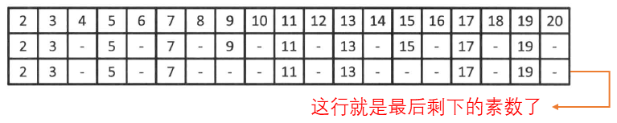

# 素数篇

本篇记录了素数有关的算法，基本主要用到的就以下 3 种。


## 判断一个数是不是素数

这个就是遍历啦，比如给了我们一个素数 n，现在让我们判断 n 是不是一个素数。

我们的做法是遍历  `b = 2 ~ sqrt(n)`，看看会不会 `n % b == 0`，如果会，就说明 n 不是一个素数，因为有小于它的数可以整除它。这种做法的时间复杂度是 `O(sqrt(n))`，不算太高哈。


## 获得 0 ~ n 之间的所有素数

当我们要判断一批数是不是素数的时候，就不需要用上面的那种方法一个一个的判断了，我们可以通过 “埃氏筛法” 来成批的判断。

“埃氏筛法” 类似与一种排除法，比如说我们要找到小于 n 的所有素数，我们就可以把 0 ~ n 中不是素数的数都挑出去，那剩下的就都是素数了。“埃氏筛法” 过程如下：

首先，将 2 到 n 范围内的所有整数写下来。其中最小的数字 2 是素数。将表中所有 2 的倍数都划去。表中剩余的最小数字是 3，它不能被更小的数整除，所以是素数。再将表中所有 3 的倍数都划去。依此类推，如果表中剩余的最小数字是 m 时，m 就是素数。然后将表中所有 m 的倍数都划去。像这样反复操作，就能依次枚举 n 以内的素数。（这个表我们可以用一个 `boolean[]`）



代码：

```java
private static boolean[] getPrimesLessK(int K) {
    boolean[] primeTab = new boolean[K];
    Arrays.fill(primeTab, true);
    primeTab[0] = primeTab[1] = false; // 最小的素数是2
    for (int i = 2; i < K; i++) {
        if (primeTab[i]) {
            for (int j = i * 2; j < K; j += i) {
                primeTab[j] = false;
            }
        }
    }
    return primeTab;
}
```


## 获得 a ~ b 之间的所有素数

在素性判定这一小节中已经讲过，b 以内的合数的最小质因数一定不超过 b。如果有 `sqrt(b)` 以内的素数表的话，就可以把埃氏筛法运用在 `[a, b)` 上了。也就是说，先分别做好 `[2, sqrt(b))` 的表和 `[a, b)` 的表，然后从 `[2, sqrt(b))` 的表中筛得素数的同时，也将其倍数从 `[a, b)` 的表中划去，最后剩下的就是区间 `[a, b)` 内的素数了。

