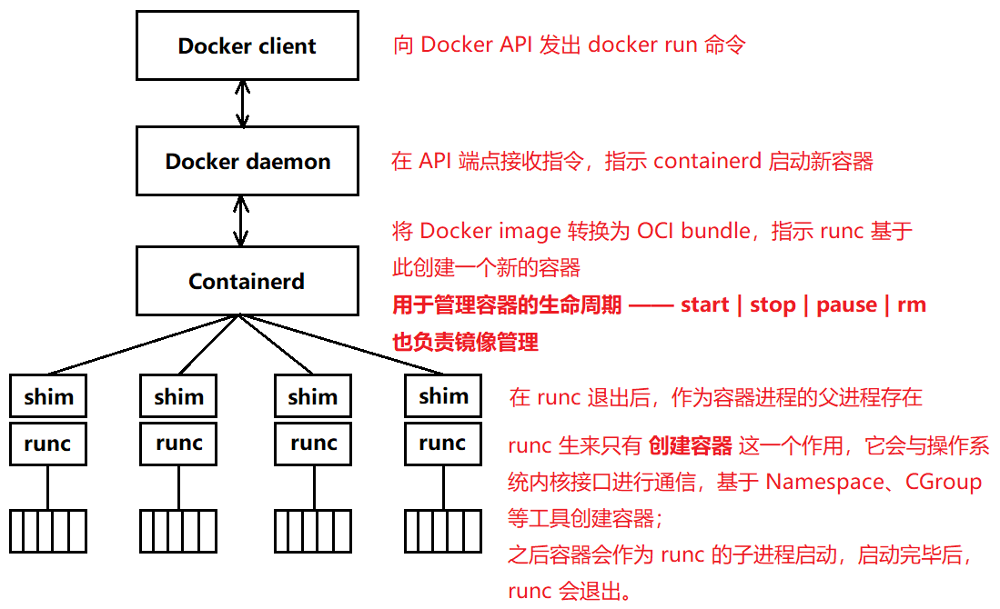

# Docker 引擎

Docker 是一个典型的 C/S 模式的架构，后端是一个松耦合架构，模块各司其职。

用户使用 Docker Client 与 Docker Daemon 建立通信，并发送请求给后者。

以前的 Docker Daemon 超级的万能，基本什么都是它亲自来干，不过随着时间的推移，大而全的 Docker  Daemon 进程带来了越来越多的 **问题：**

- 难于变更，对 Docker Daemon 进行维护和升级会对运行中的容器产生影响；
	- 因为所有容器的运行时逻辑都是在 Docker Daemon 中实现的，所以启动和停止 Daemon 会导致宿主机上的所有运行中容器被杀掉。
- 运行的越来越慢。

因此，Docker 公司开始将这个 “大而全” 的 Daemon 进程拆解开，使用 “小而专” 的工具替代它。这一过程十分的符合 UNIX 的设计哲学：小而专的工具可以组装为大型工具！

**Docker 引擎的架构如下：**

**该架构的优势：**

- 对 Docker Daemon 的维护和升级工作不会影响到运行中的容器；
- 在旧的架构中，所有容器的运行逻辑都在 Daemon 中实现，启动和停止 Daemon 都会导致宿主机上所有运行中的容器被杀掉。

**容器与 Daemon 解耦的实现：**

shim 是实现无 Daemon 容器的关键，从上图可知，containerd 通过指挥 runc 来创建新的容器。事实上，每次创建容器时，它都会 fork 一个新的 runc 进程，不过，一旦容器创建完毕，对应的 runc 进程就会退出，否则我们运行多少个容器，就要保持多少个 runc 实例。

可是 runc 进程挂掉了，那我们的容器的父进程是谁呢？此时，containerd-shim 进程登场了，一旦容器进程的父进程 runc 退出，相关联的 containerd-shim 进程就会成为容器的父进程，作为容器的父进程，shim 的部分职责如下：

- 保持所有 stdin 和 stdout 流是开启状态的，这样当 daemon 重启时，容器不会因为 pipe 的关闭而终止；
- 将容器的退出状态反馈给 daemon。