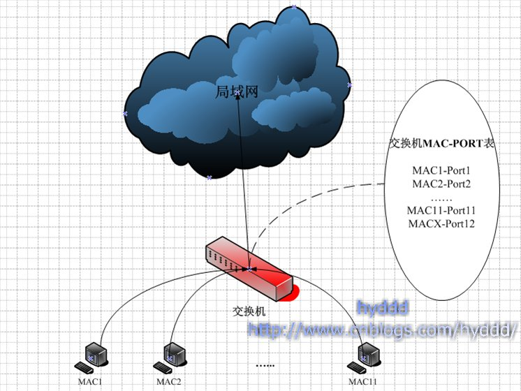
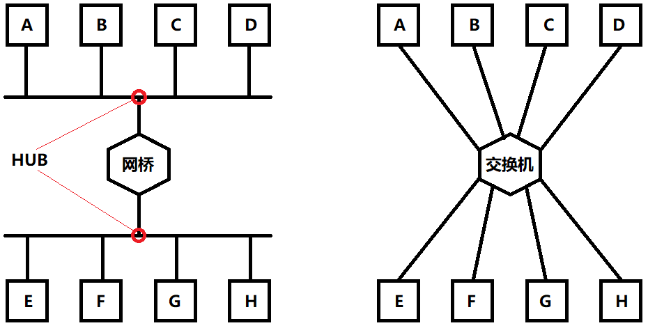

# Docker 网络


## docker network 常用命令

- `docker network ls`
	- 列出运行在本地 Docker 主机上的全部网络
- `docker network create`
	- 创建新的 Docker 网络，可以使用 `-d` 参数指定驱动（网络类型）
		- `-d bridge`：默认选择，单机桥接网络
		- `-d overlay`：创建覆盖网络，适用于多机器间的 Docker 通信
		- `-d host`：没有独立的 network namespace，和容器所在的主机共用一个
		- `-d none`：一座孤岛，和谁都不连
- `docker network inspect`
	- 查看通过 create 创建的 Docker 网络的详细配置信息
- `docker network prune`
	- 删除 Docker 主机上全部未使用的网络
- `docker network rm`
	- 删除 Docker 主机上指定网络


## 详细介绍：单机桥接网络

单机桥接网络是最简单的 Docker 网络，从名字可以将它分为 “单机” 和 “桥接” 这两部分来理解：

- 单机：该网络只能在单个 Docker 主机上运行，并且只能用于该网络所在的主机上的容器间的通信；
- 桥接：这是一种 802.1.d 桥接的一种实现（二层交换机）。

每个 Docker 主机都有一个默认的单机桥接网络：docker0，我们在一个 Docker 主机上运行 `ip a` 会看到：

```shell
$ ip a
...
4: docker0: <NO-CARRIER,BROADCAST,MULTICAST,UP> mtu 1500 qdisc noqueue state DOWN group default
    link/ether 02:42:66:37:79:bf brd ff:ff:ff:ff:ff:ff
    inet 172.17.0.1/16 brd 172.17.255.255 scope global docker0
       valid_lft forever preferred_lft forever
```

除非我们在创建容器时通过 `--network` 指定连接的网络，否则新创建的容器都会默认连接到 docker0 这个网络上。

一般我们在一台没有自己新建过网络的 Docker 主机上运行 ls 命令会有如下效果：

```shell
$ docker network ls
NETWORK ID          NAME                DRIVER              SCOPE
a1d3bf85341f        bridge              bridge              local
78ab8e16674b        host                host                local
276fb2cb0454        none                null                local
```

也就是说，默认情况下，Docker 主机会默认创建 bridge，host 和 none 这三种类型的网络。

在 Linux 主机上，Docker 网络是由 Bridge 驱动创建的，而 Bridge 底层是基于 Linux 内核中的 Linux Bridge 技术的，所以除了 Docker 提供给我们的命令以外，我们还可以通过标准的 Linux 工具来查看这些网络，例如：

```shell
$ ip link show docker0
4: docker0: <NO-CARRIER,BROADCAST,MULTICAST,UP> mtu 1500 qdisc noqueue state DOWN mode DEFAULT group default
    link/ether 02:42:66:37:79:bf brd ff:ff:ff:ff:ff:ff
```

### 自己创建一个 bridge 网络

创建一个新的网络的命令如下：

```shell
# -d: Driver String: Driver to manage the network (Default "bridge")
$ docker network create -d bridge localnet
c50345e2009a6473a22ba0a04f3aaf8334becba35ed766f2a1343238041950f2
```

除了使用 Docker network 系的命令，其实我们还可以使用 Linux brctl 工具来查看系统中的 Linux 网桥，`brctl` 并不是自带命令，所以在使用前我们需要先安装一下：`sudo apt-get install bridge-utils`。

使用 `brctl` 查看 Linux Bridge 的方式如下：

```shell
$ brctl show
bridge name     bridge id               STP enabled     interfaces
br-c50345e2009a         8000.02425c4aa81a       no                 # 这个就是我们新建的网桥
docker0         8000.0242663779bf       no
```

可以看到，目前两个网桥都没有任何设备接入，所以 interface 列表是空的。接下来，我们新建 c1 和 c2 两个容器来测试一下我们的新网桥：

```shell
# 创建后台运行的容器 c1
$ docker run -d --name c1 \
  --network localnet \
  alpine sleep 1d
16f84983126ac934499a28712209fec2a94acd559c89185985ede81372dfc21f

# 创建容器 c2 并进入到 c2 中
$ docker run -it --name c2 \
  --network localnet \
  alpine sh

# 在 c2 中 ping c1
$ ping c1
PING c1 (172.18.0.2): 56 data bytes
64 bytes from 172.18.0.2: seq=0 ttl=64 time=0.118 ms
64 bytes from 172.18.0.2: seq=1 ttl=64 time=0.391 ms
64 bytes from 172.18.0.2: seq=2 ttl=64 time=0.639 ms
^C
--- c1 ping statistics ---
3 packets transmitted, 3 packets received, 0% packet loss  # 可以 ping 通！
round-trip min/avg/max = 0.118/0.382/0.639 ms
```

**为什么我们直接通过 name 就可以 ping 通呢？**

因为在相同网络中继续接入新的容器时，新的容器都会被注册到指定的 Docker DNS 服务，所以相同网络中的容器可以解析其他容器的名称。

**端口映射**

端口映射允许将某个容器端口映射到 Docker 主机端口上，此后，对于配置中指定的 Docker 主机端口，任何发送到改端口的流量，都会被转发到容器。

```shell
$ docker run -d --name web \
  --network localnet \
  --publish 5000:80 \
  nginx
  
# 确认容器的端口映射情况
$ docker port web
```


## 服务发现

服务发现允许容器和 Swarm 服务通过名称相互定位。只要它们是在同一个网络中。

其底层实现是利用了 Docker 内置的 DNS 服务器，为每个容器提供 DNS 解析功能，例如，容器 c1 `ping c2` 的过程如下：

- `ping c2` 命令调用本地 DNS 解析器，尝试将 “c2” 解析为具体的 IP 地址；
- 如果在本地的 DNS 解析器的缓存中没有找到与 “c2” 对应的 IP 地址，本地的 DNS 解析器会向 Docker DNS 解析器发起一个递归查询；
- Docker DNS 记录了全部容器和 IP 地址的映射关系；
- Docker DNS 服务返回 “c2” 对应的 IP 地址到 “c1” 本地 DNS 解析器；
- `ping` 命令被发往 “c2” 对应的 IP 地址。


## 补充：集线器、网桥、交换机都是啥？

参考：https://www.cnblogs.com/hyddd/archive/2009/01/18/NetWorking.html

### 集线器 (Hub)

这货和其他俩最大的不同在于，这是个物理层的设备，其他俩是数据链路层的设备，所以它既不关心也根本没有能力关心 OSI 上面几层涉及的东西。

它的工作流程是：从一个端口接收到数据包时，会在其他所有端口将这个包转发一次。因为它根本不知道这个包是给谁的，所以它只能对所有人广播。

这一广播就广播出问题了……

首先，广播是无法保证安全性的，别人可以随便监听你的信息。

其次，如果一个有 500 台机器的大型网络，全部使用 Hub 连接，那么一定慢死了！因为如果 500 台机器每台机器都发一个数据包，那么每台机器都要收到差不多 499 个无用的包，此时，无用的数据包会充斥着整个网络，这就是传说中的广播风暴。

为了减少广播风暴，网桥诞生了。

### 网桥

网桥是数据链路层转发数据包的设备，因为在数据链路层，所以它能看到一些数据包的信息，它能从发来的数据包种提取到源 MAC 信息和目的 MAC 信息，这样就可以根据 MAC 信息对数据包进行有目的的转发，而不用采用广播的方式了，从而提高了整个网络的效率。

**网桥的工作原理：**


上图是用一个网桥连接的两个网络，网桥的 A 端口连接 A 子网，B 端口连接 B 子网。

我们想要知道的是，网桥是怎么知道哪些数据包该转发，哪些数据包不该转发的。

关键就在它每个端口的对应表上，当有数据包进入端口 A 时，网桥会从数据包中提取出源 MAC 地址和目的 MAC 地址，开始的时候，表 A 和表 B 都是空的，这时，网桥会把数据包转发给 B 网络，并且在表 A 中记录源 MAC 地址，说明这个 MAC 地址的机器是在 A 子网下的。同理，当 B 子网发送数据包到 B 端口时，网桥也会记录源 MAC 地址到 B 表。

在以上的规则下让网桥工作一段时间，表 A 基本上记录了 A 子网所有的机器的 MAC 地址，表 B 同理。此时，让有一个数据包从 A 子网发送到网桥时，网桥的处理流程如下：

- 网桥会先看看数据包的目的 MAC 地址是属于 A 子网还是 B 子网的：
	- 如果从 A 表中找到，则丢弃该包；
	- 如果没有从 A 表中找到，则转发给 B 子网；
- 然后检查源 MAC 地址是否在表 A 中已经存在，如果不存在，在表 A 中增加一条记录。

当然真实的网桥中应该是只有一张表的，这是一张 MAC-PortNum 表，也就是源 MAC 地址对应着这个 MAC 地址来自的端口。

### 交换机

交换机也是数据链路层的转发数据包设备，和网桥一样，它也是通过识别数据包中的 MAC 地址，对特定的端口进行转发的。

**交换机的工作原理：**



交换机也有一张 MAC-PORT 对应表（这张表的学名为：CAM），和网桥不一样的是，网桥的表是一对多的（一个端口号对多个 MAC 地址），但交换机的 CAM 表却是一对一的，如果一个端口有新的 MAC 地址，它不会新增 MAC-PORT 记录，而是修改原有的记录为新的 MAC 地址。

举个栗子，假设现在交换机记录表中已有一项：MAC1-PORT1，如果此时端口 1 又来了一个数据包，里面的源 MAC 地址是 MAC2，交换机不会在 CAM 表中添加新的记录，而是将 MAC1-PORT1 修改为 MAC2-PORT1。交换机不会认为是这个端口连接了多台计算机，而是会认为这个端口连接的计算机改变了。

如果端口 1 连接的是一台物理机，那么它的 MAC 地址一般是不会改变的，但是如果连接的是另一个交换机，那么这个端口的记录会变化的十分频繁，如上图的 Port12，它是对外的接口，与一个局域网连接。

此外，如果 CAM 表中没有找到和数据包的目的 MAC 地址对应的记录，交换机会对这个数据包进行广播，将这个数据包转发给交换机的每一个端口。

### 网桥和交换机的区别

先来看看网桥和交换机的连接模式：



从图中可以看到，网桥只有 2 个输入/出端口，而交换机有 8 个。一开始的时候只有 HUB 这种设备，可是在组建大网络的时候，发现广播风暴实在是太恐怖了，需要想办法解决一下。

那么怎么解决大网络的组建问题呢？我们知道，之所以出现了广播风暴就是因为网络中用 HUB 连接的主机太多了，所以我们可以用 HUB 连接成一个一个的小型网络，然后再通过某种方式将这些小型网络连接起来，通过这种分而治之的方式解决大型网络的搭建问题，这个某种方式，就是我们说的网桥。

如上图左所示，A 发给 BCD 的数据不再会广播到 EFGH 了，也就减少了非必要的传输，整个网络的效率也随之提高。人们发现网桥真是个好东西呀，只有两个端口真实可惜了，所以就开发出了 4 个、8 个端口的链路层设备，也就是交换机，由于交换机可以使得网络更安全（数据不容易被监听，因为数据不再广播了，注意：只是不容易而已，要搞你其实还是可以的），网络效率更高（还是因为数据不再广播！），交换机渐渐替代了 HUB，成为组建局域网的重要设备。

### 一些值得注意的问题

**网桥是否需要软件辅助？**

传统上，网桥往往包含一个 CPU，"转发-存储" 由软件来实现。但现在由于硬件水平的提升，网桥，交换机都包含了特殊的，用于转发的集成电路部分，现在的网桥和交换机都可以不需要软件辅助了！

**网桥是否可以用于连接不同的网段？**

首先我们要知道，网桥不是用来连接不同的网段的，不同网段之间通信，是需要网关的帮助的，一般是路由器这类网络层的设备完成的。而网桥和交换机是链路层设备，网段这个是和 IP 相关的概念，属于网络层。网桥和交换机跟本无能力去处理网络层的东西！

网桥连接的仅仅是两个子局域网，并且这里说的子局域网必须是同构的（同构的意思是：如果是以太网，那么网桥连接的两个子网都必须是以太网，不能一个是以太网一个是令牌网）。


