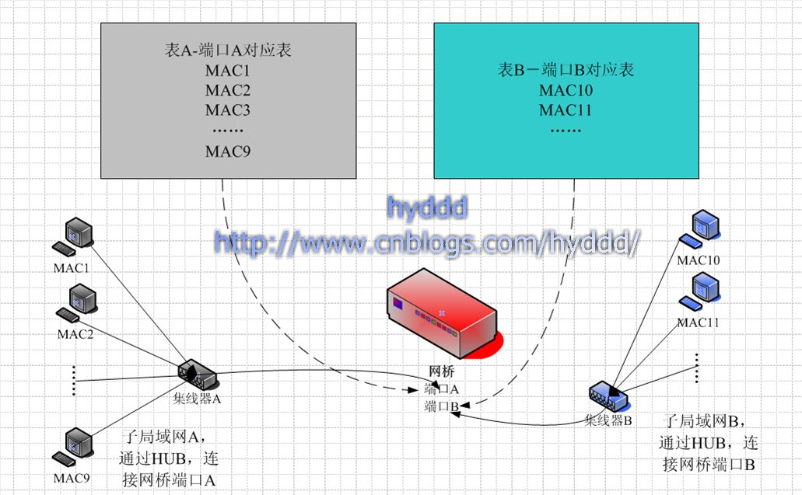

# Docker 网络

## 集线器、网桥、交换机都是啥？

参考：https://www.cnblogs.com/hyddd/archive/2009/01/18/NetWorking.html

### 集线器 (Hub)

这货和其他俩最大的不同在于，这是个物理层的设备，其他俩是数据链路层的设备，所以它既不关心也根本没有能力关心 OSI 上面几层涉及的东西。

它的工作流程是：从一个端口接收到数据包时，会在其他所有端口将这个包转发一次。因为它根本不知道这个包是给谁的，所以它只能对所有人广播。

这一广播就广播出问题了……

首先，广播是无法保证安全性的，别人可以随便监听你的信息。

其次，如果一个有 500 台机器的大型网络，全部使用 Hub 连接，那么一定慢死了！因为如果 500 台机器每台机器都发一个数据包，那么每台机器都要收到差不多 499 个无用的包，此时，无用的数据包会充斥着整个网络，这就是传说中的广播风暴。

为了减少广播风暴，网桥诞生了。

### 网桥

网桥是数据链路层转发数据包的设备，因为在数据链路层，所以它能看到一些数据包的信息，它能从发来的数据包种提取到源 MAC 信息和目的 MAC 信息，这样就可以根据 MAC 信息对数据包进行有目的的转发，而不用采用广播的方式了，从而提高了整个网络的效率。

**网桥的工作原理：**

上图是用一个网桥连接的两个网络，网桥的 A 端口连接 A 子网，B 端口连接 B 子网。

我们想要知道的是，网桥是怎么知道哪些数据包该转发，哪些数据包不该转发的。

关键就在它每个端口的对应表上，当有数据包进入端口 A 时，网桥会从数据包中提取出源 MAC 地址和目的 MAC 地址，开始的时候，表 A 和表 B 都是空的，这时，网桥会把数据包转发给 B 网络，并且在表 A 中记录源 MAC 地址，说明这个 MAC 地址的机器是在 A 子网下的。同理，当 B 子网发送数据包到 B 端口时，网桥也会记录源 MAC 地址到 B 表。

在以上的规则下让网桥工作一段时间，表 A 基本上记录了 A 子网所有的机器的 MAC 地址，表 B 同理。此时，让有一个数据包从 A 子网发送到网桥时，网桥的处理流程如下：

- 网桥会先看看数据包的目的 MAC 地址是属于 A 子网还是 B 子网的，
	- 如果从 A 表中找到，则丢弃该包；
	- 如果没有从 A 表中找到，则转发给 B 子网；
- 然后检查源 MAC 地址是否在表 A 中已经存在，如果不存在，在表 A 中增加一条记录。

当然真实的网桥中应该是只有一张表的，这是一张 MAC-PortNum 表。

### 交换机

交换机也是数据链路层的转发数据包设备，和网桥一样，它也是通过识别数据包中的 MAC 地址，对特定的端口进行转发的。

### 网桥和交换机的区别