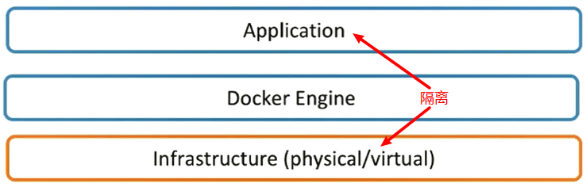
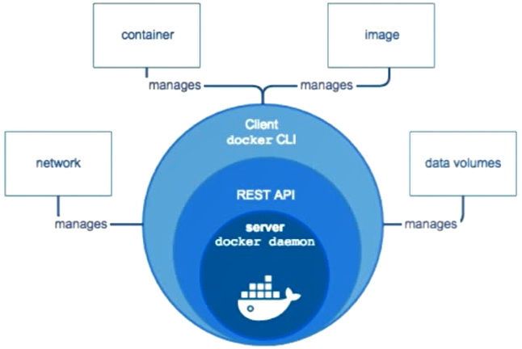
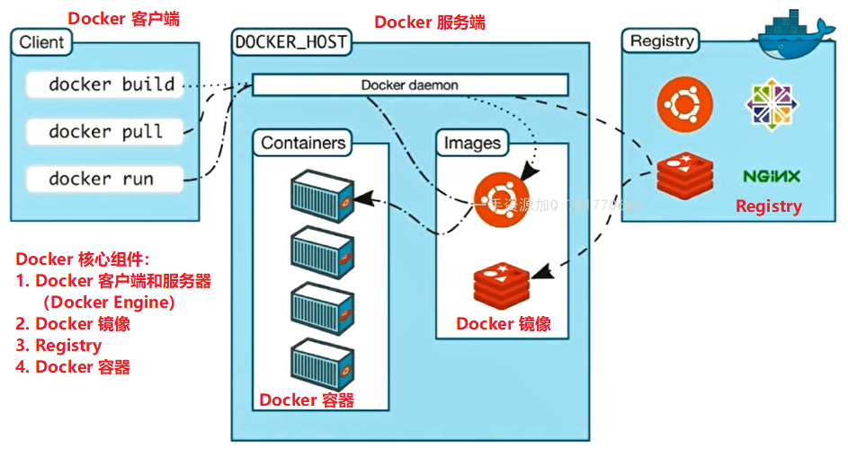
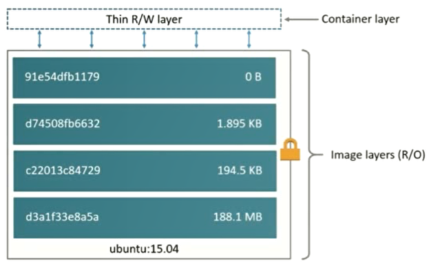

# Docker的镜像和容器


## Docker 概念简介

Docker 提供了一个开发、打包、运行 app 的平台。用来将 app 和底层 infrastructure 隔离开。



通过使用 Docker，可以更好的解耦开发人员和运维人员的职责，达到：

- 开发人员只需关心容器中运行的应用程序；
- 运维人员只需关心如何管理容器。

此外，Docker 鼓励使用面向服务的架构和微服务架构。因此，**Docker 推荐单个容器只运行一个应用程序或进程**，这样就形成了一个分布式的应用程序模型。在这种模型下，应用程序和服务都可以表示为一系列内部互联的容器，更加便于应用程序的分布式部署。

也就是说，我们可以把每一个服务都打包成一个 Docker 容器，然后随便把它们放在不同的机器上运行，并且我们还可以对这个服务的资源进行限制，可以防止因为一个服务的代码出现异常而导致整台机器当掉的问题，即不会因为一个服务出现问题而影响了其他的服务。

我们可以将服务器想象成一块板子，上面有好多好多的 USB 插口，然后每一个 Docker 容器都有自己能做的事情，并且它只做这一件事（这种设计原则也很符合 Unix 的逻辑），我们想让这台服务器有什么功能，就找到能干这个事情的 Docker 容器，然后把它往上一插，服务器就能有这个 Docker 容器负责的功能了，要是我们以后有了更好的能干这个事情的 Docker 容器，我们就把旧的 Docker 容器一拔，把新的换上，这个功能就更新了，并且在更新这个服务的时候，是不会影响其他服务的。

很容易发现，这是一个典型的 C/S 的模型：




## Docker 的架构



**详细介绍：**

- Docker Client：客户端，我们通过它向 Docker_Host 发送请求，感觉功能像个浏览器。
- Docler Host（Docker Daemon，Docker Engine）：负责接收客户端发来的请求，根据请求的内容安排 Docker 容器去做，感觉像 DispatcherServlet。
	- Images：用来构建 Container 的，就像是 Container 的源代码。
	- Containers：
- Registry：如果我们把 Image 想象成源代码，那么 Registry 就是个放 Image 的 Github，可以用来保存用户构建的镜像，有公共的镜像（比如各大公司为了方便大家的使用，给自己的服务打包进 Docker 容器中，并将 Image 发布出去，用户就可以很方便的通过公司发布的 Image 构建出一个装载了这个服务的 Docker 容器直接用），此外，当然也有用户自己创建的私有的镜像。


## Docker 底层技术支持

- Namespaces：隔离 pid，net，ipc，mnt，uts
- Control groups：做资源限制
- Union file system：Container 和 image 的分层


## Image

### 什么是 Image

前面也讲了，把 Image 想象成 Docker 容器的源代码就好啦，如果你是一个 Java 程序员的话，这东西就是你写的 .java 文件 Build 出来的 .class 文件，你运行 build 好的 .class 文件可以得到一个能用的软件，而 Image 运行起来会变成一个能用的 Docker 容器。

### 如何获取 Image

#### Build from Dockerfile

这个东西可以把它想象成 .java 文件。我们自己构建容器，其实就是想着怎么写 Dockerfile 这个文件。

文件名就叫做 Dockerfile，就像你写的 Java 代码文件得以 .java 结尾一样，我们可以新建一个目录，在里面放上一个写好的 Dockerfile（具体怎么写之后再研究），然后在这个目录下运行：

```shell
docker build -t username/imagename:tag .
# or
docker build -t="username/imagename:tag" .
# 千万不要忘了最后那个表示当前目录的点！点表示基于当前目录的 Dockerfile build Image
```

就可以得到一个 Image 啦！

#### Pull from Registry

从 docker hub 上获取：https://hub.docker.com/explore/。类似于你去 Github 上下载别人写的软件拿来用。

```dockerfile
docker pull username/imagename
```

### DIY 一个 Hello World Base Image

>**如何使用 docker 命令不用 sudo？**
>
>```shell
># 目标
>sudo docker image ls -> docker image ls == docker images
>
># 步骤
>## 1. 检查是否有 docker 用户组
>cat /etc/group | grep docker
>### 没有则创建 docker 用户组
>sudo groupadd docker
>## 2. 将当前用户加入 docker 用户组
>sudo gpasswd -a vagrant docker
>## 3. 重启 docker 服务
>sudo service docker restart
>## 4. 重新登录
>exit
>sudo login username
>```

比如我们想要构建一个，基于 Python 3.5 的打印 hello-world 的 Dockerfile：

```dockerfile
FROM python:3.5  # 如果不想基于任何镜像就 FROM scratch
ADD hello.py /
CMD ["python3", "hello.py"]
```

hello.py：

```python
print("Hello World! Hello Docker!")
```

然后运行以下命令，我们就可以构建一个简单的镜像，并且运行这个镜像，得到一个 Docker 容器了。

```shell
# 构建 docker 镜像 (tangbean/hello-world 是镜像名)
docker build -t tangbean/hello-world .
# 查看 image 分层
docker history ImageID
# 运行
docker run tangbean/hello-world
```

如果我们想停止，删除容器以及镜像，可以参考下面的一些操作：

```shell
# 停止所有 container
docker stop $(docker ps -aq)
# 删除所有 container
docker rm $(docker ps -aq)
# 删除无效的 <none>:<none> 镜像
docker rmi $(docker images -f "dangling=true" -q)
```


## Container

### 什么是 Container

- 通过 Image 创建，在 Image layer 之上建立一个 Container layer，这个 layer 是可读可写的，而 Image layer 是只读的；
- 类比一下，Image 就是类，Container 就是实例；
- Image 负责 app 的存储和分发，Container 负责运行 app。



这种感觉和开源很像，我们可以通过组合别人写好的轮子们 (Images)，然后在上面加上我们自己的逻辑，最后实现我们自己的 app (Containers)。

### 运行 Image 得到 Container

```shell
# 运行
docker run username/imagename:tag
# 列出正在运行的 container
docker container ls
# 列出所有的 container，包括运行结束的 container
docker container ls -a
```

如果我们 run 了一个操作系统的镜像，我们可以交互式的运行，这样就像是开了一个虚拟机一样了：

```shell
docker run -it centons
```

### 删除 Container

```shell
docker container ls -aq
# ==
docker ps -aq
# ==
docker container ls -a | awk {'print$1'}
```

通过以上说明，可以通过以下方式清理 Container：

```shell
# remove 所有的 Container
docker rm $(docker ps -aq)
# remove 所有退出的 Container
docker rm $(docker ps -f "status=exited" -q)
```


## 两个 Docker 命令

### `docker commit` (`docker container commit`)

用在我们通过已有的 Image 构建了一个 Container，并在这个 Container 上进行了一些操作，此时，这个 Container 已经和它刚被 run 出来的时候有所不同了。如何我们想得到这个发生了变化的 Container 的 Image文件，就需要用到 commit 这个命令了。

```shell
docker commit container_name tangbean/centons-vim(新的image的名字)
```

不过此方式并不推荐，因为我们并不知道这个 Image 是怎么创建出来的，所以还是通过 Dockerfile build Image 好一些。

### `docker build`

```shell
docker build -t username/imagename:tag .
# or
docker build -t="username/imagename:tag" .
# 千万不要忘了最后那个表示当前目录的点！点表示基于当前目录的 Dockerfile build Image
```

当我们基于一个 Image build 一个新的 Image 时，其实我们是先将 FROM 的那个 Image run 起来，然后在这个临时的 Container 运行我们在 Dockerfile 中写的各种命令，然后在将新的 Container commit 成一个 Image，再将临时的 Container 删掉。

本质上来讲，`docker build` 的过程就是 `docker run` + `docker commit` + `docker rm` 的究极集合体，一个 Dockerfile 的执行过程如下：

- 基于刚提交的镜像运行一个新的容器；
- 在这个新容器中继续执行指令；
- 对容器进行修改，再把修改后的容器提交为一个新的镜像层；
- 循环以上过程，直到 Dockerfile 中的所有指令执行完毕。


## Dockerfile 的语法（如何编写 Dockerfile）

详情可参考 [官方文档](https://docs.docker.com/engine/reference/builder/)。

### 关键字

| 关键字         | 说明                                                         |
| -------------- | ------------------------------------------------------------ |
| `FROM`         | 基于哪个 Image 构建，如果不基于任何 Image 就写 scratch       |
| `LABEL`        | 就像代码中的注释，e.g. `LABEL description="This is description"` |
| `RUN`          | 执行命令并创建新的 Image Layer，为了美观，可以一个 RUN 后面跟一堆要运行的命令，命令与命令之间通过 `&&` 连接，可以通过 `\` 来换行，以方便阅读 |
| `CMD`          | 设置容器启动后默认执行的命令和参数                           |
| `ENTRYPOINT`   | 设置容器启动时运行的命令                                     |
| `WORKDIR`      | 像 `cd` 一样，改变工作的目录，不过和 `cd` 不同的是，如果这个目录不存在，会创建这个目录并进入。所以我们要使用 `WORKDIR` 而不是 `RUN cd`，此外，尽量使用绝对路径，不要使用相对路径 |
| `ADD` & `COPY` | `ADD hello.py /`，`copy hello.py test/`，`ADD` 还有解压的功能，不过一般优先使用 `COPY`。这两个关键字都是对于添加本地文件进 Container 的，如果要添加远程文件，请使用 `curl` or `wget` |
| `ENV`          | 设置常量，例如：`ENV MYSQL_VERSION 5.6`，之后可以通过 `${MYSQL_VERSION}` 来使用这个常量。十分推荐使用 `ENV` 来提高 Dockerfile 的可维护性。 |
| `EXPOSE`       | 暴露端口                                                     |
| `VOLUME`       |                                                              |

### Shell 和 Exec 格式

#### Shell 格式

```dockerfile
RUN apt-get install -y vim
CMD echo "hello docker"
ENTRYPOINT echo "hello docker"
```

#### Exec 格式

```dockerfile
RUN ["apt-get", "install", "-y", "vim"]
CMD ["/bin/echo", "hello docker"]
ENTRYPOINT ["/bin/bash", "-c", "/bin/echo hello docker"]
```

就是执行命令，所以如果想在 shell 中执行要这样：

```dockerfile
FROM ubuntu
ENV name Docker
ENTRYPOINT ["/bin/bash", "-c", "/bin/echo hello ${name}"]  # 要加上 "/bin/bash", "-c"，并且是以数组的格式
```

### RUN、CMD、ENTRYPOINT 命令

- **RUN 命令：**

	- 执行命令并创建新的 Image Layer。

- **CMD 命令：**

	- 容器启动时默认执行的命令；
	- 如果 `docker run -it [image] /bin/bash`，即在运行 `docker run` 时指定了其他命令， CMD 命令会被忽略，也就是说，Dockerfile 中只能指定一条 CMD 指令；
	- 如果定义了多个 CMD，只有最后一个会执行。

- **ENTRYPOINT 命令：(常用)**

	- 让容器以应用程序或服务的形式运行；

	- 不会被忽略，一定会执行，实际上，`docker run` 命令行中指定的任何参数都会被当做参数再次传递给 ENTRYPOINT 指令中指定的指令：

	- 最佳实践：写一个 shell 脚本作为 ENTRYPOINT 的执行内容：

		```dockerfile
		COPY docker-entrypoint.sh /usr/local/bin/
		ENTRYPOINT ["docker-entrypoint.sh"]  # 将 docker-entrypoint.sh 作为一个启动脚本
		```

>**巧妙的组合 ENTRYPOINT 和 CMD 来完成指定默认参数的工作！**
>
>```dockerfile
>FROM ubuntu
>ENTRYPOINT ["/usr/bin/head"]
>CMD ["/etc/passwd"]  # 默认参数，如果 docker run 时不带参数就是将这个参数传入 ENTRYPOINT 的命令中
>```
>
>运行效果：
>
>```shell
>$ docker run tangbean/ubuntu-entrypoint-exec /etc/group
># 输出：
>root:x:0:
>daemon:x:1:
>bin:x:2:
>sys:x:3:
>adm:x:4:
>tty:x:5:
>disk:x:6:
>lp:x:7:
>mail:x:8:
>news:x:9:
>
>$ docker run tangbean/ubuntu-entrypoint-exec
># 输出：
>root:x:0:0:root:/root:/bin/bash
>daemon:x:1:1:daemon:/usr/sbin:/usr/sbin/nologin
>bin:x:2:2:bin:/bin:/usr/sbin/nologin
>sys:x:3:3:sys:/dev:/usr/sbin/nologin
>sync:x:4:65534:sync:/bin:/bin/sync
>games:x:5:60:games:/usr/games:/usr/sbin/nologin
>man:x:6:12:man:/var/cache/man:/usr/sbin/nologin
>lp:x:7:7:lp:/var/spool/lpd:/usr/sbin/nologin
>mail:x:8:8:mail:/var/mail:/usr/sbin/nologin
>news:x:9:9:news:/var/spool/news:/usr/sbin/nologin
>```

参考：https://deepzz.com/post/dockerfile-reference.html


## 实战：将一个 Python Flask 项目打包进 Docker

项目超级的简单，代码如下：

```python
# app.py
from flask import Flask
app = Flask(__name__)
@app.route('/')
def hello():
    return "hello docker"
if __name__ == '__main__':
    app.run(host="0.0.0.0", port=5000)
```

创建 Dockerfile 如下：

```dockerfile
FROM python:2.7
LABEL maintainer="Tang_Bean<tang_bean@163.com>"
RUN pip install flask
COPY app.py /app/
WORKDIR /app
EXPOSE 5000
ENTRYPOINT ["python", "app.py"]
```

运行命令：

```shell
docker build -t "tangbean/flask-demo" .
docker run -d -p 12345:5000 --name=nickname tangbean/flask-demo
# -d 表示后台运行这个容器，--name=别名，可以当 CONTAINER ID 使
# 访问 http://192.168.33.10:12345/
```

> 记得在虚拟机的 Vagrantfile 中打开：`config.vm.network "private_network", ip: "192.168.33.10"`。


## 操作运行中的容器

```shell
# 进入到运行中的程序
docker exec -it <CONTAINER ID> /bin/bash
# 显示 docker container 的详细信息
docker inspect <CONTAINER ID>
# logs
docker logs <CONTAINER ID>
```

