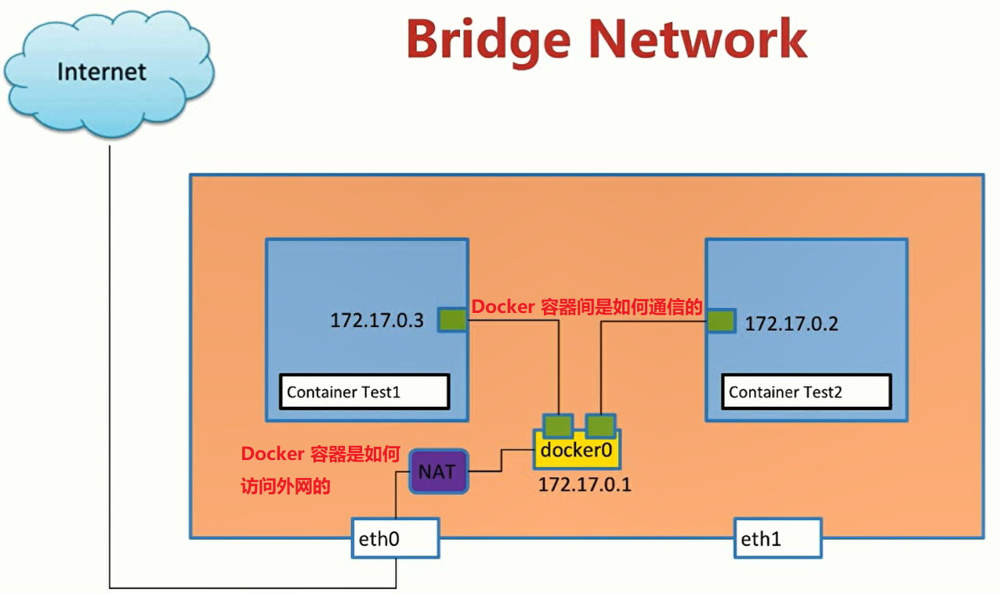

# Docker 的网络


## Linux 网络命名空间

### `ip netns` 命令

network namespace 是实现网络虚拟化的重要功能，它能创建多个隔离的网络空间，这样，不管是虚拟机还是容器，运行的时候仿佛自己就在独立的网络中。

我们可以通过 `ip netns` 管理网络的命名空间。常用命令有：`list`，`add`，**`exec`**，`delect`，我们可以通过 `ip netns help` 查看帮助信息。

首先，我们先来创建两个 namespace：test1 和 test2。

```shell
sudo ip netns add test1
sudo ip netns add test2
```

然后执行 list 或 ls 命令，我们可以将所有的 namespace 列出：

```shell
sudo ip netns list / sudo ip netns ls
# 输出
test2
test1
```

`ip netns` 命令创建的 network namespace 会出现在 `/var/run/netns/` 目录下，如果需要管理其他不是 `ip netns` 创建的 network namespace，只要在这个目录下创建一个指向对应 network namespace 文件的链接就行。

有了自己创建的 network namespace，我们还需要看看它里面有哪些东西。对于每个 network namespace 来说，它会有自己独立的网卡、路由表、ARP 表、iptables 等和网络相关的资源。因此，`ip` 命令提供了 `ip netns exec` 子命令可以在对应的 network namespace 中执行命令：

```shell
sudo ip netns exec test1 ip link
# 输出
1: lo: <LOOPBACK> mtu 65536 qdisc noop state DOWN mode DEFAULT group default qlen 1
    link/loopback 00:00:00:00:00:00 brd 00:00:00:00:00:00
```

每个 namespace 在创建的时候会自动创建一个 `lo` 的 interface，它的作用和 linux 系统中默认看到的 `lo` 一样，都是为了实现 loopback 通信。`lo` 接口默认是 `DOWN` 的，也就是关闭的，我们可以通过如下方式开启它：

```shell
sudo ip netns exec test1 ip link set lo up
```

### network namespace 间的通信

#### 使用 veth pair 连接两个 namespace

两个 network namespace 就相当于两个网络，不能相互通信的网络是没有意义的，所以我们在两个网络间建立连接，如果是在现实中，我们可能选择用一根网线将两个机器一连，那么在虚拟网络中，我们用什么来充当这根网线呢？

Linux 提供了一种叫 `veth pair` 的东西，这是一对双向的 pipe（管道），从一个方向发送的网络数据，可以直接被另外一端接收到，我们可以通过以下方法创建 veth pair：

```shell
sudo ip link add veth-test1 type veth peer name veth-test2

sudo ip link
# 输出
1: lo: <LOOPBACK,UP,LOWER_UP> mtu 65536 qdisc noqueue state UNKNOWN mode DEFAULT group default qlen 1
    link/loopback 00:00:00:00:00:00 brd 00:00:00:00:00:00
2: enp0s3: <BROADCAST,MULTICAST,UP,LOWER_UP> mtu 1500 qdisc pfifo_fast state UP mode DEFAULT group default qlen 1000
    link/ether 02:3a:f4:24:e2:72 brd ff:ff:ff:ff:ff:ff
3: enp0s8: <BROADCAST,MULTICAST,UP,LOWER_UP> mtu 1500 qdisc pfifo_fast state UP mode DEFAULT group default qlen 1000
    link/ether 08:00:27:9a:15:fd brd ff:ff:ff:ff:ff:ff
4: docker0: <NO-CARRIER,BROADCAST,MULTICAST,UP> mtu 1500 qdisc noqueue state DOWN mode DEFAULT group default
    link/ether 02:42:e5:8a:18:a2 brd ff:ff:ff:ff:ff:ff
# 多了这两个网络接口
5: veth-test2@veth-test1: <BROADCAST,MULTICAST,M-DOWN> mtu 1500 qdisc noop state DOWN mode DEFAULT group default qlen 1000
    link/ether e2:5c:0f:72:cc:b8 brd ff:ff:ff:ff:ff:ff
6: veth-test1@veth-test2: <BROADCAST,MULTICAST,M-DOWN> mtu 1500 qdisc noop state DOWN mode DEFAULT group default qlen 1000
    link/ether 06:8a:9d:96:a1:11 brd ff:ff:ff:ff:ff:ff
```

接下来，我们需要将这对 veth pair 放入 test1 和 test2 这两个 namespace 中：

```shell
sudo ip link set veth-test1 netns test1
sudo ip link set veth-test2 netns test2

sudo ip netns exec test1 ip link
# 输出
1: lo: <LOOPBACK> mtu 65536 qdisc noop state DOWN mode DEFAULT group default qlen 1
    link/loopback 00:00:00:00:00:00 brd 00:00:00:00:00:00
# veth-test1 已被添加进来
6: veth-test1@if5: <BROADCAST,MULTICAST> mtu 1500 qdisc noop state DOWN mode DEFAULT group default qlen 1000
    link/ether 06:8a:9d:96:a1:11 brd ff:ff:ff:ff:ff:ff link-netnsid 1

sudo ip netns exec test2 ip link
# 输出
1: lo: <LOOPBACK> mtu 65536 qdisc noop state DOWN mode DEFAULT group default qlen 1
    link/loopback 00:00:00:00:00:00 brd 00:00:00:00:00:00
# veth-test2 已被添加进来
5: veth-test2@if6: <BROADCAST,MULTICAST> mtu 1500 qdisc noop state DOWN mode DEFAULT group default qlen 1000
    link/ether e2:5c:0f:72:cc:b8 brd ff:ff:ff:ff:ff:ff link-netnsid 0

# 然后再执行 ip link
ip link
# 输出，发现 veth-test1 和 veth-test2 已经不见了
1: lo: <LOOPBACK,UP,LOWER_UP> mtu 65536 qdisc noqueue state UNKNOWN mode DEFAULT group default qlen 1
    link/loopback 00:00:00:00:00:00 brd 00:00:00:00:00:00
2: enp0s3: <BROADCAST,MULTICAST,UP,LOWER_UP> mtu 1500 qdisc pfifo_fast state UP mode DEFAULT group default qlen 1000
    link/ether 02:3a:f4:24:e2:72 brd ff:ff:ff:ff:ff:ff
3: enp0s8: <BROADCAST,MULTICAST,UP,LOWER_UP> mtu 1500 qdisc pfifo_fast state UP mode DEFAULT group default qlen 1000
    link/ether 08:00:27:9a:15:fd brd ff:ff:ff:ff:ff:ff
4: docker0: <NO-CARRIER,BROADCAST,MULTICAST,UP> mtu 1500 qdisc noqueue state DOWN mode DEFAULT group default
    link/ether 02:42:e5:8a:18:a2 brd ff:ff:ff:ff:ff:ff
```

最后，我们需要给这对 veth pair 配上 ip 地址，我们需要先将这两个接口打开：

```shell
sudo ip netns exec test1 ip link set dev veth-test1 up
sudo ip netns exec test2 ip link set dev veth-test2 up
```

然后给它们配上 ip 地址：

```shell
sudo ip netns exec test1 ip addr add 192.168.1.1/24 dev veth-test1
sudo ip netns exec test1 ip addr add 192.168.1.2/24 dev veth-test2

sudo ip netns exec test1 ip a
# 输出
1: lo: <LOOPBACK> mtu 65536 qdisc noop state DOWN group default qlen 1
    link/loopback 00:00:00:00:00:00 brd 00:00:00:00:00:00
6: veth-test1@if5: <BROADCAST,MULTICAST,UP,LOWER_UP> mtu 1500 qdisc noqueue state UP group default qlen 1000
    link/ether 06:8a:9d:96:a1:11 brd ff:ff:ff:ff:ff:ff link-netnsid 1
    inet 192.168.1.1/24 scope global veth-test1  # 已分配好 ip 地址
       valid_lft forever preferred_lft forever
    inet6 fe80::48a:9dff:fe96:a111/64 scope link
       valid_lft forever preferred_lft forever

sudo ip netns exec test2 ip a
# 输出
1: lo: <LOOPBACK> mtu 65536 qdisc noop state DOWN group default qlen 1
    link/loopback 00:00:00:00:00:00 brd 00:00:00:00:00:00
5: veth-test2@if6: <BROADCAST,MULTICAST,UP,LOWER_UP> mtu 1500 qdisc noqueue state UP group default qlen 1000
    link/ether e2:5c:0f:72:cc:b8 brd ff:ff:ff:ff:ff:ff link-netnsid 0
    inet 192.168.1.2/24 scope global veth-test2  # 已分配好 ip 地址
       valid_lft forever preferred_lft forever
    inet6 fe80::e05c:fff:fe72:ccb8/64 scope link
       valid_lft forever preferred_lft forever
```

接下来，我们就可以在 test1 和 test2 之间互相 ping 通啦！

```shell
sudo ip netns exec test1 ping 192.168.1.2
# 输出
PING 192.168.1.2 (192.168.1.2) 56(84) bytes of data.
64 bytes from 192.168.1.2: icmp_seq=1 ttl=64 time=0.070 ms
64 bytes from 192.168.1.2: icmp_seq=2 ttl=64 time=0.063 ms
64 bytes from 192.168.1.2: icmp_seq=3 ttl=64 time=0.046 ms
^C
--- 192.168.1.2 ping statistics ---
3 packets transmitted, 3 received, 0% packet loss, time 2000ms
rtt min/avg/max/mdev = 0.046/0.059/0.070/0.013 ms

sudo ip netns exec test2 ping 192.168.1.1
# 输出
PING 192.168.1.1 (192.168.1.1) 56(84) bytes of data.
64 bytes from 192.168.1.1: icmp_seq=1 ttl=64 time=0.042 ms
64 bytes from 192.168.1.1: icmp_seq=2 ttl=64 time=0.050 ms
64 bytes from 192.168.1.1: icmp_seq=3 ttl=64 time=0.049 ms
^C
--- 192.168.1.1 ping statistics ---
3 packets transmitted, 3 received, 0% packet loss, time 1998ms
rtt min/avg/max/mdev = 0.042/0.047/0.050/0.003 ms
```

#### 使用 bridge 连接不同的 namespace

虽然 veth pair 可以实现两个 network namespace 之间的通信，但是当多个 namespace 需要通信的时候，如果为多个 network namespace 两两创建连接实在是太不现实了，那么我们应该如何在多个 network namespace 之间进行通信呢？

Linux 为我们提供了虚拟交换机的功能，也就是 bridge。

执行 docker 




参考：https://cizixs.com/2017/02/10/network-virtualization-network-namespace/