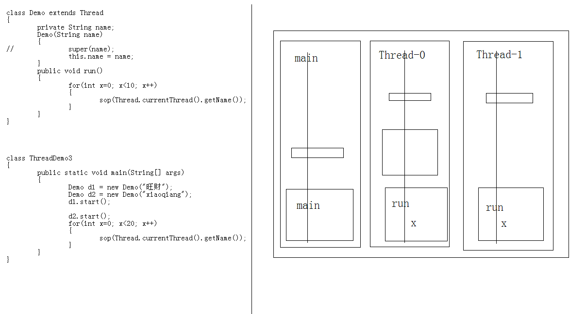
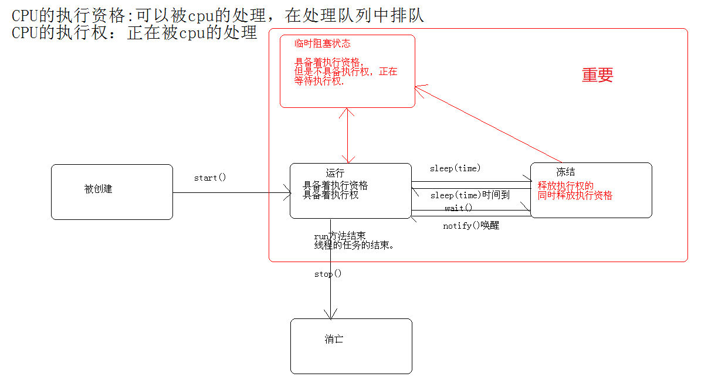

# 多线程

[[toc]]

## 进程 & 线程

### 进程
- 正在进行中的程序

### 线程
- **进程中**一个负责**程序执行的控制单元**(执行路径)
- 一个进程中至少要有一个线程（否则这个进程根本没有存在的意义）
- 多线程
    - 一个进程中有多个执行路径
    - 为了同时运行多部分代码，每个线程都运行自己要执行的任务

## 多线程的优缺点
- 优点：解决了多部分同时运行的问题
- 缺点：线程太多回到效率的降低
- 原因：**其实应用程序的同时执行都是 CPU 在做着快速的切换完成的，这个切换是随机的，也就是说，一个 CPU 在一个时刻只执行一个线程**

## JVM中的多线程 [重要]
- JVM启动时就启动了多个线程，至少可以分析出一下两个线程
    - 执行main函数的线程
    - 负责垃圾回收的线程
- 在`Object`中有个`protected void finalize()`方法，当对象没有引用时 called garbage collector 回收它自己
- e.g.

```
class Demo extends Object
{
	public void finalize()
	{
		System.out.println("demo ok");
	}
}

class  ThreadDemo
{
	public static void main(String[] args) 
	{

		new Demo();
		new Demo();
		new Demo();
		System.gc();  // Runs the garbage collector
		System.out.println("Hello World!");
	}
}

Output:
Hello World!
demo ok
demo ok
demo ok
```

- Example 中`System.out.println("Hello World!");`先执行了，是因为**垃圾回收和主函数是两个不同的线程在运行，而主线程执行的快些**
- 有时也会出现这种情况，因为垃圾回收线程还没运行完，整个进程结束了，进程中的线程都被清理掉了

```
Output:
Hello World!
demo ok
```

## 线程的创建 [重要]

### 方式一：继承 Thread 类
##### 步骤：
- 定义一个类继承 Thread 类
- 覆盖 Thread 类中的 run 方法
- 直接创建 Thread 的子类对象创建线程
- 调用 start 方法开启线程并调用线程的任务 run 方法执行

**e.g.** [ThreadDemo0](13_多线程/ThreadDemo0.txt)

##### Note：
- Thread 类用于描述线程，线程是需要任务的，所以Thread类也要有对任务的描述，写在`public void run()`方法中
- 直接调用`run()`方法并不能创建线程，要调用`start()`方法，通过`start()`方法调用`run()`方法才会创建新的线程
- 在例子中创建了两个线程，再加上一个主线程，在例子中主线程会在另外两个线程之前结束
- **获取线程的名称`getName()`，注意：线程的名称在创建线程的对象时就在其父类`Thread`中定义了，命名规则：Thread-编号(从0开始)**
- 也可以在构造器中改调用`super(name)`方法，可以自己给线程起名字
- 主线程的名字就是 main
- **获取当前正在运行的线程的方法`static Thread currentThread()`，静态方法直接调用`Thread.currentThread()`**
- 对比`start()`和`run()`的区别
    - **e.g.** [ThreadDemo1](13_多线程/ThreadDemo1.txt)
    
##### 多线程运行内存图解
- 解释了为什么`main`函数弹栈了`run`方法还能运行，因为每个线程有它自己的栈，一个线程运行完后释放自己的栈，不影响其他线程



### 方式二：实现 Runnable 接口

Runnable 接口中只有一个`run()`方法

##### 步骤
- 定义类实现`Runnable`接口
- 覆盖接口中的`run`方法，将线程的任务代码封装到`run`方法中
- 通过`Thread`类创建线程对象，并将`Runnable`接口的子类对象作为`Thread`类的构造函数的参数进行传递

```
class Demo implements Runnable {
	public void run() {
		show();
	}
	public void show() {
		for(int x=0; x<20; x++) {
			System.out.println(Thread.currentThread().getName()+"....."+x);
		}
	}
}

Demo d = new Demo();
Thread t1 = new Thread(d);  // 通过 Thread 类创建线程对象
```

- 调用线程对象的`start`方法开启线程

##### Thread 类的结构
Thread 类也实现了 Runnable 接口
```
class Thread {
    private Runnable r;
    
    public Thread() {
    
    }
    
    public Thread(Runnable r) {
        this.r = r;
    }
    
    public void run() {
        if (r != null)
            r.run();
    }
    
    public void start() {
        run();
    }
}
```

##### 优点
- 将线程的任务从线程的子类中分离出来，进行了单独的封装，按照面向对象的思想将任务的封装成对象
- 避免了 java 单继承的局限性。

## 多线程状态图 [重要]



## 买票实例（4个窗口卖一种票）[重要]

- **不能多次启动同一个线程，会触发`IllegalThreadStateException`异常**
```
t1.start();
t1.start();  // 非法
```

- **实现方法：实现 Runnable 接口**

```
class Ticket implements Runnable {
    private int num;
    
    public void run() {
        while(true) {
            if (num > 0) {
                try {
                    Thread.sleep(10);
                } catch(InterruptedException e) {
                    // 因为Runnable接口中的run方法并没有抛出异常，所以这个异常只能catch，不能throws
                }
                
                // 加了sleep(10)后，可能4个线程同时通过了if (num > 0)的检查判断，从而导致num变为复数
                System.out.println(Thread.currentThread().getName() + "...sale..." + num--);
            }
        }
    }
}

class  TicketDemo {
	public static void main(String[] args) {

		Ticket t = new Ticket();  // 就这一个对象，所以只有100张票

		Thread t1 = new Thread(t);
		Thread t2 = new Thread(t);
		Thread t3 = new Thread(t);
		Thread t4 = new Thread(t);

		t1.start();
		t2.start();
		t3.start();
		t4.start();
    }
}
```

## 线程安全问题 [重要]

**NOTE：上面代码 class Ticket 中的 run() 方法就会出现线程安全问题**

### 线程安全问题产生的原因
- 多个线程在操作共享数据
- **操作共享数据的线程代码有多行**
    - 即当一个线程在执行操作共享数据的**多行**代码时，**其他线程参与了运算**，就会导致线程安全问题的产生


### 解决思路
- **将多条操作共享数据的线程代码封装起来**，当有线程在执行这些代码的时候，其他线程时不可以参与运算的，必须要当前线程把这些代码都执行完毕后，其他线程才可以参与运算


### 线程安全问题的判断
- **看在线程运行的代码中是否有共享数据，即`run()`中是否有共享数据**


### 使用工具1 -- 同步代码块
##### 同步代码块格式
```
synchronized(对象) {
    需要被同步的代码;
}
```

##### e.g.
```
Object obj = new Object();

public void run() {
    synchronized(obj) {
        ...
    }
}
```


#### 同步代码块原理

- `synchronized(obj)`中，`obj`就是一个同步锁，当有一个线程进入到存在线程安全问题的多行代码中时，这个线程就会持有这个同步锁，其他的线程因为拿不到同步锁就无法进入同步代码块

#### 同步代码块的优缺点 & 前提
- **优点：**解决了线程的安全问题
- **缺点：**相对降低了效率，因为同步外的线程的都会判断同步锁
- **前提：**同步中必须有**多个线程**并使用**同一个锁**
    - 所以`Object obj = new Object()`要在`run()`方法外面，因为如果在`run()`方法里面，就会是每个线程有一个同步锁，不再满足同一个锁的前提，仍会出现线程安全问题


### 使用工具2 -- 同步函数
- 当需要封装进同步代码块的代码直接就是一个函数中的全部代码时，就直接把这个函数用关键字`synchronized`定义为同步函数进行简写
- **同步函数的同步锁是`this`**
    - 相当于
    ```
    synchronized(this) {
        ...
    }
    ```
- **静态同步函数的同步锁**
    - 该函数所属字节码文件对象，可以用`getClass`方法获取，也可以用当前`类名.class`表示
    - 相当于
    ```
    synchronized(this.getClass / Ticket.class) {
        ...
    }
    ```

### 同步代码块与同步函数的区别
- 同步函数的锁是固定的`this`
- 同步代码块的锁可以是任意的对象

*建议使用同步代码块*

## 单例模式的多线程问题 [重要]

```
class Single {
    private static Single s;
    private Single(){}
    
    public static Single getInstance() {
        if (s == null)
            -->0 -->1  // 两个线程同时到了这，就会 new 两个对象出来，产生线程安全问题
            s = new Single();
        return s;
    }
}
```

##### 解决方法

```
class Single {
    private static Single s;
    private Single(){}
    
    public static Single getInstance() {
        if (s == null) {                  // 外面的这个 if 判断解决了要进行同步锁判断的效率问题
            synchronized(Single.class) {  // synchronized 解决了线程安全问题
                if (s == null)
                    s = new Single();
            }
        }
        return s;
    }
}
```

## 死锁 [重要]

- 常见情形：同步的嵌套 & 多个锁，不同线程各持一个锁在等待另一个锁，并且都不放开自己已经持有的锁
- 死锁示例：[DeadLockTest](13_多线程/DeadLockTest.txt)

## 线程间的通信 [重要]

多个线程在处理同一资源，但是任务却不同


### 等待唤醒机制

##### 用到的方法（注意：这些方法都必须定义在同步中）
- `wait()`：让线程处于冻结状态，被`wait()`的线程会被存储到线程池中
- `notify()`：唤醒线程池中一个线程**(任意)**
- `notifyAll()`：唤醒线程池中的所有线程

##### NOTE
- **这些方法都必须定义在同步中**
    - 原因：因为这些方法是用于操作线程状态的方法，必须要明确**操作的是哪个锁上的线程**，所以这些方法其实是**调用了锁的方法**
- 因为是调用了锁的方法，所以它们都定义在了`Object`类中
    - 原因：因为锁可以是任意的对象，任意的对象调用的方式一定定义在`Object`类中
    
##### Example（单生产者单消费者问题）
- 原始版：[ResourceDemo](13_多线程/ResourceDemo.txt)
- 优化版：[OptimizedResourceDemo](13_多线程/OptimizedResourceDemo.txt)


### 多生产者多消费者问题

#### 出现的问题
##### 问题一
```
if (flag)
    try {wait();} catch (InterruptedException e) {}
...
```
在`wait()`处休眠的线程再次被唤醒后，不会再判断`flag`的值，而是直接往下运行，会导致不该运行的线程运行，出现数据错误的情况

##### 解决方法
```
while (flag)
    try {wait();} catch (InterruptedException e) {}
...
```
采用`while`判断标记

##### 问题二
`notify()`与`while(flag)`的搭配会导致死锁

##### 解决方法
采用`notifyAll()`解决了本方线程一定会唤醒对方线程的问题

#### Example
[ProducerConsumerDemo](13_多线程/ProducerConsumerDemo.txt)


### jdk1.5 后对多线程的改进
- `synchronized`中对于锁的操作是隐式的，jdk1.5 以后将同步和锁封装成了对象，将隐式动作变成了显示动作
- `Lock`接口：替代了同步代码块或者同步函数，将同步的隐式锁操作变成现实锁操作，并且可以在一个锁上加上多组监视器
    - `lock()`：获取锁。
    - `unlock()`：释放锁，通常需要定义finally代码块中

```
Lock l = ...;

l.lock();
try {
    // access the resource protected by this lock
} finally {
    l.unlock();
}
```
- `Condition`接口：出现替代了`Object`中的`wait()` `notify()` `notifyAll()`方法，将这些监视器方法单独进行了封装，变成`Condition`监视器对象
    - 替换方法为`await()` `signal()` `signalAll()`
    
#### Example
[JDK1_5_ProducerConsumerDemo](13_多线程/JDK1_5_ProducerConsumerDemo.txt)

#### Docs Example
```
class BoundedBuffer {
    final Lock lock = new ReentrantLock();
    final Condition notFull  = lock.newCondition();
    final Condition notEmpty = lock.newCondition();

    final Object[] items = new Object[100];
    int putptr, takeptr, count;

    public void put(Object x) throws InterruptedException {
        lock.lock();
        try {
            while (count == items.length)
                notFull.await();
            items[putptr] = x;
            if (++putptr == items.length) putptr = 0;
            ++count;
            notEmpty.signal();
        } finally {
            lock.unlock();
        }
    }

    public Object take() throws InterruptedException {
        lock.lock();
        try {
            while (count == 0)
                notEmpty.await();
            Object x = items[takeptr];
            if (++takeptr == items.length) takeptr = 0;
            --count;
            notFull.signal();
            return x;
        } finally {
            lock.unlock();
        }
    }
}
```

## `wait()`和`sleep()`的区别

- `wait()`可以指定时间也可以不指定，`sleep()`必须指定时间
- 在同步中时，对 CPU 的执行权和锁的处理不同
    - `wait()`：释放执行权，释放锁
    - `sleep()`：释放执行权，不释放锁

## 同步的注意事项

- 同步代码块中可以存活多个线程，但运行的只有一个线程，因为只有一个线程可以拿到锁

```
class Demo {
	void show() {
		synchronized(this) {
			wait(); // t0 t1 t2 三个线程都在同步代码块中存活，但运行时还是要一个一个运行的
		}
	}
    
	void method() {
		synchronized(this) { // t4
			notifyAll();
		}
	}
}
```


## 停止线程

- `stop()`方法（官方的不推荐使用）
- `run()`方法结束

##### 怎么控制线程的任务结束呢?
- 任务中都会有循环结构，只要控制住循环就可以结束任务
- 控制循环通常就用定义标记来完成

```
private boolean flag;

public synchronized void run() {
    while (flag) {
    ...
    }
}
```

##### 但是如果线程处于了冻结状态，无法读取标记，那应该如何结束呢？
- 可以使用`interrupt()`方法将线程从冻结状态强制恢复到运行状态中来，让线程具备 cpu 的执行资格
- 但强制的`interrupt()`动作会抛出`InterruptedException`，记得要处理

##### Example
[StopThread](13_多线程/StopThread.txt)

## 官方不推荐使用`stop()`和`suspend()`的原因
### 不推荐使用`stop()`的原因
- 因为它不安全，会造成数据的不完整
- 说明
    - `stop()`会解除由线程获取的所有锁定，当在一个线程对象上调用`stop()`方法时，这个线程对象所运行的线程就会立即停止
    - 假如一个线程正在执行：`synchronized void { x = 3; y = 4;}`，由于方法是同步的，多个线程访问时总能保证 x，y 被同时赋值，而如果一个线程正在执行到`x = 3;`时，被调用了`stop()`方法，即使在同步块中，它也干脆地 stop 了，这样就产生了不完整的残废数据
    - 而多线程编程中最最基础的条件是要保证数据的完整性

### 不推荐使用`suspend()`的原因
- 因为它容易发生死锁
- 说明
    - 调用`suspend()`的时候，目标线程会停下来，但却仍然持有在这之前获得的锁定
    - 此时，其他任何线程都不能访问锁定的资源，除非被“挂起”的线程恢复运行
    - 对任何线程来说，如果它们想恢复目标线程，同时又试图使用一个锁定的资源，就会造成死锁

## 守护线程（后台线程）
**`setDaemon()`**

- 当所有剩余运行的线程都是守护线程（后台线程）后，java 虚拟机会退出执行
    - 即所有的前台线程都结束后，剩下的后台线程就自动结束了
- 为什么叫“守护线程”
    - 来自圣斗士星矢，星矢是守护雅典娜的，雅典娜就是前台线程，星矢就是守护线程，如果雅典娜都没了，星矢自然就没有存在的必要了
- 例子：`t1`和`main`线程结束后，`t2`线程自动结束

```
StopThread st = new StopThread();

Thread t1 = new Thread(st);
Thread t2 = new Thread(st);

t1.start();
t2.setDaemon(true);
t2.start();
```


## `join()`方法

```
t0.join();
```

- `t0`线程要申请加入进来运行
- 用在临时加入一个线程运算时
- `join()`方法会使当前运行的线程冻结，直到调用`join()`方法的线程运行完毕后，才再次开始运行
- 因为有冻结线程的能力，所以会抛出`InterruptedException`异常

## `toString()`方法

##### 输出
```
Thread[线程名，优先级，线程组]
```

##### 优先级
- 优先级范围 1~10，6 7 差距不大，但 1 5 10 差距就比较大了，优先级大只是这个线程的执行频率变高，并不是会一直执行这个线程直至结束

```
t2.setPriority(Thread.MAX_PRIORITY);
```

## `yield()`方法

```
Thread.yield();  // 释放执行权
```

## 两个小问题

##### 问题一
```
class Test implements Runnable {
	public void run(Thread t){
    }
}
```
错在没有实现`Runnable`接口的方法

##### 问题二
```
class ThreadTest {
	public static void main(String[] args) {

		new Thread(new Runnable() {
			public void run() {
				System.out.println("runnable run");
			}
		}) {
			public void run() {
				System.out.println("subThread run");
			}
		}.start();
    }
}
```
输出：`subThread run`，因为以子类方法为主，而`public Thread(Runnable target)`构造器相当于将 Thread 的 parent 赋成 target
