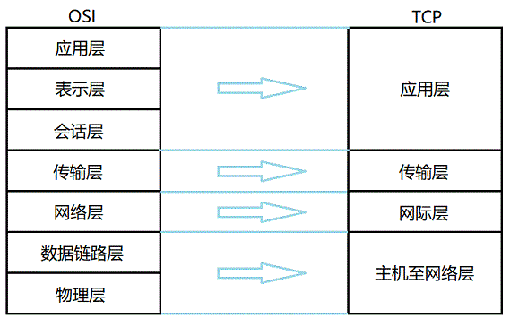
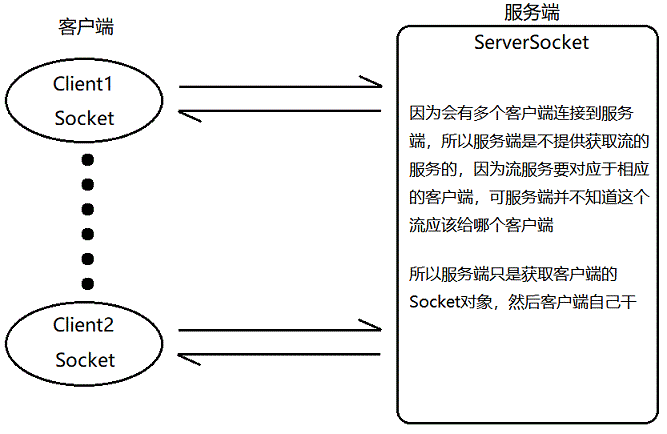
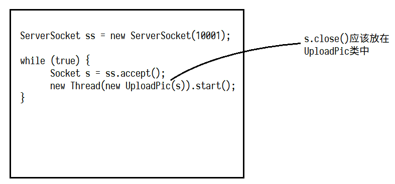

# 网络编程

## 网络模型

### OSI & TCP 分层模型



### 网络通讯要素

- **IP地址**
    - 网络中的设备标识
    - 本地回环地址：127.0.0.1 / localhost
- **端口号**
    - 用于标识进程的逻辑地址（要不然数据到了另一台设备会不知道把数据交给谁来解析）
    - 有效端口：1 ~ 65535，其中 0 ~ 1024 为系统使用或保留端口
- **传输协议**
    - UDP
        - 不需要建立连接，因此速度快，但也不可靠
        - 将数据及源和目的封装在数据包中，每个数据包大小限制在64k以内
    - TCP
        - 需要建立连接，因此可靠，但速度会变慢
        - 通过三次握手建立连接，形成传输数据的通道
        - 可以在连接中进行大量数据传输

## IP 对象
- `java.net`包
- 无构造方法，用`get……`方法获取对象，要抛`UnknownHostException`异常
- `getAllByName()`方法，返回`InetAddress[]`，因为有的主机IP地址不唯一

### InetAddress

- `InetAddress`
    - `Inet4Address`
    - `Inet6Address`
    
```java
import java.net.InetAddress;
import java.net.UnknownHostException;

public class InetAddressDemo {
    public static void main(String[] args) throws UnknownHostException {
        InetAddress ip = InetAddress.getByName("www.baidu.com");
        System.out.println(ip.getHostAddress() + "\t\t" + ip.getHostName());

        InetAddress myIP = InetAddress.getLocalHost();
        System.out.println(myIP.getHostAddress() + "\t\t" + myIP.getHostName());
    }
}

/* Output:
220.181.112.244     www.baidu.com
10.137.218.152      Bean-PC
*/
```

### 域名解析 (DNS)

- Domain Name System (DNS)
- 我们访问其他主机还是通过 IP 地址来访问的，但是 IP 地址不如主机名好记，为了在主机名和 IP 地址之间形成对应关系，我们需要一张 DNS 表
- com：盈利组织，org：非盈利组织
- 可以设置系统里的 hosts 文件来屏蔽恶意网站，例如
```
127.0.0.1    www.baidu345.com
```

## Socket

- 为网络服务提供的一种机制。
- 通信两端都有 Socket，就像港口。
- 网络通信其实就是 Socket 间的通信。
- 数据在两个 Socket 间通过 IO 传输。

## UDP 协议

- `java.net.DatagramSocket`
- `java.net.DatagramPacket`

### 发送端
- 建立 UDP 的 Socket 服务；
- 将要发送的数据封装到数据包中；
- 通过 UDP 的 Socket 服务将数据包发送出去；
- 关闭 Socket 服务。

```java
public class UDPSendDemo {
    public static void main(String[] args) throws IOException {
        DatagramSocket send = new DatagramSocket();
        String sendMess = "Hi, I'm Beanzy";
        byte[] sendByte = sendMess.getBytes();
        InetAddress aimIP = InetAddress.getByName("localhost");
        DatagramPacket sendBag = new DatagramPacket(sendByte, sendByte.length, aimIP, 4000);
        send.send(sendBag);
        send.close();
    }
}
```

### 接收端
- 建立 UDP Socket 服务,因为是要接收数据，必须要明确一个端口号；
- 创建数据包，用于存储接收到的数据，方便用数据包对象的方法解析这些数据；
- 使用 Socket 服务的 receive 方法将接收的数据存储到数据包中；
- 通过数据包的方法解析数据包中的数据；
- 关闭资源。

```java
public class UDPReceiveDemo {
    public static void main(String[] args) throws IOException {
        DatagramSocket receive = new DatagramSocket(4000);

        byte[] buf = new byte[1024];
        DatagramPacket receBag = new DatagramPacket(buf, buf.length);
        receive.receive(receBag);  // 阻塞式，收不到就等着

        String ip = receBag.getAddress().getHostAddress();
        int port = receBag.getPort();
        String mess = new String(receBag.getData(), 0, receBag.getLength());

        System.out.println("From " + ip + ":" + port + "    " + mess);
        receive.close();
    }
}
```

### 多线程 Chat

```java
public class ChatDemo {
    public static void main(String[] args) throws SocketException, UnknownHostException {
        InetAddress ip = InetAddress.getLocalHost();
        int port = 10001;
        DatagramSocket send = new DatagramSocket();
        DatagramSocket rece = new DatagramSocket(port);

        new Thread(new UDPReceiveThread(rece)).start();
        new Thread(new UDPSendThread(send, ip, port)).start();
    }
}

public class UDPSendThread implements Runnable {
    private DatagramSocket send;
    private InetAddress ip;
    private int port;
    private static final int BUF_SIZE = 1024;

    public UDPSendThread(DatagramSocket send, InetAddress ip, int port) {
        this.send = send;
        this.ip = ip;
        this.port = port;
    }

    @Override
    public void run() {
        BufferedReader br = new BufferedReader(new InputStreamReader(System.in));
        String mess = null;

        try {
            while ((mess = br.readLine()) != null) {
                byte[] buf = new byte[BUF_SIZE];
                buf = mess.getBytes();
                DatagramPacket sendPac = new DatagramPacket(buf, buf.length, ip, port);
                send.send(sendPac);

                if (mess.equals("bye")) break;
            }
        } catch (IOException e) {
            e.printStackTrace();
        } finally {
            send.close();
        }
    }
}

public class UDPReceiveThread implements Runnable {
    private DatagramSocket receive;
    private static final int BUF_SIZE = 1024;

    public UDPReceiveThread(DatagramSocket receive) {
        this.receive = receive;
    }

    @Override
    public void run() {
        while (true) {
            byte[] buf = new byte[BUF_SIZE];
            DatagramPacket recePac = new DatagramPacket(buf, buf.length);
            try {
                receive.receive(recePac);
            } catch (IOException e) {
                e.printStackTrace();
            }
            String ip = recePac.getAddress().getHostAddress();
            int port = recePac.getPort();
            String mess = new String(recePac.getData(), 0, recePac.getLength());
            System.out.println(ip + ":" + port + "    " + mess);

            if (mess.equals("bye")) break;
        }
        receive.close();
    }
}
```

## TCP 协议

- `java.net.Socket`
- `java.net.ServerPacket`



### 客户端
- 创建 TCP 客户端 Socket 服务。使用的是 `Socket` 对象，建议该对象一创建就明确目的地。要连接的主机。 
- 如果连接建立成功，说明数据传输通道已建立
    - 该通道就是 Socket 流 ,是底层建立好的
    - 这里既有输入，又有输出
    - 想要输入或者输出流对象，可以找 Socket 来获取，可以通过 `getOutputStream()`，和 `getInputStream()` 来获取两个字节流
- 使用输出流，将数据写出
- 关闭资源


### 服务端
- 创建服务端 Socket 服务，通过 `ServerSocket` 对象
- 服务端必须对外提供一个端口，否则客户端无法连接
- 获取连接过来的客户端 `Socket` 对象
- 通过客户端对象获取 Socket 流读取客户端发来的数据
- 关闭资源，关客户端，关服务端


### 客户端和服务端交互

##### 客户端
```java
public class ClientDemo {
    public static void main(String[] args) throws IOException {
        Socket client = new Socket(InetAddress.getLocalHost(), 10001);

        OutputStream out = client.getOutputStream();
        out.write("Hello, I'm Bean".getBytes());

        InputStream in = client.getInputStream();
        byte[] buf = new byte[1024];
        int len = in.read(buf);
        String mess = new String(buf, 0, len);
        System.out.println(mess);

        client.close();
    }
}
```

##### 服务端
```java
public class ServerDemo {
    public static void main(String[] args) throws IOException {
        ServerSocket server = new ServerSocket(10001);

        Socket client = server.accept();
        String ip = client.getInetAddress().getHostAddress();
        int port = client.getPort();

        InputStream in = client.getInputStream();
        byte[] buf = new byte[1024];
        int len = in.read(buf);
        String mess = new String(buf, 0, len);
        System.out.println(ip + ":" + port + "  " + mess);

        OutputStream out = client.getOutputStream();
        out.write("I know you ...".getBytes());

        client.close();
        server.close();
    }
}
```

### 多线程服务端原理图


## 浏览器运行原理

##### 浏览器向服务器发送的内容

```
GET / HTTP/1.1  请求行  请求方式  /myweb/1.html  请求的资源路径   http协议版本。
请求消息头 . 属性名：属性值
Accept: image/gif, image/x-xbitmap, image/jpeg, image/pjpeg, application/x-shockwave-flash, 
application/vnd.ms-excel, application/vnd.ms-powerpoint, application/msword, */*
Accept: */*     
Accept-Language: zh-cn,zu;q=0.5
Accept-Encoding: gzip, deflate
User-Agent: Mozilla/4.0 (compatible; MSIE 6.0; Windows NT 5.1; SV1; InfoPath.2)
Host: 192.168.1.100:9090
// Host: www.huyouni.com:9090
Connection: Keep-Alive
// 空行
// 请求体
```

##### 服务端发回应答消息

```
HTTP/1.1 200 OK   //应答行，http的协议版本   应答状态码   应答状态描述信息

应答消息属性信息。 属性名：属性值
Server: Apache-Coyote/1.1
ETag: W/"199-1323480176984"
Last-Modified: Sat, 10 Dec 2011 01:22:56 GMT
Content-Type: text/html
Content-Length: 199
Date: Fri, 11 May 2012 07:51:39 GMT
Connection: close
// 空行
// 应答体。
<html>
	<head>
		<title>这是我的网页</title>
	</head>

	<body>

		<h1>欢迎光临</h1>

		<font size='5' color="red">这是一个tomcat服务器中的资源。是一个html网页。</font>
	</body>


</html>
```

## URL 类

```java
public class URLDemo {
    public static void main(String[] args) throws IOException {
        String url = "http://127.0.0.1:8080/examples/servlets/helloworld.html";
        URL tomcat = new URL(url);

        InputStream in = tomcat.openStream();  // 这行的原理是下两行
        URLConnection conn = tomcat.openConnection();
        InputStream in = conn.getInputStream();

        byte[] buf = new byte[1024];
        int len = 0;

        StringBuilder text = new StringBuilder();
        while ((len = in.read(buf)) != -1) {
            text.append(new String(buf, 0, len));
        }
        System.out.println(text.toString());
    }
}
```

## 常见网络结构

### C/S  client/server

##### 特点：
- 该结构的软件，客户端和服务端都需要编写
- 可发成本较高，维护较为麻烦
		
##### 好处：
- 客户端在本地可以分担一部分运算


### B/S  browser/server

##### 特点：
- 该结构的软件，只开发服务器端，不开发客户端，因为客户端直接由浏览器取代
- 开发成本相对低，维护更为简单
	
##### 缺点：
- 所有运算都要在服务端完成
