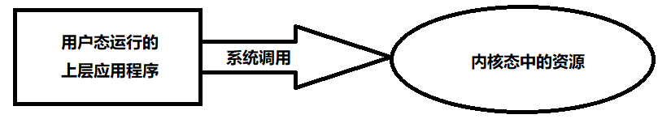
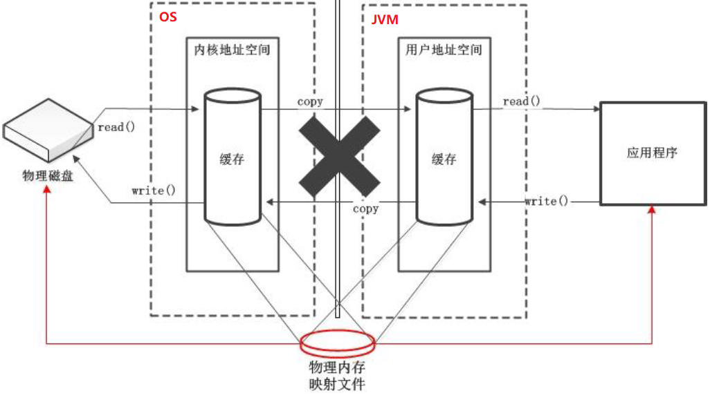
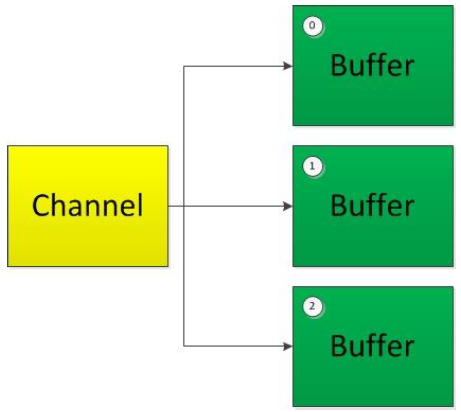

# Java NIO

NIO，就是 New IO，是非阻塞 IO。支持面向缓冲区，基于通道的 IO 操作。

传统的 IO 是面向流的，并且是单向的。如果要进行双工的通信，要建立两个流，一个输入流，一个输出流。

NIO 是面向缓冲区的，是双向的，通信双方建立一个通道，然后把数据存放在缓冲区中，然后缓冲区在通道中流动进行数据的传输。打个比方，通道 —— 铁路，缓冲区 —— 火车，数据 —— 人，一堆人想要从 A 地到达 B 地，首先需要把人装上火车，然后火车在铁路上从 A 地跑到 B 地，实现将人从 A 地运到 B 地；同样的道理，一堆数据如果想要从 A 地运到 B 地，需要先把数据装入缓冲区，然后将缓冲区从 A 地跑到 B 地，从而实现将数据从 A 地运到 B 地。

<!-- TOC -->

- [Java NIO](#java-nio)
    - [缓冲区 Buffer](#缓冲区-buffer)
        - [缓冲区中的核心属性](#缓冲区中的核心属性)
        - [直接缓冲区与非直接缓冲区](#直接缓冲区与非直接缓冲区)
        - [常用方法代码示例](#常用方法代码示例)
    - [通道 Channel](#通道-channel)
        - [主要实现类](#主要实现类)
        - [获取通道](#获取通道)
        - [通道之间的数据传输](#通道之间的数据传输)
        - [分散读取与聚集写入](#分散读取与聚集写入)
        - [代码示例](#代码示例)
    - [阻塞与非阻塞](#阻塞与非阻塞)
        - [IO 的进化之路](#io-的进化之路)
        - [select、poll、epoll](#selectpollepoll)
        - [NIO 完成网络通信的三个核心](#nio-完成网络通信的三个核心)
        - [阻塞式网络通信](#阻塞式网络通信)
        - [非阻塞式网络通信](#非阻塞式网络通信)
    - [管道 Pipe](#管道-pipe)
        - [代码示例](#代码示例-1)

<!-- /TOC -->

## 缓冲区 Buffer

首先，有这些个 Buffer 种类：

- ByteBuffer
- CharBuffer
- ShortBuffer
- IntBuffer
- LongBuffer
- FloatBuffer
- DoubleBuffer

*简而言之就是，8 个基本类型，除了 reference 都有相应类型的缓冲区在。*

### 缓冲区中的核心属性

```java
// Invariants: mark <= position <= limit <= capacity
private int mark = -1;    // 可以记录当前 position 的位置，然后调用 reset()，可以把 position 恢复到这个位置
private int position = 0; // 缓冲区中正在操作的数据的位置
private int limit;        // 缓冲区中可以操作数据的大小，limit 后的数据是不能进行读写的
private int capacity;     // 缓冲区中最大存储数据的容量，一旦声明不能改变 
```

> **Note：** 抽象类虽然自身不可以实例化，但是其子类覆盖了所有的抽象方法后，是可以实例化的，所以抽象类的构造函数，适用于给其子类对象进行初始化的。
>
> 所以对于 `ByteBuffer.allocate()` 方法，实际上是新建了一个 ByteBuffer 抽象类的子类 HeapByteBuffer 对象，HeapByteBuffer 类实现了 ByteBuffer 的所有抽象方法，所以我们可以通过调用 ByteBuffer 抽象类的构造函数来初始化 HeapByteBuffer 对象。

### 直接缓冲区与非直接缓冲区

|              | 非直接缓冲区              | 直接缓冲区                                         |
| ------------ | ------------------------- | -------------------------------------------------- |
| **分配方法** | `allocate()`              | `allocateDirect()`                                 |
| **特点**     | 将缓冲区建立在 JVM 内存中 | 将缓冲区建立在物理内存 (直接内存) 中，可以提高效率 |

可以通过 `isDirect()` 来判断当前的缓冲区是不是直接缓冲区。

**为什么使用直接缓冲区可以提高效率呢？**

正常情况下，如果你想将一些数据写到物理磁盘上，你需要先将数据从 JVM 内存中 copy 到内核地址空间，因为内核才真正具有控制计算机硬件资源的功能，用户态运行的上层应用程序只能通过系统调用来让内核态的资源来帮助将数据写入硬盘。



当要将一个超大的文件写到硬盘上时，这个 copy 的操作就显得很费时了。


而使用直接内存，我们可以操作物理磁盘在内存中的内存映射文件，来直接将物理硬盘上的数据加载进内存，或者将内存中的写入硬盘中，而这个映射，其实是一个物理地址到逻辑地址的转换（或者逆过程）。



### 常用方法代码示例

```java
public class BufferDemo {
    private ByteBuffer buffer = ByteBuffer.allocate(1024);
    private ByteBuffer directBuffer = ByteBuffer.allocateDirect(1024);

    /**
     * 打印 buffer 的 4 大核心属性
     */
    @Test
    public void test0() {
        System.out.println(buffer.position());
        System.out.println(buffer.limit());
        System.out.println(buffer.capacity());
        System.out.println("---------------------");
    }

    /**
     * Test put, get, flip, rewind,
     */
    @Test
    public void test1() {
        String str = "abcde";
        /* put：向缓冲区中写入数据 */
        buffer.put(str.getBytes());
        System.out.println(buffer.position()); // 5
        System.out.println(buffer.limit());    // 1024
        System.out.println(buffer.capacity()); // 1024
        System.out.println("---------------------");

        /* flip：将缓冲区从写状态切换到读状态 */
        buffer.flip();
        System.out.println(buffer.position()); // 0
        System.out.println(buffer.limit());    // 5
        System.out.println(buffer.capacity()); // 1024
        System.out.println("---------------------");

        /* get：从缓冲区中读数据出来 */
        byte[] tmp = new byte[2];
        buffer.get(tmp);
        System.out.println("get result: " + new String(tmp));
        System.out.println(buffer.position());  // 2
        System.out.println(buffer.limit());     // 5
        System.out.println(buffer.capacity());  // 1024
        System.out.println(buffer.remaining()); // 3，看看还有多少元素可读
        System.out.println("---------------------");

        /* mark：记录当前 position 的位置到 mark 变量 */
        /* reset：令 position = mark */
        buffer.mark();
        buffer.get(tmp);
        System.out.println("get result: " + new String(tmp));
        System.out.println("before reset: position = " + buffer.position()); // 4
        buffer.reset();
        System.out.println("after reset: position = " + buffer.position());  // 2
        System.out.println("---------------------");

        /* rewind：令 position = 0，就是个倒带的操作 */
        buffer.rewind();
        System.out.println(buffer.position());  // 0
        System.out.println(buffer.limit());     // 5
        System.out.println(buffer.capacity());  // 1024
        System.out.println(buffer.remaining()); // 5
        System.out.println("---------------------");
        
        /* compact：从读状态切换回写状态，可以接着上回写的地方继续往下写 */
        buffer.compact();
        System.out.println(buffer.position());  // 5
        System.out.println(buffer.limit());     // 1024
        System.out.println(buffer.capacity());  // 1024
        System.out.println(buffer.remaining()); // 1019
        System.out.println("---------------------");
                
        /* clear，实际上并没有将数据真的清除，只有当新的数据把旧的数据覆盖了，旧的数据才真的被清除 */
        buffer.clear();
        System.out.println(buffer.position());  // 0
        System.out.println(buffer.limit());     // 1024
        System.out.println(buffer.capacity());  // 1024
        System.out.println(buffer.remaining()); // 1024
        System.out.println("---------------------");

        /* isDirect：判断缓冲区是不是直接内存缓冲区 */
        System.out.println(buffer.isDirect());       // false
        System.out.println(directBuffer.isDirect()); // true
        System.out.println("---------------------");
    }
}
```


## 通道 Channel

用于连接两个节点。在 NIO 中负责缓冲区中数据的传输，它本身是不能存储数据的。

### 主要实现类

- `java.nio.channels.Channel` 接口
  - 本地传输：
    - FileChannel
  - 网络传输：
    - SocketChannel
    - ServerSocketChannel
    - DatagramChannel

### 获取通道

Java 中以下类拥有 `getChannel()` 方法，可以通过这个方法获取对应的通道。

- 本地 IO
	- FileInputStream / FileOutputStream
	- RandomAccessFile
- 网络 IO
	- Socket
	- ServerSocket
	- DatagramSocket

除此之外，JDK 1.7 中的 AIO 还提供了以下两种获取通道的方式：

- 为各个通道提供了静态方法 `open()`
- `Files.newByteChannel()`

### 通道之间的数据传输

- `transferFrom()`
- `transferTo()`

### 分散读取与聚集写入

就是以前是用一个缓冲区协助通道传输数据，Scatter 和 Gather 就是用一堆缓冲区（缓冲区数组）协助通道传输数据。

| 分散读取 Scattering Reads：按照缓冲区的顺序，将从 Channel 中读取的数据依次将 Buffer 填满。 | 聚集写入 Gathering Writes：按照缓冲区的顺序，写入position 和 limit 之间的数据到 Channel 。 |
| ------------------------------------------------------------ | ------------------------------------------------------------ |
|                           |                           |

### 代码示例

```java
public class ChannelDemo {
    /**
     * 利用通道完成文件的复制（非直接缓冲区）
     */
    @Test
    public void copyFile1() {
        FileInputStream in = null;
        FileOutputStream out = null;
        FileChannel inChannel = null;
        FileChannel outChannel = null;
        try {
            in = new FileInputStream("1.png");
            out = new FileOutputStream("2.png");
            inChannel = in.getChannel();
            outChannel = out.getChannel();
            ByteBuffer buffer = ByteBuffer.allocate(1024);
            while (inChannel.read(buffer) != -1) {
                buffer.flip();
                outChannel.write(buffer);
                buffer.clear();
            }
        } catch (FileNotFoundException e) {
            e.printStackTrace();
        } catch (IOException e) {
            e.printStackTrace();
        } finally {
            try {
                if (in != null) {
                    in.close();
                }
                if (out != null) {
                    out.close();
                }
                if (inChannel != null) {
                    inChannel.close();
                }
                if (outChannel != null) {
                    out.close();
                }
            } catch (IOException e) {
                e.printStackTrace();
            }
        }
    }

    /**
     * 使用直接缓冲区完成文件的复制(内存映射文件)，通过 Channel 的 map 方法获取的缓冲区就是直接缓冲区
     */
    @Test
    public void copyFile2() {
        FileChannel inChannel = null;
        FileChannel outChannel = null;
        try {
            inChannel = FileChannel.open(Paths.get("1.png"), StandardOpenOption.READ);
            outChannel = FileChannel.open(Paths.get("2.png"), StandardOpenOption.WRITE,
                    StandardOpenOption.READ, StandardOpenOption.CREATE);
            MappedByteBuffer inBuffer = inChannel.map(
                FileChannel.MapMode.READ_ONLY, 0, inChannel.size());
            MappedByteBuffer outBuffer = outChannel.map(
                FileChannel.MapMode.READ_WRITE, 0, inChannel.size());

            byte[] dst = new byte[inBuffer.limit()];
            inBuffer.get(dst);
            outBuffer.put(dst);
        } catch (IOException e) {
            e.printStackTrace();
        } finally {
            if (inChannel != null) {
                try {
                    inChannel.close();
                } catch (IOException e) {
                    e.printStackTrace();
                }
            }
            if (outChannel != null) {
                try {
                    outChannel.close();
                } catch (IOException e) {
                    e.printStackTrace();
                }
            }
        }
    }

    /**
     * 通道之间的数据 transfer (直接缓冲区)
     */
    @Test
    public void copyFile3() {
        FileChannel inChannel = null;
        FileChannel outChannel = null;
        try {
            inChannel = FileChannel.open(Paths.get("1.png"), StandardOpenOption.READ);
            outChannel = FileChannel.open(Paths.get("2.png"), StandardOpenOption.WRITE,
                    StandardOpenOption.READ, StandardOpenOption.CREATE);
            // 以下两行效果相等
            inChannel.transferTo(0, inChannel.size(), outChannel);
            outChannel.transferFrom(inChannel, 0, inChannel.size());
        } catch (IOException e) {
            e.printStackTrace();
        } finally {
            if (inChannel != null) {
                try {
                    inChannel.close();
                } catch (IOException e) {
                    e.printStackTrace();
                }
            }
            if (outChannel != null) {
                try {
                    outChannel.close();
                } catch (IOException e) {
                    e.printStackTrace();
                }
            }
        }
    }
}
```


## 阻塞与非阻塞

### IO 的进化之路

**阻塞 IO**

通常 IO 操作都是阻塞 I/O 的，也就是说当你调用 read 时，如果没有数据收到，那么线程或者进程就会被挂起，直到收到数据。

这样，当服务器需要处理 1000 个连接的的时候，而且只有很少连接忙碌的，那么会需要 1000 个线程或进程来处理 1000 个连接，而 1000 个线程大部分是被阻塞起来的。由于 CPU 的核数或超线程数一般都不大，比如 4,8,16,32,64,128，比如 4 个核要跑1000 个线程，那么每个线程的时间槽非常短，而 **线程切换非常频繁**。这样会出现如下问题：

- **线程是有内存开销的** ，1 个线程可能需要 512K（或 2M）存放栈，那么 1000 个线程就要 512M（或 2G）内存。
- 线程的切换，或者说上下文切换是有 CPU 开销的，**当大量时间花在上下文切换的时候，分配给真正的操作的 CPU 就要少很多。**

这就出现了非阻塞 IO。

**非阻塞 IO**

非阻塞 IO 就是，当你调用 read 时，如果有数据收到，就返回数据，如果没有数据收到，就立刻返回一个错误。这样是不会阻塞线程了，但是你还是要不断的轮询看看数据准备好没，如果准备好了就读取或写入。

因为 **有轮询这个操作，会引入不必要的 CPU 资源浪费。**

**IO 多路复用**

多路复用是指使用一个线程来检查多个文件描述符（Socket）的就绪状态，比如调用 select、poll、epoll 函数，传入多个文件描述符，如果有一个文件描述符就绪，则返回，否则阻塞直到超时。得到就绪状态后进行真正的操作可以在同一个线程里执行，也可以启动线程执行（比如使用线程池）。

**异步 IO**

就是 AIO，这个其实用的很少。

用户进程发起 read 操作之后，立刻就可以开始去做其它的事。而另一方面，从 kernel 的角度，当它受到一个 asynchronous read 之后，首先它会立刻返回，所以不会对用户进程产生任何 block。然后，kernel 会等待数据准备完成，然后将数据拷贝到用户内存，当这一切都完成之后，kernel 会给用户进程发送一个 signal，告诉它 read 操作完成了。

那么异步 IO 这么牛逼，为啥还用的少呢？主要有以下几个原因：

- 在 Linux 系统上，AIO 的底层实现仍使用 EPOLL，没有很好实现 AIO，因此在性能上没有明显的优势。作者原话：Not faster than NIO (epoll) on unix systems (which is true)。
- AIO 还有个缺点是接收数据需要预先分配缓存，而不是 NIO 那种需要接收时才需要分配缓存, 所以对连接数量非常大但流量小的情况，内存浪费很多。

### select、poll、epoll

目前支持 I/O 多路复用的系统调用有 select，poll，epoll。

I/O 多路复用就是通过一种机制，一个进程可以监视多个描述符，一旦某个描述符就绪（一般是读就绪或者写就绪），能够通知程序进行相应的读写操作。但 select，pselect，poll，epoll 本质上都是同步 I/O，因为他们都需要在读写事件就绪后自己负责进行读写，也就是说这个读写过程是阻塞的，而异步 I/O 则无需自己负责进行读写，异步 I/O 的实现会负责把数据从内核拷贝到用户空间。

**select**

select 函数监视的文件描述符分 3 类，分别是 writefds、readfds、和 exceptfds。调用后 select 函数会阻塞，直到有描述符就绪（有数据 可读、可写、或者有 except），或者超时（timeout 指定等待时间，如果立即返回设为 null 即可），函数返回。当select 函数返回后，可以通过遍历 fdset，来找到就绪的描述符。

但是 select 有 3 个缺点：

- 在 Linux 上，单个进程最多能够监视 1024 个文件描述符。
- 对 socket 进行扫描时是线性扫描，即采用轮询的方法，效率较低。
- 需要维护一个用来存放大量 fd 的数据结构，这样会使得用户空间和内核空间在传递该结构时复制开销大。

**poll**

本质上和 select 没有区别，只不过把存储就绪的文件描述符的的集合换成了链表，就没有最大连接数限制了。

**epoll**

是 select 和 poll 的增强版本。

它提供了 3 个系统函数：

- `int epoll_create(int size);`
	- **用来创建一个 epoll 描述符。** 它需要传入一个 size，给内核最初分配的空间大小一个建议，然后系统会在内核中分配一个空间来存放事件表，并返回一个 epoll 描述符，用来操作这个事件表。
- `int epoll_ctl(int epfd, int op, int fd, struct epoll_event *event);`
	- **用来增、删、改内核中的事件表。** 
- `int epoll_wait(int epfd, struct epoll_event *result_events, int maxevents, int timeout);`
	- **用来等待事件，用处和 `Selector#select()` 差不多。**

epoll 为每个文件描述符指定了一个回调函数，调用 epoll_ctl 时，就是注册了一个事件：在集合中放入文件描述符以及事件数据，并且加上一个回调函数。一旦文件描述符上的对应事件发生，就会调用回调函数，这个函数会把这个文件描述符加入到就绪队列上。当你调用 epoll_wait 时，它只是在查看就绪队列上是否有内容，有的话就返回给你的程序，不需要像 select 和 poll 那样把所有在监视的文件描述符遍历一遍，只是看看就绪队列是否为空而已。

### NIO 完成网络通信的三个核心

- 通道（Channel）：负责连接。
	- SocketChannel
	- ServerSocketChannel
	- DatagramChannel
	- Pipe.SinkChannel
	- Pipe.SourceChannel
- 缓冲区（Buffer）：负责数据存取。
- 选择器（Selector）：是 SelectableChannel 的多路复用器，用于监控 SelectableChannel 的 IO 状况。

### 阻塞式网络通信

```java
public class BlockSocketDemo {
    @Test
    public void client() throws IOException {
        // 1. 创建通道
        SocketChannel sc = SocketChannel.open(new InetSocketAddress("127.0.0.1", 9898));
        FileChannel fc = FileChannel.open(Paths.get("1.png"), StandardOpenOption.READ);
        // 2. 准备存数据的缓冲区
        ByteBuffer buffer = ByteBuffer.allocate(1024);
        // 3. 从图片文件中读取数据到缓冲区，然后在将缓冲区中的数据写入 SocketChannel
        while (fc.read(buffer) != -1) {
            buffer.flip();
            sc.write(buffer);
            buffer.clear();
        }
        sc.shutdownOutput();
        // 4. 等待服务器发来的成功接收的应答数据
        while (sc.read(buffer) != -1) {
            buffer.flip();
            System.out.print(new String(buffer.array(), 0, buffer.limit()));
            buffer.clear();
        }
        // 5. 关流
        fc.close();
        sc.close();
    }

    @Test
    public void server() throws IOException {
        // 1. 创建通道
        ServerSocketChannel ssc = ServerSocketChannel.open();
        FileChannel sfc = FileChannel.open(Paths.get("2.png"),
                StandardOpenOption.READ, StandardOpenOption.WRITE, StandardOpenOption.CREATE);
        // 2. 将 ServerSocketChannel 绑定在相应的端口上
        ssc.bind(new InetSocketAddress("127.0.0.1", 9898));
        // 3. 阻塞式等待客户端发来数据，接到数据后才会继续往下执行
        SocketChannel sc = ssc.accept();
        // 4. 创建缓冲区，从 SocketChannel 中读取数据，并将数据写入到服务端新建的文件通道中
        ByteBuffer buffer = ByteBuffer.allocate(1024);
        while (sc.read(buffer) != -1) {
            buffer.flip();
            sfc.write(buffer);
            buffer.clear();
        }
        // 5. 给客户端发送成功接收数据
        buffer.put("服务端已成功接收到你发来的数据".getBytes());
        buffer.flip();
        sc.write(buffer);
        // 6. 关流
        sc.close();
        sfc.close();
        ssc.close();
    }
}
```

### 非阻塞式网络通信

```java
public class NonBlockSocketDemo {
    @Test
    public void client() throws IOException, InterruptedException {
        // 1. 获取通道
        SocketChannel sc = SocketChannel.open(new InetSocketAddress("127.0.0.1", 9898));
        // 2. 切换非阻塞模式
        sc.configureBlocking(false);
        // 3. 分配指定大小的缓冲区
        ByteBuffer buffer = ByteBuffer.allocate(1024);
        // 4. 将数据写入缓冲区，并将缓冲区写入 SocketChannel
        for (int i = 0; i < 10; i++) {
            buffer.put((LocalDateTime.now().toString()).getBytes());
            buffer.flip();
            sc.write(buffer);
            buffer.clear();
            Thread.sleep(1000);
        }
        // 5. 关流
        sc.close();
    }

    @Test
    public void server() throws IOException {
        // 1. 获取通道
        ServerSocketChannel ssc = ServerSocketChannel.open();
        // 2. 切换非阻塞模式
        ssc.configureBlocking(false);
        // 3. 将 ServerSocketChannel 绑定在相应的端口上
        ssc.bind(new InetSocketAddress("127.0.0.1", 9898));
        // 4. 创建选择器
        Selector selector = Selector.open();
        // 5. ServerSocketChannel 把自己注册到选择器上
        // 选择注册哪个选择器是 channel 的动作，所以是 channel 来干
        ssc.register(selector, SelectionKey.OP_ACCEPT);

        /* 下面是重点，虽然这个写法真的好好麻烦 ... */
        // 首先是 selector.select() 这个方法，这个方法会返回当前已经准备好的 channel 的个数
        // 这个方法是一个阻塞方法，它只有在至少有一个 channel 被选择了时才会返回
        // 也就是说，当 selector.select() 有返回值了时，就说明有一个或多个 channel 准备就绪了
        while (selector.select() > 0) {
            // 我们可以通过 selector.selectedKeys() 获取选择器选择的 SelectionKey set
            Iterator<SelectionKey> it = selector.selectedKeys().iterator();
            // 然后遍历这个 set，处理每个 channel
            while (it.hasNext()) {
                SelectionKey sk = it.next();
                // 判断这个 SelectionKey 的类型，根据类型进行相应的处理
                if (sk.isAcceptable()) {
                    // 这个代码块是建立连接操作成功了，连接建立成功之后，我们就能拿到客户端的 SocketChannel 了
                    SocketChannel sc = ssc.accept();
                    sc.configureBlocking(false);
                    // 接下来我们就要开始 read SocketChannel 了，这也是个 IO 操作，
                    // 所以把它注册进选择器，进行监控
                    sc.register(selector, SelectionKey.OP_READ);
                } else if (sk.isReadable()) {
                    // 这个代码块是客户端的 SocketChannel 传来的数据准备好了，我们可以读了
                    SocketChannel sc = (SocketChannel) sk.channel();
                    ByteBuffer buffer = ByteBuffer.allocate(1024);
                    int len;
                    while ((len = sc.read(buffer)) > 0) {
                        buffer.flip();
                        System.out.println(new String(buffer.array(), 0, len));
                        buffer.clear();
                    }
                }
                // 处理完一个 SelectionKey 之后，不要忘记把它从选择器的选择集合中移除
                it.remove();
            }
        }

    }
}
```


## 管道 Pipe

Java NIO 的 Pipe 可以在两个线程之间建立单项的数据连接，管道有一个 `Pipe.SinkChannel` 和 一个 `Pipe.SourceChannel`，数据会被写到 `Pipe.SinkChannel`，然后从 `Pipe.SourceChannel` 中读取。

### 代码示例

```java
public class NioPipeDemo {
    @Test
    public void test() throws IOException {
        Pipe pipe = Pipe.open();
        Pipe.SinkChannel sinkChannel = pipe.sink();

        String str = "我是管道发来的数据";
        ByteBuffer byteBuffer = ByteBuffer.allocate(1024);
        byteBuffer.put(str.getBytes());
        byteBuffer.flip();
        while (byteBuffer.hasRemaining()) {
            sinkChannel.write(byteBuffer);
        }

        Pipe.SourceChannel sourceChannel = pipe.source();
        byteBuffer.clear();
        int len = sourceChannel.read(byteBuffer);
        System.out.println(new String(byteBuffer.array(), 0, len));

        sinkChannel.close();
        sourceChannel.close();
    }
}
```


