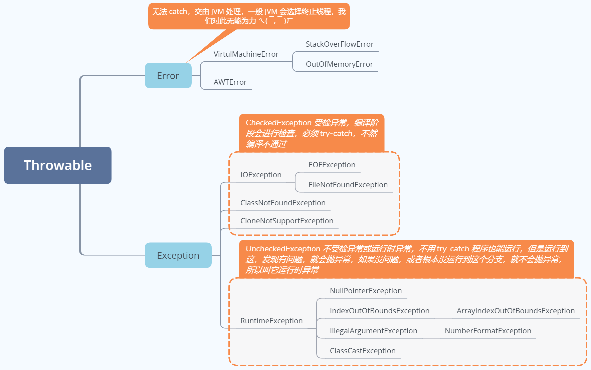
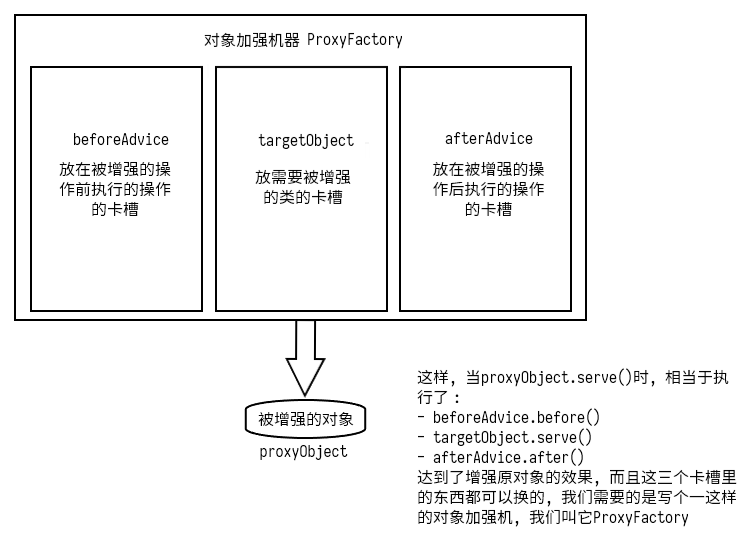

# Java 基础常见面试题

<!-- TOC -->

- [Java 基础常见面试题](#java-基础常见面试题)
    - [面向对象和面向过程的区别？](#面向对象和面向过程的区别)
    - [Java 的三个基本特性，在项目中那些地方用到多态](#java-的三个基本特性在项目中那些地方用到多态)
    - [方法的重载和重写](#方法的重载和重写)
        - [Java 中为什么静态方法不能被重写？](#java-中为什么静态方法不能被重写)
    - [自动装箱与拆箱](#自动装箱与拆箱)
    - [`==` 与 `equals`](#-与-equals)
    - [接口和抽象类的区别](#接口和抽象类的区别)
        - [区别](#区别)
        - [Java 抽象类可以实现接口吗？它需要实现接口的所有方法吗？](#java-抽象类可以实现接口吗它需要实现接口的所有方法吗)
    - [static 和 final 的区别和用途](#static-和-final-的区别和用途)
        - [static](#static)
        - [final](#final)
    - [Object 类的常见方法总结](#object-类的常见方法总结)
    - [String、StringBuffer、StringBuilder 以及对 String 不变性的理解](#stringstringbufferstringbuilder-以及对-string-不变性的理解)
        - [可变性](#可变性)
        - [线程安全性](#线程安全性)
        - [性能](#性能)
        - [对于三者使用的总结](#对于三者使用的总结)
        - [String 不变性的理解](#string-不变性的理解)
        - [String 有重写 Obiect 的 hashCode 和 toString 吗？](#string-有重写-obiect-的-hashcode-和-tostring-吗)
    - [Java 序列化](#java-序列化)
        - [如何实现序列化和反序列化](#如何实现序列化和反序列化)
        - [序列化的控制：Externalizable 接口](#序列化的控制externalizable-接口)
        - [Externalizable 接口的替代方法](#externalizable-接口的替代方法)
        - [常见的序列化协议](#常见的序列化协议)
    - [异常](#异常)
        - [Throwable 类常用方法](#throwable-类常用方法)
        - [异常处理总结](#异常处理总结)
    - [匿名内部类是什么？如何访问在其外面定义的变量？](#匿名内部类是什么如何访问在其外面定义的变量)
        - [4 个分类](#4-个分类)
    - [泛型](#泛型)
        - [泛型 `<?>` 与 `<T>` 的区别](#泛型--与-t-的区别)
    - [Java 枚举类](#java-枚举类)
    - [Java 反射](#java-反射)
    - [Java 动态代理](#java-动态代理)
    - [Socket](#socket)
        - [UDP 协议](#udp-协议)
        - [TCP 协议](#tcp-协议)
    - [Java 中的 NIO、BIO、AIO 分别是什么？](#java-中的-niobioaio-分别是什么)
        - [I/O 模型分类](#io-模型分类)

<!-- /TOC -->

## 面向对象和面向过程的区别？

面向过程是编年体，面向对象是纪传体。

- **面向过程：** 分析出解决问题所需要的步骤，然后用函数把这些步骤一步一步实现，使用的时候一个一个依次调用就可以了。
- **面向对象：** 把构成问题事物分解成各个对象，建立对象的目的不是为了完成一个步骤，而是为了描叙某个事物在整个解决问题的步骤中的行为。

例如设计一个五子棋游戏：

面向过程的设计思路是，首先分析问题的步骤：1、开始游戏，2、黑子先走，3、绘制画面，4、判断输赢，5、轮到白子，6、绘制画面，7、判断输赢，8、返回步骤2，9、输出最后结果。把上面每个步骤用分别的函数来实现，问题就解决了。 

面向对象的设计思路是，将整个五子棋分为：1、黑白双方，2、棋盘系统，负责绘制画面，3、规则系统，负责判定诸如犯规、输赢等。第一类对象（玩家对象）负责接受用户输入，并告知第二类对象（棋盘对象）棋子布局的变化，棋盘对象接收到了棋子的变化就要负责在屏幕上面显示出这种变化，同时利用第三类对象（规则系统）来对棋局进行判定。


## Java 的三个基本特性，在项目中那些地方用到多态

- **封装：** 要求低耦合高内聚，可以说，封装就是隐藏一切可隐藏的东西，只向外界提供最简单的编程接口。
- **继承：** 继承是通过已有的类（父类）创建新类（子类）的过程，这让软件系统有了一定的延续性。
- **多态：** 允许不同的子类对象对同一消息做出不同的响应。
	- 实现：1. 方法重写，2. 用父类型引用子类型，然后调用重写了的方法。

代理模式用到了多态。


## 方法的重载和重写

首先，它们的共同点就是 **方法名一定要相同** ！区别在于：

- **重载：** 发生在同一个类中，参数必须不同（类型 or 个数 or 顺序，不包括返回参数），方法返回值和访问修饰符可以不同，发生在编译时。
- **重写：** 发生在父子类中，参数列表必须相同，返回值范围和抛出的异常范围小于等于父类，访问修饰符范围大于等于父类（如果父类方法访问修饰符为 private 则子类就不能重写该方法），发生在运行时。

除此之外，重载与重写的实现方式也很不一样，它们的区别在于方法分派上，方法分派就是在方法调用前，确定要调用的方法到底是哪一个，它的实际入口地址到底在哪，而 **重载是基于方法的静态分派实现的，重写是基于方法的动态分派实现的** 。

那么什么是方法的静态分派和动态分派呢？[详见这里](https://github.com/TangBean/understanding-the-jvm/blob/master/Ch2-Java%E8%99%9A%E6%8B%9F%E6%9C%BA%E7%A8%8B%E5%BA%8F%E6%89%A7%E8%A1%8C/02-%E8%99%9A%E6%8B%9F%E6%9C%BA%E5%AD%97%E8%8A%82%E7%A0%81%E6%89%A7%E8%A1%8C%E5%BC%95%E6%93%8E_01-%E6%96%B9%E6%B3%95%E8%B0%83%E7%94%A8.md#%E5%88%86%E6%B4%BE%E8%B0%83%E7%94%A8)。

为了不影响阅读，在这里再简单总结下：

- 静态分派：编译时，通过方法的参数（类型 & 个数 & 顺序）这种静态的东西来判断到底调用哪个方法。
- 动态分派：运行时，通过方法的接收者这种动态的东西来判断到底调用哪个方法。

通过以上两条，我们也能得出为什么重载是基于方法的静态分派实现的，重写是基于方法的动态分派实现的了。

### Java 中为什么静态方法不能被重写？

首先，static 方法的调用指令就与其他方法不一样，它是通过 invokestatic 指令调用的，所以是解析调用，也就是说，在编译阶段，就根据变量的静态类型确定好了要调用哪个方法，并把该方法的符号引用解析成了直接引用。

重写是要基于方法的动态分派的，即在运行时，根据方法的实际类型决定要调用哪个方法，invokevirtual 指令会去操作数栈顶取出这个变量的实际对象，也就是变量的实际类型的对象，然后根据变量的实际类型对象去决定调用哪一个方法。


## 自动装箱与拆箱

- **装箱：** 将基本类型用它们对应的引用类型包装起来；
- **拆箱：** 将包装类型转换为基本数据类型；


## `==` 与 `equals`

- **`==`：** 判断两个对象的地址是不是相等。
	- 两个操作数都是包装类的引用时，比较的是是否为同一个对象；
	- **当其中有一个参数包含算术运算时，会触发自动拆箱，比较的是数值**，并且可以进行如 int 和 long 之间的转型比较操作；
	- 但不遇算术运算不会自动拆箱；
- **`equals`：** 
	- 会自动拆箱；
	- **不会处理如 int 和 long 之间的转型比较问题**，比如 `int a = 1` 和 `long b = 1L` 进行比较 `a == b`，会因为类型不同而直接返回 false，但是用 `==` 比较的话就会返回 true。

看一段几乎包含了所有判等情况的代码：

```java
public static void main(String[] args) {
    Integer a = 1;
    Integer b = 2;
    Integer c = 3;
    Integer d = 3;
    Integer e = 321;
    Integer f = 321;
    Long g = 3L;
    Double gg = 3.0;
    System.out.println("Integer");
    System.out.println(c == d);             // true
    System.out.println(e == f);             // false
    System.out.println(c == (a + b));       // true
    System.out.println(c.equals(a + b));    // true
    System.out.println(g == (a + b));       // true
    System.out.println(g.equals(a + b));    // false
    System.out.println(gg.equals(a + b));   // false

    System.out.println("Boolean");
    Boolean h = true;
    Boolean i = true;
    System.out.println(h == i);  // true

    System.out.println("Double");
    Double j = 1.0;
    Double k = 1.0;
    System.out.println(j == k);         // false
    System.out.println(j.equals(k));    // true
}
```


## 接口和抽象类的区别

### 区别

1. 接口的方法默认是 public abstract，所有方法在接口中不能有实现（Java 8 开始接口方法可以有默认实现），抽象类可以有非抽象的方法；
2. 接口中的实例变量默认是 final 类型的，而抽象类中则不一定；
3. 一个类可以实现多个接口，但最多只能实现一个抽象类；
4. 一个类实现接口的话要实现接口的所有方法，而抽象类不一定；
5. 接口不能用 new 实例化，但可以声明，但是必须引用一个实现该接口的对象；
6. 抽象类里可以有构造方法，而接口内不能有构造方法；
7. 从设计层面来说，抽象是对类的抽象，是一种模板设计，接口是行为的抽象，是一种行为的规范。

> 补充：在 JDK8 中，接口也可以定义静态方法，可以直接用接口名调用。**实现类是不可以调用的。如果同时实现两个接口，接口中定义了一样的默认方法，必须重写，不然会报错。**

### Java 抽象类可以实现接口吗？它需要实现接口的所有方法吗？

可以，并且因为它是抽象的，所以它不需要实现所有的方法。

一个好的做法是：提供一个抽象基类以及一个接口来声明类型。

举个例子就是，`java.util.List` 接口和相应的 `java.util.AbstractList` 抽象类。因为 AbstractList 实现了所有的通用方法，具体的实现像 LinkedList 和 ArrayList 不受实现所有方法的负担，它们可以直接实现 List 接口。这对两方面都很好，你可以利用接口声明类型的优点和抽象类的灵活性在一个地方实现共同的行为。


## static 和 final 的区别和用途

### static

- **修饰变量：** 静态变量随着类加载时被完成初始化，内存中只有一个，且 JVM 也只会为它分配一次内存，该类的所有实例共享静态变量。
- **修饰方法：** 在类加载的时候就存在，不依赖任何实例；static 方法必须实现，不能用 abstract 修饰。
- **修饰代码块：** 在类加载过程中的初始化阶段会执行静态代码块中的内容，静态代码中的内容会和 static 变量的赋值操作一起被组合到 `<client>()` 方法中，并在初始化阶段被执行。
- **执行顺序：** 父类静态代码块 -> 子类静态代码块 -> 父类非静态代码块 -> 父类构造方法 -> 子类非静态代码块 -> 子类构造方法

### final

- **修饰变量：**
  - 基本数据类型的变量：数值一旦在初始化之后便不能更改。
  - 引用类型的变量：在对其初始化之后便不能再让其指向另一个对象，但引用的对象内容可变。
- **修饰方法：** 不能被继承，不能被子类修改。
	- 使用 final 方法的原因：
		- 把方法锁定，以防任何继承类修改它的含义；
		- final 方法效率高，因为在早期的Java实现版本中，会将 final 方法转为内嵌调用，这样就节省了方法调用的开销。但是如果方法过于庞大，可能看不到内嵌调用带来的任何性能提升（现在的 Java 版本已经不需要使用 final 方法进行这些优化了）。类中所有的 private 方法都隐式地指定为 final。
- **修饰类：** 不能被继承，final 类中的所有成员方法都会被隐式地指定为final方法。
- **修饰形参：** final 形参不可变。

final 一定程度上可以用来防止指令的重排序，比如：

```java
public class Holder {
    private int n;
    // private final int n; // 这句可以解决这个问题

    public Holder(int n) {
        // 一个线程执行到这，另一个线程进来了，这时候虽然对象还没有构造好，但另一个线程已经拿到对象了
        this.n = n;
    }

    public void assertSanity() {
        // 会成立原因：某个线程在n != n时，第一次读取到 n 是一个失效值，
        // 第二次读取到的是更新后的值，就抛异常了。
        if (n != n) { 
            throw new AssertionError("n != n");
        }
    }
}
```

这个问题发生的主要原因就是对对象初始引用的调用被重排序排到了构造函数前面，用了 final 修饰需要在构造函数中修饰的变量可以解决这个问题，因为：

- 对于含有 final 域的对象，JVM 必须保证对象的初始引用在构造函数之后执行，不能乱序执行；
- 也就是说，一旦得到了对象的引用，那么这个对象的 final 域一定是已经完成了初始化的。


## Object 类的常见方法总结

```java
// native方法，用于返回当前运行时对象的Class对象，使用了final关键字修饰，故不允许子类重写。
public final native Class<?> getClass();

// native方法，用于返回对象的哈希码，主要使用在哈希表中，比如JDK中的HashMap。
public native int hashCode();

// naitive方法，用于创建并返回当前对象的一份拷贝。
// 一般情况下，对于任何对象 x，表达式 x.clone() != x 为true，x.clone().getClass() == x.getClass() 为true。
// Object本身没有实现Cloneable接口，所以不重写clone方法并且进行调用的话会发生CloneNotSupportedException异常。
protected native Object clone() throws CloneNotSupportedException;

// 用于比较2个对象的内存地址是否相等，String类对该方法进行了重写用户比较字符串的值是否相等。
public boolean equals(Object obj);

// 返回类的名字@实例的哈希码的16进制的字符串。建议Object所有的子类都重写这个方法。
public String toString();

// native方法，并且不能重写。唤醒一个在此对象监视器上等待的线程(监视器相当于就是锁的概念)。
// 如果有多个线程在等待只会任意唤醒一个。
public final native void notify();

// native方法，并且不能重写。跟notify一样，唯一的区别就是会唤醒在此对象监视器上等待的所有线程，而不是一个线程。
public final native void notifyAll();

// native方法，并且不能重写。暂停线程的执行。注意：sleep方法没有释放锁，而wait方法释放了锁 。timeout是等待时间。
public final native void wait(long timeout) throws InterruptedException;

// 多了nanos参数，这个参数表示额外时间（以毫微秒为单位，范围是 0-999999）。 所以超时的时间还需要加上nanos毫秒。
public final void wait(long timeout, int nanos) throws InterruptedException;

// 跟之前的2个wait方法一样，只不过该方法一直等待，没有超时时间这个概念
public final void wait() throws InterruptedException;

// 实例被垃圾回收器回收的时候触发的操作，它能干的finally块都能干，所以不要用，因为虚拟机并不保证这个方法执行完成
protected void finalize() throws Throwable { }
```


## String、StringBuffer、StringBuilder 以及对 String 不变性的理解

### 可变性

简单的来说：String 类中使用 final 关键字字符数组保存字符串，`private final char value[]`，所以 String 对象是不可变的。而 StringBuilder 与 StringBuffer 都继承自 AbstractStringBuilder 类，在 AbstractStringBuilder 中也是使用字符数组保存字符串 `char[] value` 但是没有用 final 关键字修饰，所以这两种对象都是可变的。

```java
abstract class AbstractStringBuilder implements Appendable, CharSequence {
    char[] value; // 无 final 修饰
    int count;
    AbstractStringBuilder() {
    }
    AbstractStringBuilder(int capacity) {
    	value = new char[capacity];
    }
    ...
}
```

### 线程安全性

String 中的对象是不可变的，也就可以理解为常量，线程安全。

AbstractStringBuilder 是 StringBuilder 与StringBuffer 的公共父类，定义了一些字符串的基本操作，如 expandCapacity、append、insert、indexOf 等公共方法。不过 StringBuffer 对方法加了同步锁或者对调用的方法加了同步锁，所以是线程安全的。StringBuilder 并没有对方法进行加同步锁，所以是非线程安全的。

### 性能

每次对 String 类型进行改变的时候，都会生成一个新的 String 对象，然后将指针指向新的 String 对象。StringBuffer 每次都会对 StringBuffer 对象本身进行操作，而不是生成新的对象并改变对象引用。相同情况下使用 StirngBuilder 相比使用 StringBuffer 仅能获得 10%~15% 左右的性能提升，但却要冒多线程不安全的风险。

### 对于三者使用的总结

- 操作少量的数据 —— String
- 单线程操作字符串缓冲区下操作大量数据 —— StringBuilder
- 多线程操作字符串缓冲区下操作大量数据 —— StringBuffer

### String 不变性的理解

- String 类是 final 的，不能被继承，我们是不能继承它改造它的。
- 使用 “+” 连接字符串时不是在原有的字符串上进行修改，而是创建新的字符串。
- 在 Java 中，通过使用 “+” 符号来串联字符串的时候，实际上底层会转成通过 StringBuilder 实例的 append() 方法来实现。
- `String s = new String("Hello world");` 可能创建两个对象也可能创建一个对象。如果静态区中有 "Hello world" 字符串常对象的话，则仅仅在堆中创建一个对象。如果静态区中没有 "Hello world" 对象，则堆上和静态区中都需要创建对象。

### String 有重写 Obiect 的 hashCode 和 toString 吗？

- String 重写了 Object 类的 hashCode 和 toString 方法。
- 如果重写 equals 一定要重写 hashCode，因为有如下几个规定需要遵守：
	- `o1.equals(o2) == true`，则 `o1.hashCode() == o2.hashCode()` 一定为 true
	- `o1.hashCode() == o2.hashCode()` 为 false 时，`o1.equals(o2) == false`
	- `o1.hashCode() == o2.hashCode()` 为 true 时，`o1.equals(o2)` 不一定为 true
- 如果重写 equals 但不重写 hashCode ，在比如用 HashSet 时，如果 `原对象.equals(新对象)`，但没有重写 hashCode，那么集合中会存在两个值相同的对象。


## Java 序列化

序列化是指 **把 Java 对象字节序列化的过程**，就是说将原本保存在 **内存** 中的对象，以字节序列的形式，保存到 **硬盘 (或数据库等)** 中。当需要使用时，再 **反序列化** 恢复到内存中使用。

### 如何实现序列化和反序列化

只要对象实现了 Serializable 接口，这个对象就可以通过如下方法进行序列化和反序列化 ( **注意：** Serializable 接口仅仅是一个标记接口，**里面没有任何方法** )：

- **序列化：**

    ```java
    // 创建一个 OutputStream 流并将其封装在一个 ObjectOutputStream 对象内。
    ObjectOutputStream out = new ObjectOutputStream(new FileOutputStream("worm.out"));
    // 调用 ObjectOutputStream 对象的 writeObject() 方法，即可将对象 wa 序列化。
    out.writeObject(wa);
    ```

- **反序列化：**

    ```java
    // 创建一个 InputStream 流并将其封装在一个 ObjectInputStream 对象内。
    ObjectInputStream in = new ObjectInputStream(new FileInputStream("worm.out"));
    // 调用 ObjectInputStream 对象的 readObject() 方法，可获得一个向上转型的 Object 对象引用，然后将获得的 Object 对象向下转型即可。
    Worm newWa = (Worm) in.readObject();
    ```

- **注意：**

    - 将一个对象从它的序列化状态恢复出来所需要的必要条件：保证 Java JVM 能够找到相关的 .class 文件，否则会抛出 ClassNotFoundException 异常。

    - 被 static 修饰的字段是无法被序列化的，因为它根本就不保存在对象中，而是保存在方法区中，如果想要序列化 static 值，必须自己手动去实现，并手动调用方法，一般会在类中加上 `serializeStaticState(ObjectOutputStream os)` 和 `deserializeStaticState(ObjectInputStream os)` 这两个方法用来序列化 static 字段。

        ```java
        class Square implements Serializable {
            private static int color = RED;
            public static void serializeStaticState(ObjectOutputStream os) throws IOException {
                os.writeInt(color); // 在这里
            }
            public static void deserializeStaticState(ObjectInputStream os) throws IOException {
                color = os.readInt();
            }
        }
        
        // 在序列化和反序列化 Square 对象时的时候需要手动调用：
        // 序列化：
        ObjectOutputStream out = new ObjectOutputStream(new FileOutputStream("square.out"));
        Square.serializeStaticState(out); // 在 writeObject 前先把 static 变量的值写道 Output 流中
        out.writeObject(sq);
        // 反序列化：
        ObjectInputStream in = new ObjectInputStream(new FileInputStream("square.out"));
        Square.deserializeStaticState(in); // 在 readObject 前先把 static 变量的值从 Input 流中取出来
        Square newSq = (Square) in.readObject();
        ```

    - 另外要注意安全问题，序列化也会将 private 数据保存下来，必要的时候可以把敏感数据用 transient 关键字修饰，防止其被序列化。

        - 一旦变量被 transient 修饰，变量将不再是对象持久化的一部分，在对象反序列化后，transient 修饰的变量被设为初始值，即 int 型数据的值为 0，对象型数据为 null。

另一种实现序列化和反序列化的方法：实现 ExternalSerializable 接口。

### 序列化的控制：Externalizable 接口

Externalizable 接口继承自 Serializable 接口，同时增加了两个方法：`writeExternal()`和`readExternal()`，这两个方法会在序列化和反序列化还原的过程中被自动调用，我们可以在`writeExternal()`中将来自对象的重要信息写入，然后在`readExternal()`中恢复数据。(默认是不写入任何成员对象的)

- **对比 transient 关键字：**
	- Externalizable 接口：选择要进行序列化的字段进行序列化操作。
	- transient 关键字：选择不要进行序列化的字段取消序列化操作。
- **对比 Serializable 接口：**
	- Externalizable 接口：会调用普通的默认构造器，因此必须有 public 的默认构造器，否则会抛出异常。相当于新 new 了一个对象，然后把`writeExternal()`中进行序列化的成员变量进行重新赋值。
	- Serializable 接口：对象完全以它存储的二进制位为基础来构造，不调用构造器。

### Externalizable 接口的替代方法

Externalizable 接口使用起来较为麻烦，我们可以实现 Serializable 接口，并添加 (是"添加"，既不是"覆盖"也不是"实现") 如下两个方法：

```java
private void writeObject(ObjectOutputStream stream) throws IOException { ... }
private void readObject(ObjectInputStream stream) throws IOException, ClassNotFoundException { ... }
```

ObjectOutputStream 和 ObjectInputStream 对象的 writeObject() 和 readObject() 方法会调用我们的对象的 writeObject() 和 readObject() 方法。

**既然如此我们为什么不为这两个方法写个接口呢？因为这两个方法是 private 的，而接口中定义的东西都是默认 public 的，所以只能是"添加"这两个方法了。**

在我们的 writeObject() 和 readObject() 方法中，可以调用 defaultWriteObject() 和 defaultReadObject() 方法来选择执行默认的 writeObject() 和 readObject() 方法，比较方便好用。**注意：** 如果我们打算使用默认机制写入对象的非 transient 部分，那么必须调用 defaultWriteObject() 作为 writeObject() 的第一个操作，调用 defaultReadObject() 作为 readObject() 的第一个操作。

### 常见的序列化协议

- **XML：** XML是一种常用的序列化和反序列化协议，具有跨机器，跨语言等优点，并且可读性强。
- **JSON：**
	- 这种 Associative array 格式非常符合工程师对对象的理解。
	- 它保持了XML的人眼可读（Human-readable）的优点。
	- 相对于XML而言，序列化后的数据更加简洁。
	- 它具备 Javascript 的先天性支持，所以被广泛应用于 Web browser 的应用常景中，是 Ajax 的事实标准协议。
	- 与 XML 相比，其协议比较简单，解析速度比较快。
	- 松散的  Associative array 使得其具有良好的可扩展性和兼容性。


## 异常



### Throwable 类常用方法

```java
// 返回异常发生时的详细信息
public string getMessage();

// 返回异常发生时的简要描述
public string toString();

// 返回异常对象的本地化信息。使用 Throwable 的子类覆盖这个方法，可以声称本地化信息。如果子类没有覆盖该方法，则该方法返回的信息与 getMessage() 返回的结果相同
public string getLocalizedMessage();

// 在控制台上打印 Throwable 对象封装的异常信息
// 这个的实现：printStackTrace(System.err);
public void printStackTrace();
```

### 异常处理总结

- try 块：用于捕获异常。其后可接零个或多个 catch 块，如果没有 catch 块，则必须跟一个 finally 块。
- catch 块：用于处理在 try 块捕获到的异常。
- finally 块：无论是否捕获或处理异常，finally 块里的语句都会被执行。
	- 当在 try 块或 catch 块中遇到 return 语句时，比如 `return a`，虚拟机会先将这个 return 的结果保存起来，假设现在 `a = 1`，finally 语句块将在方法返回之前被执行，然后再执行这个 return 语句，不过即使我们在 finally 块中将 a 的值改为了 2，这里 return 的还是 1。
	- 不过如果在 finally 块中遇到了 return 语句，它就不管前面的 return 语句，真的 return 了。不过最好不要这么干，在 finally 块中写 return 是很糟糕的写法。
	- 在以下 4 种特殊情况下，finally 块不会被执行或不会被从头到尾执行完：
		- 在 finally 语句块中发生了异常。
		- 在前面的代码中用了 `System.exit()` 退出程序。
		- 程序所在的线程死亡。
		- 关闭 CPU。


## 匿名内部类是什么？如何访问在其外面定义的变量？

内部类本身就是类的一个属性，与其他属性的定义方式一致，都是 `[访问控制符] [是否静态] [类型] [变量名]`。

- `private static String str`
- `private static class Inner {}`

### 4 个分类

- **成员内部类**：`private class InstanceInnerClass {}`
	- 外部类和内部类互相可见，即使是 private 的属性也是可见的。**原因：**
		- 编译器在内部类中偷偷摸摸的创建了包可见构造器，从而使外部类获得了私有内部类的创建权限，并偷偷传进去了一个外部类的 `this$0` 引用。
		- 编译器在外部类中偷偷摸摸的创建了包可见的访问私有变量的静态方法，从而使内部类获得了外部类私有属性的访问权限。
	- 不能有静态成员。
- **静态内部类**：`static class StaticInnerClass {}`
	- 只能访问外部类的静态成员，不能从嵌套类对象中访问非静态的外部类对象。因为用它的时候可能根本不存在外部类对象。
	- 如果内部类不需要与外围类有联系，就不需要拿到外围类的引用，这时可以把它声明为 static 的。
	- 创建嵌套类对象不需要其外围类对象。
	- 因为普通类的字段与方法只能放在类的外部层次上，所以普通内部类不能有 static 字段。
- **匿名内部类**：`(new Thread() {}).start();`
	- 匿名内部类因为没有类名，可知 **匿名内部类不能定义构造器，也不能定义任何静态成员、方法**。毕竟它就被用一下。
	- 因为在创建匿名内部类的时候，会立即创建它的实例，可知 **匿名内部类不能是抽象类，必须实现接口或抽象父类的所有抽象方法**。
	- 匿名内部类会 **继承一个父类** 或 **实现一个接口**，实现父类或接口中所有抽象方法，可以改写父类中的方法，添加自定义方法。
	- 当匿名内部类和外部类有同名变量（方法）时，默认访问的是匿名内部类的变量（方法），要访问外部类的变量（方法）则需要加上外部类的类名。同时，匿名内部类访问的外部类成员变量或成员方法必须用 static 修饰，就是说，它是不持有外部类对象的引用的。
- **局部内部类**：`class MethodClass1 {}`（方法中）
	- 方法中的内部类没有访问修饰符， 即方法内部类对包围它的方法之外的任何东西都不可见。
	- 方法内部类只能够访问该方法中的局部变量，所以也叫局部内部类。而且这些局部变量一定要是 final 修饰的常量。原因：
		- 当 JVM 运行到需要创建 Inner 对象之后，传入 InnerClass 用到的方法局部变量可能已经被 GC 回收了。
		- 所以编译器在 InnerClass 中创建了一个方法局部变量的备份；
		- 如果 OutterClass 中的方法局部变量不停的在变化，内部类备份也需要跟着变化保持一致。所以，为了保持局部变量与局部内部类中备份域保持一致，编译器只能规定这些局部域必须是常量，一旦赋值不能再发生变化了。

4 种内部类的最精简定义方式：

```java
public class OuterClass {
    // 成员内部类
    private class InstanceInnerClass {}

    // 静态内部类
    static class StaticInnerClass {}

    public static void main(String[] args) {
        // 两个匿名内部类
        (new Thread() {}).start();
        (new Thread() {}).start();

        // 两个方法内部类
        class MethodClass1 {}
        class MethodClass2 {}
    }
}
```


## 泛型

### 泛型 `<?>` 与 `<T>` 的区别

```java
public static <T> void show1(List<T> list){
    for (Object object : list) {
    	System.out.println(object.toString());
    }
}
public static void show2(List<?> list) {
    for (Object object : list) {
    	System.out.println(object);
    }
}
public static void test(){
    List<Student> list1 = new ArrayList<>();
    list1.add(new Student("zhangsan",18,0));
    list1.add(new Student("lisi",28,0));
    list1.add(new Student("wangwu",24,1));
    // 这里如果 add(new Teacher(...)); 就会报错，因为我们已经给 List 指定了数据类型为 Student
    show1(list1);
    System.out.println("************分割线**************");
    // 这里我们并没有给 List 指定具体的数据类型，可以存放多种类型数据
    List list2 = new ArrayList<>();
    list2.add(new Student("zhaoliu",22,1));
    list2.add(new Teacher("sunba",30,0));
    // 从 show2 方法可以看出和 show1 的区别了，list2 存放了 Student 和 Teacher 两种类型，同样可以输出数据
    show2(list2);
}
```


## Java 枚举类


## Java 反射

反射机制是在运行状态中，动态的创建对象、调用对象的方法等。这里主要通过我 Github 中的两个项目进行说明。

首先是第一个项目 OnlineExecutor，这个项目在将客户端发来的源码文件动态编译为字节数组之后，会调用我们自己写的 HotSwapClassLoader 将 byte[] 加载为一个 Class 对象。这里的将 byte[] 加载为一个 Class 对象的过程需要破坏双亲委派模型，所以肯定不可能通过重写 findClass 方法来实现，通常应该通过 loadClass 方法来实现，不过 loadClass 方法的本质也是调用了 defineClass 方法，将 byte[] 加载为一个 Class 对象的，所以我们直接又写了一个 `loadByte(byte[] classBytes)` 方法，方法里直接调用 defineClass 方法将 byte[] 加载为一个 Class 对象。得到了这个 Class 对象之后，我们就可以通过反射调用客户端发来的代码中的 main 方法了：

```java
HotSwapClassLoader classLoader = new HotSwapClassLoader();
Class clazz = classLoader.loadByte(modifyBytes);
try {
    Method mainMethod = clazz.getMethod("main", new Class[] { String[].class });
    mainMethod.invoke(null, new String[] { null });
} catch (Exception e) {
}
```

对于第二个项目 SimpleSpring，我们从配置文件中得到我们要在容器中装载的 Bean 的全类名，然后我们可以通过

```java
Class beanClass = Class.forName(beanInfo.getClassName());
```

获取到这个 bean 的 Class 对象，然后通过这个 Class 对象调用 `beanClass.newInstance();` 或者获取构造函数 constructor，然后通过 `constructor.newInstance(paramArgs);` 创建 bean 实例。

通过以上分析可以发现，我们有以下两种方法可以获取一个类的 Class 对象，那么它们又有什么区别呢？

- `Class.forName("全类名")`：
	- 会对类进行初始化，也就是说类加载时会执行静态代码块；
	- 同时使用的类加载器是调用 forName 方法的代码使用的类加载器。
- `classLoader.loadClass()`：
	- 只会装载或链接，只有在调用 newInstance 方法时才会执行静态代码块（类似懒加载）；
	- 使用的类加载器是调用 loadClass 方法的类加载器。


## Java 动态代理

动态代理是干啥的？增强对象的！并且是终极加强版的对象增强工具！为啥，请看下表：

| **增强对象方式** | **被增强对象** | **增强内容** |
| ---------------- | -------------- | ------------ |
| 继承             | 固定           | 固定         |
| 装饰者模式       | 不固定         | 固定         |
| 动态代理         | 不固定         | 不固定       |

通过上表可以看出，动态代理最为灵活！

现在我们就要实现这个超强的对象加强机器，它就像一个有三个卡槽的对象加强机器一样，给它装配好合适的卡之后，它就能按你给它装配了什么卡生产出相应的增强对象出来，十分的灵活。如下图：



之后只要我们创建一个 ProxyFactory factory，然后在里面放好 targetObject (这个是必须有的)，再放上 beforeAdvice 和 afterAdvice (这两个是可有可没有的，要根据对象加强的需要)，最后调用 factory.createProxy() 就能生产出来一个被加强的对象了。

**需求分析：**

我们有一个 Eat 接口，实现了这个接口的类都能吃饭，然后我们我们现在想要对所有实现这个接口的类的 eat() 方法进行加强，在吃之前要说：我开动啦，吃完之后要说：我吃饱啦。

**实现**

先准备 3 个接口和两个实现了 Eat 接口的类：

```java
public interface Eat {
    public void eat();
}

public interface BeforeAdvice {
    public void before();
}

public interface AfterAdvice {
    public void after();
}

public class Man implements Eat {
    @Override
    public void eat() {
        System.out.println("Man在吃饭...");
    }
}

public class Animal implements Eat {
    @Override
    public void eat() {
        System.out.println("Animal在吃饭...");
    }
}
```

然后我们就可以通过动态代理实现这样的一个对象加强器了：

```java
public class DynamicProxyFactory {
    private Object targetObject;
    private BeforeAdvice beforeAdvice;
    private AfterAdvice afterAdvice;

    public Object createProxy() {
        // 类加载器比较好得到，用当前类的类加载器就行
        ClassLoader loader = this.getClass().getClassLoader();

        // 要实现的接口也很好得到，就是我们要加强的接口
        Class[] interfaces = targetObject.getClass().getInterfaces();

        // 处理器就是调用代理对象的方法时会执行的内容，除了个别类似 getClass() 这种方法，
        // 其他的方法调用了并不会执行，而是执行 invoke 这个方法
        // 所以我们要是想加强原方法只要让它在 invoke 里执行，再加上需要扩展的部分，就达到了增强的效果
        InvocationHandler handle = new InvocationHandler() {
            @Override
            public Object invoke(Object proxy, Method method, Object[] args) throws Throwable {
                if (beforeAdvice != null) {
                    beforeAdvice.before();
                }
                Object result = method.invoke(targetObject, args);
                if (afterAdvice != null) {
                    afterAdvice.after();
                }
                return result;
            }
        };

        // 得到一个实现了interfaces中接口的类
        // 这个方法需要三个参数：类加载器，要实现的接口，处理器
        return Proxy.newProxyInstance(loader, interfaces, handle);
    }

    public Object getTargetObject() {
        return targetObject;
    }

    public void setTargetObject(Object targetObject) {
        this.targetObject = targetObject;
    }

    public BeforeAdvice getBeforeAdvice() {
        return beforeAdvice;
    }

    public void setBeforeAdvice(BeforeAdvice beforeAdvice) {
        this.beforeAdvice = beforeAdvice;
    }

    public AfterAdvice getAfterAdvice() {
        return afterAdvice;
    }

    public void setAfterAdvice(AfterAdvice afterAdvice) {
        this.afterAdvice = afterAdvice;
    }
}
```

这个 DynamicProxyFactory 的使用方法如下：

```java
// 创建工厂
DynamicProxyFactory factory = new DynamicProxyFactory();

// 设置工厂要进行增强的对象
// factory.setTargetObject(new Man());
factory.setTargetObject(new Animal());

// 设置工厂要在原方法前进行的增强内容
factory.setBeforeAdvice(new BeforeAdvice() {
    @Override
    public void before() {
        System.out.println("我开动啦");
    }
});

// 设置工厂要在原方法后进行的增强内容
factory.setAfterAdvice(new AfterAdvice() {
    @Override
    public void after() {
        System.out.println("我吃饱啦");
    }
});

// 通过createProxy得到增强后的方法
Eat proxyObject = (Eat) factory.createProxy();
proxyObject.eat();
```


## Socket

- 为网络服务提供的一种机制。
- 通信两端都有 Socket，就像港口。
- 网络通信其实就是 Socket 间的通信。
- 数据在两个 Socket 间通过 IO 传输。

### UDP 协议

发送端和接收端类：都是 `java.net.DatagramSocket`

数据包类：`java.net.DatagramPacket`


### TCP 协议

发送端和接收端类：

- 客户端：`java.net.Socket`
- 服务端：`java.net.ServerSocket`


## Java 中的 NIO、BIO、AIO 分别是什么？

### I/O 模型分类

- **同步阻塞 IO：** 用户进程在发起一个 IO 操作以后，必须等待 IO 操作的完成，只有当真正完成了 IO 操作以后，用户进程才能继续运行。Java 传统的 IO 模型属于此种方式。
- **同步非阻塞 IO：** 用户进程发起一个 IO 操作以后边可返回做其它事情，但是用户进程需要时不时的询问 IO 操作是否就绪，这就要求用户进程不停的去轮询，从而引入不必要的 CPU 资源浪费。Java 的 NIO 就属于此种方式。
- **异步阻塞 IO：** 此种方式下是指应用发起一个 IO 操作以后，不等待内核 IO 操作的完成，等内核完成 IO 操作以后会通知应用程序，这其实就是同步和异步最关键的区别，同步必须等待或者主动的去询问 IO 是否完成，那么为什么说是阻塞的呢？因为此时是通过 select 系统调用来完成的，而 select 函数本身的实现方式是阻塞的，而采用 select 函数有个好处就是它可以同时监听多个文件句柄，从而提高系统的并发性！
- **异步非阻塞 IO：** 用户进程只需要发起一个 IO 操作然后立即返回，等 IO 操作真正的完成以后，应用程序会得到 IO 操作完成的通知，此时用户进程只需要对数据进行处理就好了，不需要进行实际的 IO 读写操作，因为真正的 IO 读取或者写入操作已经由内核完成了。


参考：[深入分析 Java I/O 的工作机制](https://www.ibm.com/developerworks/cn/java/j-lo-javaio/index.html)
