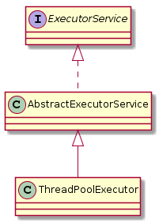

# Java 多线程


## 关于 synchronized 关键字的 5 连击

### 说一说自己对于 synchronized 关键字的了解


### synchronized 关键字的使用

- 修饰实例方法，作用于当前对象实例加锁，进入同步代码前要获得当前对象实例的锁。
- 修饰静态方法，作用于当前类对象加锁，进入同步代码前要获得当前类对象的锁。
- 修饰代码块，指定加锁对象，对给定对象加锁，进入同步代码库前要获得给定对象的锁。

由于修饰实例方法和静态方法时的加锁对象是不同的，所以如果一个线程 A 调用一个实例对象的非静态 synchronized 方法，而线程 B 需要调用这个实例对象所属类的静态 synchronized 方法，是允许的，不会发生互斥现象。

虽然双重检验锁方式实现单例模式并不被推荐，不过倒是很喜欢用它来考 synchronized……，下面是实现方式：

```java
public class Singleton {
    private volatile static Singleton instance;
    private Singleton() {}
    
    public static Singleton getInstance() {
        // 先判断对象是否已经实例过，没有实例化过才进入加锁代码
        // 相当于通过缩小加锁的范围来提高性能
        if (instance == null) {
            synchronized (Singleton.class) {
                if (instance == null) {
                    instance = new Singleton();
                }
            }
        }
        return instance;
    }
}
```

### synchronized 关键字的底层原理

我们通过下面这段代码的反编译结果来研究 synchronized 关键字的底层原理。

```java
public class SynchronizedDemo {
    public void method() {
        synchronized (this) {
            System.out.println("synchronized");
        }
    }
}
```

通过 `javap -c -s -v -l SynchronizedDemo.class` 反编译这段代码，得到：

```java
public void method();
  descriptor: ()V
  flags: ACC_PUBLIC
  Code:
    stack=2, locals=3, args_size=1
       0: aload_0
       1: dup
       2: astore_1
       3: monitorenter // 加锁！
       4: getstatic     #2                  // Field java/lang/System.out:Ljava/io/PrintStream;
       7: ldc           #3                  // String synchronized
       9: invokevirtual #4                  // Method java/io/PrintStream.println:(Ljava/lang/String;)V 
      12: aload_1
      13: monitorexit // 放锁！
      14: goto          22
      17: astore_2
      18: aload_1
      19: monitorexit
      20: aload_2
      21: athrow
      22: return
```

JVM 是基于进入和退出 monitor 对象来实现方法同步和代码块同步的。代码块的同步是通过 `monitorenter` 和 `monitorexit` 实现的，方法同步使用的是另一种方式，细节在 JVM 规范中并没有详细说明。

当一个线程执行到 `monitorenter` 指令时，会尝试获取对象对应的 monitor 的所有权，任何对象都有一个 monitor 与之关联，当一个 monitor 被持有后，该对象所保护的区域将处于锁定状态，因为其他线程这时不能持有 monitor。这个 monitor 保存在 Java 对象的对象头中。

### JDK1.6 之后的 synchronized 关键字底层做了哪些优化

JDK1.6 对锁的实现引入了大量的优化，如偏向锁、轻量级锁、自旋锁、适应性自旋锁、锁消除、锁粗化等技术来减少锁操作的开销。

锁主要存在四种状态，依次是：无锁状态、偏向锁状态、轻量级锁状态、重量级锁状态，他们会随着竞争的激烈而逐渐升级。注意锁可以升级不可降级，这种策略是为了提高获得锁和释放锁的效率。

### synchronized 和 ReenTrantLock 的区别

- **都是可重入锁**
	- 即自己拿到锁之后可以再次获取自己内部的锁，如果不能可重入锁的话，就会发生死锁。可重入锁可以通过为每个锁关联一个获取该锁的次数的计数器 count，和一个所有者线程来实现，同一个线程每获取一次锁，锁的计数器都 +1，每放开一次锁，锁的计数器都加 -1，等到锁的计数器减为 0，表明这个线程放开了这个锁。
- **synchronized 依赖于 JVM，ReenTrantLock 依赖于 API**
- **ReentrantLock 有如下高级功能：**
	- 可轮询、可定时、可中断的锁
	- 公平锁
	- 非块结构的锁
	- 可实现选择性通知

在不需要 ReentrantLock 提供的高级功能时，优先选择 synchronized，**原因如下：**

- Java 6 开始，ReenstrantLock 和内置锁的性能相差不大；
- synchronized 是 JVM 的内置属性，未来更有可能对 synchronized 进行性能优化，如对线程封闭的锁对象的锁消除，增加锁的粒度等；
- ReenstrantLock 危险性更高（如忘记在 finally 块中 lock.unlock() 了，会导致锁永远无法被释放，出现问题，极难 debug）；
- 许多现有程序中已使用了 synchronized，两种方式混合使用比较易错。


## 关于 volatile 的 2 连击


## 关于线程池的 n 连击

### 为什么要用线程池？

- **降低资源消耗：** 通过重复利用已创建的线程降低线程创建和销毁造成的消耗。
- **提高响应速度：** 当任务到达时，任务可以不需要的等到线程创建就能立即执行。
- **提高线程的可管理性：** 线程是稀缺资源，如果无限制的创建，不仅会消耗系统资源，还会降低系统的稳定性，使用线程池可以进行统一的分配，调优和监控。

### 实现 Runnable 接口和 Callable 接口的区别？

如果想让线程池执行任务的话需要实现的 Runnable 接口或 Callable 接口把我们要执行的任务封装起来。 Runnable 接口或 Callable 接口实现类都可以被 ThreadPoolExecutor 或 ScheduledThreadPoolExecutor 执行。两者的区别在于 Runnable 接口不会返回结果，但是 Callable 接口可以返回结果。

> 工具类 Executors 可以实现将 Runnable 对象转化为 Callable 对象：
>
> - `Executors.callable(Runnable task)`（result 传入的是 null，先当与返回 null 的 Calllable）
> - `Executors.callable(Runnable task, T result)`
>
> 这个转换是怎么实现的呢？适配器模式！
>
> Executors 中给 Runable 接口写了一个 Callable 接口的适配器：RunableAdapter：
>
> ```java
> static final class RunnableAdapter<T> implements Callable<T> {
>     final Runnable task;
>     final T result;
>     RunnableAdapter(Runnable task, T result) {
>         this.task = task;
>         this.result = result;
>     }
>     public T call() {  // 适配器里有个 call 方法
>         task.run();    // 里面调用的是 Runable 的 run 方法
>         return result; // 返回的是我们传入的 result 对象
>     }
> }
> ```

### 执行 `execute()` 方法和 `submit()` 方法的区别？

- `execute()`：用于提交不需要返回值的任务，无法判断任务是否被线程池执行成功。
- `submit()`：用于提交需要返回值的任务。
	- 线程池会返回一个 Future 类型的对象 future，通过 future 可以判断任务是否执行成功，并且可以通过 `future.get()` 方法来获取返回值。
	- `future.get()` 方法会阻塞当前线程直到任务完成。
	- `future.get(long timeout, TimeUnit unit)` 方法给任务加了个执行时间限制，如果任务在 timeout 时间内完成了，future 会拿到执行结果，如果 timeout 时间内没有执行完，则会抛出 `TimeoutException` 异常。

### 如何创建线程池

先来看一下线程池的类图：



也就是说，线程池实际上是一个 ThreadPoolExecutor 对象，不过我们一般都用一个 ExecutorService 接口持有它。

那么怎么创建一个 ThreadPoolExecutor 对象呢？像这样：

首先，我们需要介绍一下 ThreadPoolExecutor 的构造方法，因为以上三种 ThreadPoolExecutor 其实都是被赋予了不同的构造参数的 ThreadPoolExecutor 对象。

```java
public ThreadPoolExecutor(int corePoolSize,
                          int maximumPoolSize,
                          long keepAliveTime,
                          TimeUnit unit,
                          BlockingQueue<Runnable> workQueue,
                          ThreadFactory threadFactory,
                          RejectedExecutionHandler handler) { ... }
```

**参数说明：**

| 参数                     | 描述                                                         |
| ------------------------ | ------------------------------------------------------------ |
| corePoolSize             | 核心线程池大小，即没有执行任务时的线程池大小，只有在工作队列满了的情况下才会创建超出这个数量的线程 |
| maximumPoolSize          | 最大线程池的大小                                             |
| keepAliveTime            | 某个线程的空闲时间超过了存活时间，那么将被标记为可回收的     |
| BlockingQueue            | 用来暂时保存任务的工作队列                                   |
| RejectedExecutionHandler | 当 ThreadPoolExecutor 已经关闭或者达到了最大线程池大小并且工作队列已满时，调用 `execute()` 方法会调用 RejectedExecutionHandler handler 的 `rejectedExecution(Runnable r, ThreadPoolExecutor executor);` 方法 |

一般书上讲的都是通过 Executors 工具类创建线程池，有如下三种 ThreadPoolExecutor 可以选择：

- **Executors.newFixedThreadPool()** 

	- 固定长度的线程池，每当提交一个任务时就创建一个线程，直到达到线程池的最大数量，如果某个线程由于发生了未预期的 Exception 而结束，那么线程池会补充一个新的线程。

	- 创建方法：

		```java
		public static ExecutorService newFixedThreadPool(int nThreads) {
		    return new ThreadPoolExecutor(nThreads, nThreads,  // 线程池大小不可扩展
		                                  0L, TimeUnit.MILLISECONDS,  // 多余线程会被立即终止
		                                  new LinkedBlockingQueue<Runnable>());  
		    							// 使用容量为 Integer.MAX_VALUE 的工作队列
		    							// 由于使用了无界队列，不会拒绝任务，所以不会调用 handler
		}
		```

- **Executors.newCacheThreadPool()** 

	- 可缓存的线程池，如果线程池的当前规模超过了处理需求时，那么将回收空闲的线程，而当需求增加时，则可以添加新的线程，线程池的规模不存在任何限制。

	- 创建方法：

		```java
		public static ExecutorService newCachedThreadPool() {
		    return new ThreadPoolExecutor(0, Integer.MAX_VALUE,  // 初始为0，线程池中的线程数是无界的
		                                  60L, TimeUnit.SECONDS,
		                                  new SynchronousQueue<Runnable>());  
		}
		```

	- 注意：

		- 池中不会有空闲线程，也不会有等待的线程。
		- 一旦任务到达的速度大于线程池处理任务的速度，就会创建一个新的线程给任务。
		- 与另外两个线程池不同的地方在于，这个工作队列并不是用来放还没有执行的任务的，而是用来放执行过任务后空闲下的线程的，空闲下来的线程会被：`SynchronousQueue#poll(keepAliveTime, TimeUnit.NANOSECONDS)` poll 到工作队列中等待 60s，如果这 60s 有新的任务到达了，这个线程就被派出去执行任务，如果没有，就销毁。（毕竟创建一个线程是需要时间的，如果用完就立即销毁太浪费了……）

- **Executors.newSingleThreadPool()**

	- 单个工作者线程来执行任务，如果这个线程异常结束，会创建另一个线程来替代。能确保依照任务在队列中的顺序来串行执行。

	- 创建方法：

		```java
		public static ExecutorService newSingleThreadExecutor() {
		    return new FinalizableDelegatedExecutorService
		        (new ThreadPoolExecutor(1, 1,  // 线程池的大小固定为1
		                                0L, TimeUnit.MILLISECONDS,
		                                new LinkedBlockingQueue<Runnable>()));
		    						  // 使用容量为 Integer.MAX_VALUE 的工作队列
		}
		```

	- 


### 设置线程池的大小

#### 线程池过大过小的缺点

- 过大
	- 大量线程将在很少的 CPU 资源上发生竞争
	- 大量空闲线程会耗费内存，导致资源耗尽
- 过小
	- CPU 闲置，系统吞吐率下降

#### 线程池大小的设置

- 计算密集型任务：`N = N_cpu + 1`。
	- 加 1 的原因：当有一个线程偶尔故障时，额外的那个线程可以立即补上，保证 CPU 时钟不会被浪费。
- 包含 I/O 或其他阻塞操作： `N = N_cpu * U_cpu * (1 + W / C)`。
	- `N_cpu`：CPU 的个数。
	- `U_cpu`：目标 CPU 利用率。
	- `W / C`：等待时间 (Wait) / 计算时间 (Compute)。
	- 获取 CPU 数目的方法：`int N_CPUS = Runtime.getRuntime().availableProcessors();`。

### 设置线程池的 workQueue

- **无界队列**
	- 使用无界队列的线程池：
		- newFixedThreadPool
		- newSingleThreadExecutor
	- BlockingQueue 选择：
		- 无界的 LinkedBlockingQueue
- **有界队列** （可以避免资源耗尽，队列满了的处理方法请看下小节：`RejectedExecutionHandler handler` 的设置）
	- 只有当任务相互独立时，为线程池或工作队列设置界限才是合理的。如果任务之间存在依赖性，那么有界的线程池或队列就可能导致线程“饥饿”死锁问题。
		- BlockingQueue 选择：
			- ArrayBlockingQueue
			- 有界的 LinkedBlockingQueue
			- PriorityBlockingQueue
- **同步移交** （SynchronousQueue）
	- newCachedThreadPool 中使用；
	- 对于非常大的或者无界的线程池，可以通过使用 SynchronousQueue 来避免任务排队；
	- SynchronousQueue 不是一个真正的队列，而是一种在线程之间进行移交的机制；
	- 要将一个元素放入 SynchronousQueue 中，必须有另一个线程正在等待接受这个元素。如果没有线程正在等待，并且线程池的当前大小小于最大值，那么 ThreadPoolExecutor 将创建一个新的线程，否则这个任务将被拒绝。

### 线程池的 RejectedExecutionHandler

当 ThreadPoolExecutor 已经关闭或者达到了最大线程池大小并且工作队列已满时，调用 `execute()` 方法会调用 RejectedExecutionHandler handler 的 `rejectedExecution(Runnable r, ThreadPoolExecutor executor);` 方法。

JDK 提供了 4 种 RejectedExecutionHandler 接口的实现，它们都是以 ThreadPoolExecutor 类的静态内部类的形式定义的，它们的具体实现以及拒绝策略如下：

- **AbortPolicy** （默认）（Abort：流产）

	- 抛出未检查的 RejectedExecutionException，调用者自己捕获处理。

	- 实现：

		```java
		public static class AbortPolicy implements RejectedExecutionHandler {
		    public AbortPolicy() { }
		
		    public void rejectedExecution(Runnable r, ThreadPoolExecutor e) {
		        throw new RejectedExecutionException("Task " + r.toString() +
		                                             " rejected from " +
		                                             e.toString()); // 抛异常！
		    }
		}
		```

	- 这个是 ThreadPoolExecutor 的默认的 RejectedExecutionHandle handler，ThreadPoolExecutor 中有一个：

		```java
		private static final RejectedExecutionHandler defaultHandler = new AbortPolicy();
		```

		如果调用 ThreadPoolExecutor 的构造方法时没有给出 RejectedExecutionHandle 参数的话，它就会将上面的 defaultHandler 作为参数构造 ThreadPoolExecutor 对象，像这样：

		```java
		public ThreadPoolExecutor(int corePoolSize,
		                          int maximumPoolSize,
		                          long keepAliveTime,
		                          TimeUnit unit,
		                          BlockingQueue<Runnable> workQueue) {
		    this(corePoolSize, maximumPoolSize, keepAliveTime, unit, workQueue,
		         Executors.defaultThreadFactory(), defaultHandler); // 默认传入了 defaultHandler
		}
		```

- **DiscardPolicy** （Discard：抛弃）

	- 抛弃新提交的任务。

	- 实现：它的 `rejectedExecution` 方法啥都没干……

		```java
		public static class DiscardPolicy implements RejectedExecutionHandler {
		    public DiscardPolicy() { }
		
		    public void rejectedExecution(Runnable r, ThreadPoolExecutor e) {
		    }
		}
		```

- **DiscardOldestPolicy** 

	- 抛弃下一个被执行的任务，然后重新尝试提交任务。

	- 实现：

		```java
		public static class DiscardOldestPolicy implements RejectedExecutionHandler {
		    public DiscardOldestPolicy() { }
		    
		    public void rejectedExecution(Runnable r, ThreadPoolExecutor e) {
		        if (!e.isShutdown()) { // 先判断线程池关没
		            e.getQueue().poll(); // 丢到等待队列中下一个要被执行的任务
		            e.execute(r); // 重新尝试提交新来的任务
		        }
		    }
		}
		```

	- 不要和 PriorityBlockingQueue 一起使用，会丢失优先级最高的任务

- **CallerRunsPolicy** （既不抛出异常，也不抛弃任务）

	- 它不会在线程池中执行该任务，而是在调用 execute 提交这个任务的线程执行。

	- 如当主线程提交了任务时，任务队列已满，此时该任务会在主线程中执行。这样主线程在一段时间内不会提交任务给线程池，使得工作者线程有时间来处理完正在执行的任务。

	- 可以实现服务器在高负载下的性能缓慢降低。

	- 提交任务的应用程序被拿去执行任务了，不会返回 accept，TCP 层的请求队列会被填满而抛弃请求，客户端才会反应过来，即可以通过 TCP 层来缓冲一下。

	- 实现：

		```java
		public static class CallerRunsPolicy implements RejectedExecutionHandler {
		    public CallerRunsPolicy() { }
		
		    public void rejectedExecution(Runnable r, ThreadPoolExecutor e) {
		        if (!e.isShutdown()) {
		            // 直接在把它提交来的线程调用它的 run 方法，相当于没有新建一个线程来执行它，
		            // 而是直接在提交它的线程执行它，这样负责提交任务的线程一段时间内不会提交新的任务来
		            r.run(); 
		        }
		    }
		}
		```

> ThreadPoolExecutor 的饱和策略可以通过调用 setRejectedExecutionHandler 来修改。


## 关于 Atomic 原子类的 4 连击

### 介绍一下 Atomic 原子类


### JUC 包中的原子类是哪 4 类?


### 讲讲 AtomicInteger 的使用


### 简单介绍一下 AtomicInteger 类的原理


## AQS

### AQS 介绍


### AQS 原理分析


### AQS 组件总结


## 线程状态


## 线程通信方式


## 中断线程


## 死锁


## 非阻塞同步机制


