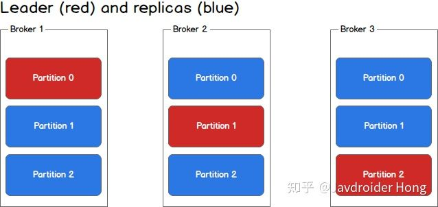

# Kafka 概述

## 消息队列的两种模式

### 点对点

消息生产者生产消息发送到 queue 中，然后消息消费者从 queue 中取出并且消费消息。一个消息只能被一个消费者消费，并且一旦消费者读取队列中的消息，它就从该队列中消失。

### 发布 / 订阅

消息被保留在主题中，可以被多个消费者消费，但不能被一个消费者多次消费（这个不绝对……）。 与点对点系统不同，消费者可以订阅一个或多个主题并使用该主题中的所有消息。 在发布 - 订阅系统中，消息生产者称为发布者，消息使用者称为订阅者。

Kafka 采用的就是这种模式。

## 为什么需要消息中间件？

主要由以下两个原因：

- 解耦消息的生产和消费
- 缓冲

生产者只负责生产消息，并把消息放在 “篮子” 中（Kafka），消费者也只负责消费，如果消费者想要消费消息了就去 “篮子” 中拿。在这种模型下，我们可以将生产者和消费者的代码写在不同的地方，这样就将消息的生产和消费解耦开来，更易于系统的扩展。

要是生产者发狂了，生产消息生产的特别快，我们可以通过增加篮子的方式防止消息丢失，也就说，这个篮子还可以充当一个缓冲的功能。

## Kafka 进化史

> 该进化史只是为了方便理解，并不是真的……（也可能是真的……）

### Kafka 一代

从上面的描述，我们可以看出，消息中间件之所以可以解耦消息的生产和消费，主要是它提供了一个存放消息的地方——生产者把消息放进来，消费者在从中取出消息进行处理。

大多数情况下，我们是希望先发来的消息被先处理的（FIFO），可以看到，一个 FIFO 的 Queue 是一个很合适的存储消息的数据结构，此外，一个消息可能被多个消费者订阅，所以我们还不能一个消息被消费完了就把它删掉，所以一代的 Kafka 使用了一个简单的 FIFO 的队列作为存储消息的数据结构，并且是一个会进行持久化存储的队列，每一个消费者都会用一个 offset 记录着自己消费到了第几个消息，这样下次消费的时候之间通过 offset + 1，就可以从下一个位置继续消费了，甚至消费者还可以通过调整 offset 的值，重新消费以前的消息。

这种模式虽然简单，不过是存在着不少问题的：

- 一个队列中混杂着各种不同 Topic 的消息，如果一个消费者只订阅了 Topic A，现在却要在一个混杂着 Topic ABCDEFG... 的队列中找 Topic A 消息，性能简直烂透了；
- 把消息都往一个队列中塞，问了保证线程安全，我们是肯定要给队列加锁的，也就说同一时刻只能有一个生产者往队列里面塞消息，请求一多，它肯定应付不过来。

综上所述，导致的问题的最主要原因就是：只有一个队列存储消息，根本不够用！

### Kafka 二代

既然一个队列不够用，那么我们的解决方式当然是增加队列啦，也就是分布式存储！

二代 Kafka 引入了 Partition 的概念，采用多条队列，每条队列中存放的消息都是相同 Topic 的，从而顺利的解决了一代 Kafka 的两个问题：

- **纯 Topic 队列**。一个队列只有一种topic，消费者再也不用担心会碰到不是自己想要的 Topic 的消息了。
- **提高吞吐量**。不同 Topic 的消息交给不同队列去存储，再也不用以一敌十了。

不过这样的 Kafka 就完美了吗？显然不是，我们虽然通过 Partition 提升了性能，但是我们忽略了一个很重要的问题—— **高可用**。即万一机器挂掉了怎么办？单点系统总是不可靠的。**我们必须考虑备用节点和数据备份的问题。**

### Kafka 三代

为了解决高可用的问题，我们需要 **集群**。

在 Kafka 中，集群中的每个实例叫做 **Broker**，一个 Broker 中可以有多个 Partition，其中有一个 Partition 是 leader（红色），其他的则是 replica（蓝色），生产者根据消息的 Topic 和 key 值，确定消息要发往哪个 Partition（假设为 p1），并将其发往 p1 所在的 Broker 中的 leader，leader 会负责消息的写入，并与其余的 replica 进行同步。

那么为什么高可用呢？因为一旦某一个 Partition 的 leader 挂掉了，那么只需要在 leader 所在的 Broker 中提拔一个 replica 作为新的 leader 就可以了，系统可以照常运行。

参考：

- https://zhuanlan.zhihu.com/p/37405836