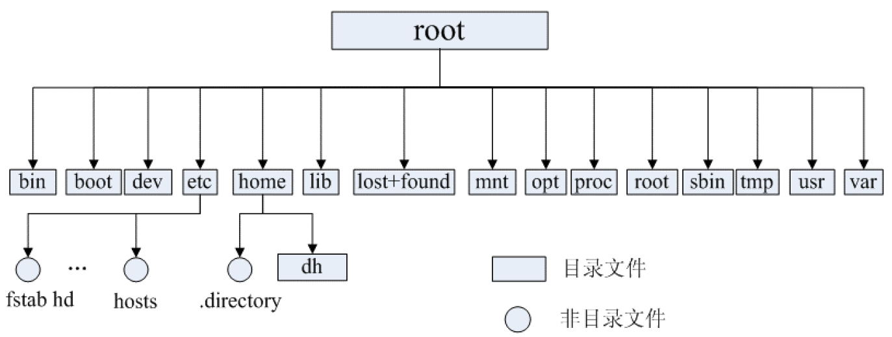
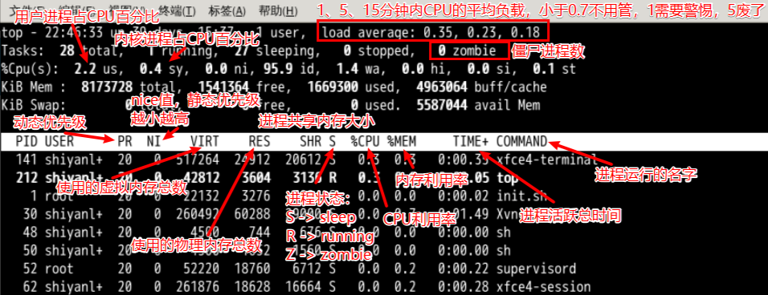

# Linux 常见面试题


## 简单介绍一下 Linux 文件系统？

在 Linux 操作系统中，所有被操作系统管理的资源，例如网络接口卡、磁盘驱动器、打印机、输入输出设备、普通文
件或是目录都被看作是一个文件，即万物皆文件。

### Linux 的 5 种文件类型

| 文件类型         | 描述                                                         | 示例                                                         |
| ---------------- | ------------------------------------------------------------ | ------------------------------------------------------------ |
| 普通文件         | 用来在辅助存储设备（如磁盘）上存储信息和数据                 | 包含程序源代码（用C、C++、Java等语言所编写）、可执行程序、图片、声音、图像等 |
| 目录文件         | 用于表示和管理系统中的文件，目录文件中包含一些文件名和子目录名 | /home                                                        |
| 链接文件         | 用于不同目录下文件的共享                                     | 链接文件指向已存在的文件                                     |
| 设备文件         | 用来访问硬件设备                                             | 键盘、硬盘、光驱等                                           |
| 命名管道（FIFO） | 是一种特殊类型的文件，Linux 系统下，进程之间的通信可以通过该文件完成 |                                                              |

### Linux 文件系统



- `/bin`：存放二进制可执行文件（ls,cat,mkdir等），常用命令一般都在这里；
- `/etc`：存放系统管理和配置文件；
- `/home`：存放所有用户文件的根目录，是用户主目录的基点，比如用户 user 的主目录就是 /home/user，可以用 ~ 表示；
- `/usr`：用于存放系统应用程序；
- `/opt`：额外安装的可选应用程序包所放置的位置。一般情况下，我们可以把 tomcat 等都安装到这里；
- `/proc`：虚拟文件系统目录，是系统内存的映射。可直接访问这个目录来获取系统信息：`cat /proc/cpuinfo`；
- `/root`：超级用户（系统管理员）的主目录；
- `/sbin`：存放二进制可执行文件，只有root才能访问。这里存放的是系统管理员使用的系统级别的管理命令和程序。如ifconfig 等；
- `/dev`：用于存放设备文件；
- `/mnt`：系统管理员安装临时文件系统的安装点，系统提供这个目录是让用户临时挂载其他的文件系统；
- `/boot`：存放用于系统引导时使用的各种文件；
- `/lib`：存放着和系统运行相关的库文件 ；
- `/tmp`： 用于存放各种临时文件，是公用的临时文件存储点；
- `/var`： 用于存放运行时需要改变数据的文件，也是某些大文件的溢出区，比方说各种服务的日志文件（系统启动日志等。）等；
- `/lost+found`： 这个目录平时是空的，系统非正常关机而留下“无家可归”的文件（windows下叫什么.chk）就在这里。


## 一些常见的 Linux 命令了解吗？

### 打包并压缩文件

```shell
tar -zcvf 打包压缩后的文件名 要打包压缩的文件
z：调用 gzip 压缩命令进行压缩
c：打包文件
v：显示运行过程
f：指定文件名
```

### 解压压缩包

```shell
tar -xvf 压缩文件 -C /usr
x：代表解压
-C：代表指定解压的位置
```

### 网络通信命令

- 查看当前系统的网卡信息：`ifconfig`
- 查看与某台机器的连接情况：`ping`
- 查看当前系统的端口使用：`netstat -an`

### `lsof` 命令

```shell
lsof -i:port  # 查看端口被哪个进程占用
lsof -p pid   # 查看进程打开了哪些文件
```

### top 命令



- PID：进程的ID
- USER：进程所有者
- PR：进程的优先级别，越小越优先被执行
- NI：nice 值
- VIRT：进程占用的虚拟内存
- RES：进程占用的物理内存
- SHR：进程使用的共享内存
- S：进程的状态。S 表示休眠，R 表示正在运行，Z 表示僵死状态，N 表示该进程优先值为负数
- %CPU：进程占用CPU 的使用率
- %MEM：进程使用的物理内存和总内存的百分比
- TIME+：该进程启动后占用的总的CPU 时间，即占用CPU 使用时间的累加值。
- COMMAND：进程启动命令名称

```shell
top -H -p 进程id   # 查看具体的进程的内存占用
top -u 用户名   # 查看用户的进程内存
输入top 后出来数据了:
1. 输入 M 按照内存排序
2. 输入 P 按照 CPU 排序输入
3. 输入 T 按照占用 CPU 的时间排序
```

### 查看 cpu 核的个数主频

```shell
cat /proc/cpuinfo
```

### 查看行数指令（比如第 100 行到第 150 行 top IP）

```shell
sed -n "100,150p" +文件名
```

### 列出所有进程的信息

```shell
ps aux  # 列出所有进程的信息
ps aux | grep zsh
```

### 强制结束一个进程

```shell
ps aux | grep gedit
kill -9 1608  # 使用 9 这个信号强制结束 gedit 进程
```


## Linux 是如何进行进程调度的？

进程调度就是对进程进行调度，即负责选择下一个要运行的进程，即从等待运行的进程中选择一个合适的来执行。


