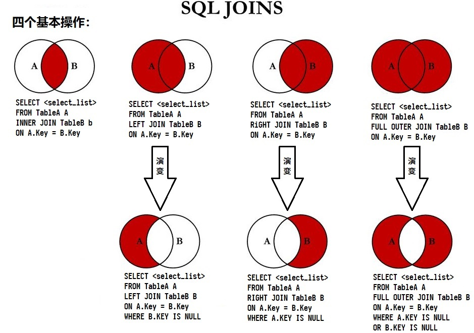

# MySQL 常见面试题


## 数据库索引连环问

### 添加索引的方式

```mysql
/* 主键索引 */
ALTER TABLE `table_name` ADD PRIMARY KEY ( `column` )

/* 唯一索引 */
ALTER TABLE `table_name` ADD UNIQUE ( `column` )

/* 普通索引 */
ALTER TABLE `table_name` ADD INDEX index_name ( `column` ) /* 一列 */
ALTER TABLE `table_name` ADD INDEX index_name ( `column1`, `column2`, `column3` ) /* 多列 */

/* 全文索引 */
ALTER TABLE `table_name` ADD FULLTEXT ( `column` )
```

### 索引的优点？

- 创建唯一性索引，保证数据库表中每一行数据的唯一性。
- 大大加快数据的检索速度，这是创建索引的最主要的原因。
- 在使用分组和排序子句进行数据检索时，同样可以显著减少查询中分组和排序的时间。
- 通过使用索引，可以在查询中使用优化隐藏器，提高系统的性能。
- 加速数据库表之间的连接，特别是在实现数据的参考完整性方面特别有意义。

### 索引的缺点？

- 创建索引和维护索引要耗费时间，这种时间随着数据量的增加而增加。
- 索引需要占用物理空间，除了数据表占用数据空间之外，每一个索引还要占一定的物理空间，如果建立聚簇索引，那么需要的空间就会更大。
- 当对表中的数据进行增加、删除和修改的时候，索引也需要维护，降低数据库维护的速度。

### 使用索引的注意事项？

- 在经常需要搜索的列上，可以加快搜素的速度。
- 在经常使用在 WHERE 子句中的列上面创建索引，可以加快条件的判断速度。
- 在经常需要排序的列上创建索引，因为索引已经排序，这样查询时可以利用索引的排序，加快排序查询时间。
- 对于中到大型表素引都是非常有效的，但是特大型表的话维护开销会很大，不适合建索引。
- 在经常用在连接的列上，这些列主要是一些外键，可以加快连接的速度。
- 避免 where 子句中对字段使用函数，这会造成索引无效。
- 在使用 innoDB 时使用与业务无关的自增主键作为主键，即使用逻辑主键，而不要更用业务主键。
- 将打算加索引的列设置为 NOT NULL，否则将导致引擎放弃使用索引而进行全表扫描。
- 删除长期未使用的素引，不用的索引的存在会造成不必要的性能损耗 MySQL 5.7 可以通过查询 sys 库的chema_unused_indexes 视图来查询哪些素引从未被使用。
- 在使用 limit offset 查询缓慢时，可以借助素引来提高性能。

### 索引是如何提高查询速度的？

使用哈希表或 BTree 数据结构存储索引，相当于将无序的数据变成相对有序的数据，可以加快查询速度。

索引相关内容可见：[MySQL索引.pdf](MySQL索引.pdf)


## 大表的常见优化手段

当MySQL单表记录数过大时，数据库的CRUD性能会明显下降，一些常见的优化措施。

- **限定数据的范围：** 务必禁止不带任何限制数据范围条件的查询语句。即缩小需要查询的数据量。
- **读/写分离：** 经典的数据库拆分方案，主库负责写，从库负责读。
- **垂直分区：** 根据数据库里面数据表的相关性进行拆分。即把一张列比较多的表根据列的相关性拆分为多张表。
	- 优点：可以使得行数据变小，简化表的结构。
	- 缺点：
		- 主键会出现冗余，需要管理冗余列，并会引起 Join 操作（可以通过在应用层进行Join来解决）。
		- 垂直分区会让事务变得更加复杂。
- **水平分区：** 保持数据表结构不变，通过某种策略存储数据分片。这样每一片数据分散到不同的表或者库中，达到了分布式的目的。 水平拆分可以支撑非常大的数据量。
	- 水平拆分最好分库。水平拆分能够支持非常大的数据量存储，应用端改造也少，但分片事务难以解决 ，跨界点 Join 性能较差，逻辑复杂。
	- 尽量不要对数据进行分片，因为拆分会带来逻辑、部署、运维的各种复杂度。


## innoDB 与 MyISAM 引擎区别

索引实现方式不同


## 什么是数据库事务？如果没有事务会有什么后果？事务的特性是什么？

把事务想象成转账，比如 A 给 B 转账 10 元，需要两个操作：

- 先将 A 的账户减去 10 元
- 然后给 B 的账户加上 10 元

这两个操作要么同时成功，要么同时失败，一旦出现一个失败一个成功的情况，钱的总数就不对了……

这就需要我们在这两个操作前建一个事务，只有当两个操作同时成功时才会将修改提交到数据库，一旦有一个操作失败，就进行事务的回滚，把数据库恢复成一个操作都没有进行之前的样子。

因此，事务需要具有以下 **四个特性：**

- **原子性：** 处在一个事务中的操作要么同时成功，要么同时失败。
- **一致性：** 需要与实际业务规则保持一致，如转账操作，两个账户的总金额要保持不变。
- **隔离性：** 不同的事务之间没有影响，如脏读就是不同事务间的数据发生了影响。
- **持久性：** 事务一旦提交成功，事务中的所有数据必须持久化到数据库中去，就算提交的时候数据库原地崩溃，重启后也要有办法恢复数据。


## 事务隔离级别

### 并发事务会遇到的问题

- **脏读：** 读到了其他事务未提交的脏数据。
- **不可重复读：** 由于其他事务对某个记录进行了 **修改** 而导致当前事务对某个数据的两次读取结果不同。
- **幻读：** 由于其他事务 **插入了一条记录** 而导致当前事务对某个数据的两次读取结果不同。

### 四大隔离级别

| 隔离级别                      | 可以处理的并发问题 | 描述                           | 实现          | 性能 |
| ----------------------------- | ------------------ | ------------------------------ | ------------- | ---- |
| `SERIALIZABLE` (串行化)       | 全部               | 事务一个接着一个执行           | 三级 + GAP 锁 | 1星  |
| `REPEATABLE READ` (可重复读)  | 脏读，不可重复读   | 所有被 SELECT 的数据不能被修改 | 三级          | 2星  |
| `READ COMMITTED` (读已提交)   | 脏读               | 不可重复读，幻读               | 二级          | 3星  |
| `READ UNCOMMITTED` (读未提交) | 无                 | 允许其他事务读取未提交的数据   | 啥都不用      | 4星  |

MySQL 默认的隔离级别是`REPEATABLE READ`，Oracle 默认的隔离级别是`READ COMMITTED`。

实现详见下小节。


## 事务隔离是怎么实现的？有哪些锁？

### 两种锁

- 排他写锁（X 锁）：若事务 T1 对数据对象 A 加上 X 锁，则只允许 T 读取和修改 A，其他任何事物都不能再对 A 加任何类型的锁，直到 T 释放 A 上的锁为止。
- 共享读锁（S 锁）：若事务 T 对数据 A 加上 S 锁，则事务 T 可以读 A 但是不能修改 A，其他事务只能对 A 加 S 锁而不能加 X 锁，直到 T 释放 A 上的 S 锁为止。所以它的最主要作用是阻塞 X 锁。

### 三级加锁协议（可解决脏读和不可重复读）

**一级加锁协议（无法避免脏读、不可重复读）**

- 如果只对数据进行读操作，不需要加锁。
- 如果对数据进行写操作，需要加 X 锁直至事务结束。

**二级加锁协议（可避免脏读，无法避免不可重复读）**

在一级加锁协议的基础上，添加操作：事务 T 在读取数据 R 前要对 R 加上 S 锁，读完之后即可释放 S 锁，无需等待事务结束。

**三级加锁协议（可避免脏读、不可重复读）**

基本与二级加锁协议相同，只是 S 锁加上之后要等到事务结束才能释放。


**3 种锁：**

- Record Locks（记录锁）：在索引记录上加锁。
- Gap Locks（间隙锁）：在索引记录之间加锁，或者在第一个索引记录之前加锁，或者在最后一个索引记录之后加锁，可避免幻读。
- Next-Key Locks：在索引记录上加锁，并且在索引记录之前的间隙加锁。它相当于是 Record Locks 与 Gap Locks 的一个结合。


## 什么是乐观锁？悲观锁？实现方式？

**悲观锁：** 每次去拿数据的时候都认为别人会修改，所以每次在拿数据的时候都会上锁，这样别人想拿这个数据就会阻塞直到它拿到锁，虽然安全，但并发性极差，如 Java 的 synchronized。

**乐观锁：** 每次去拿数据的时候都认为别人不会修改，所以不会上锁，但是在提交更新的时候会判断一下在此期间别人有没有去更新这个数据，如 CAS。

……


## 7 个 join




## limit 20000 如何优化

### 子查询优化法

先找出第一条数据，然后大于等于这条数据的 id 就是要获取的数据，要求数据连续，基本就是不能有 WHERE 语句了。

原始 SQL 语句：

```sql
select * from Member limit 10000,100
```

优化后：

```sql
select * from Member where MemberID >= (select MemberID from Member limit 100000,1) limit 100
```

### 使用 id 限定优化

这种方式假设数据表的 id 是连续递增的，则我们根据查询的页数和查询的记录数可以算出查询的 id 的范围，可以使用 id
between and 来查询。

原始 SQL 语句：

```sql
select * from orders_history where type=2 limit 100000,100
```

优化后：

```sql
select * from orders_history where type=2 and id between 1000000 and 1000100 limit 100
```


## SQL语法

- SQL语句可以在单行或多行书写，以分号结尾(在命令行里)
- 可使用空格和缩进来增强语句的可读性
- MySQL不区别大小写，建议使用大写

### SQL语句分类

- DDL (Data Definition Language)：数据库或表的结构操作
- DML (Data Manipulation Language)：对表的记录进行更新（增、删、改）
- DQL (Data Query Language)：对表的记录的查询
- DCL (Data Control Language)：对用户的创建，及授权

### DDL (Data Definition Language)

**数据库操作：**

- 查看所有数据库：`SHOW DATABASES`
- 选择要操作的数据库：`USE 数据库名`
- 创建数据库(方括号中是可选操作)：`CREATE DATABASE [IF NOT EXISTS] mydb1 [CHARSET=utf8]`
- 删除数据库：`DROP DATABASE [IF EXISTS] mydb1`
- 修改数据库编码：`ALTER DATABASE mydb1 CHARACTER SET utf8`

**表操作：**

- 创建表

    ```sql
    CREATE TABLE [IF NOT EXISTS] 表名(
        列名 列类型,
        列名 列类型,
        ...
        列名 列类型
    );
    ```

- 查看当前数据库中所有的表名称：`SHOW TABLES`

- 查看表结构：`DESC 表名`

- 删除表：`DROP TABLE 表名 `

- 修改表：`ALTER TABLE 表名`

    - 添加列：

        ```sql
        ALTER TABLE 表名
        ADD (
            列名 列类型,
            列名 列类型,
            ...
            列名 列类型
        );
        ```

    - 修改列类型：`ALTER TABLE 表名 MODITY 列名 列类型; `

    - 修改列名：`ALTER TABLE 表名 CHANGE 原列名 新列名 列类型;`

    - 删除列：`ALTER TABLE 表名 DROP 列名;`

    - 修改表名称：`ALTER TABLE 原表名 RENAME TO 新表名;`

### DML (Data Manipulation Language)

**插入数据：**

- `INTERT INTO 表名(列名1,列名2, ...) VALUES(列值1, 列值2, ...);`
- `INTERT INTO 表名 VALUES(列值1, 列值2)`

示例：

```sql
// 插入所有列
INSERT INTO stu(
  number, name, age, gender
)
VALUES(
  'ITCAST_0001', 'zhangSan', 28, 'male'
);
 
// 插入部分列，没有指定的列默认为NULL值
INSERT INTO stu(
  number, name
) VALUES(
  'ITCAST_0002', 'liSi'
)
 
// 不给出插入列，那么默认为插入所有列！值的顺序要与创建表时列的顺序相同
INSERT INTO stu VALUES(
  'ITCAST_0003', 'wangWu', 82, 'female'
);
```

**修改数据：**

- `UPDATE 表名 SET 列名1=列值1, 列名2=列值2, ... [WHERE 条件]`
    - 条件必须是一个 boolean 类型的值或表达式：`UPDATE t_person SET gender='男', age=age+1 WHERE sid='1';`
    - 运算符：`=, !=, <>, >, <, >=, <=, BETWEEN...AND, IN(...), IS NULL, NOT, OR, AND`

示例：

```sql
/* 下面两句效果是一样的 */
UPDATE stu SET age=102 WHERE age >= 18 AND age <= 80;
UPDATE stu SET age=102 WHERE age BETWEEN 18 AND 80;
 
UPDATE stu SET age=102 WHERE name='zhangSan' OR name='liSi';
UPDATE stu SET age=102 WHERE name IN ('zhangSan', 'liSi');
UPDATE stu SET age=102 WHERE age IS NULL;  /* 不能使用等号(age=null)，age=null返回的都是false */
UPDATE stu SET age=102 WHERE age IS NOT NULL;
```

**删除数据：**

- `DELETE FROM 表名 [WHERE 条件];`，一定要带 where 条件！要不就把整个表里的数据全删了！

### DQL (Data Query Language)

**SQL中单表查询关键字及其排列顺序：**

```sql
select
from
where
group by
having
order by
```
#### 基本查询

```sql
//表名：emp
//查询所有列
SELECT * FROM emp;
 
//查询指定列
SELECT empno, ename, sal, comm FROM emp;
 
//查询sal列，如果相同只显示一次
SELECT DISTINCT sal FROM emp;
 
//列运算
//加、减、乘、除运算
SELECT sal*1.5 FROM emp;
SELECT sal+comm FROM emp;
 
//字符串连接
SELECT CONCAT('$', sal) FROM emp;
 
//如果comm中存在NULL值，那么当成0来运算
SELECT IFNULL(comm, 0)+1000 FROM emp;
 
//给列起别名
SELECT IFNULL(comm, 0)+1000 AS 奖金 FROM emp;  /* 其中AS可以省略 */
/* 加了别名之后，显示出来的表的表头会显示为别名奖金 */
/* 不加别名表头会显示为：IFNULL(comm, 0)+1000 */
```

##### 条件控制

```sql
//条件查询
SELECT empno,ename,sal,comm FROM emp WHERE sal > 10000 AND comm IS NOT NULL;
SELECT empno,ename,sal FROM emp WHERE sal BETWEEN 20000 AND 30000;
SELECT empno,ename,job FROM emp WHERE job IN ('经理', '董事长');
```


#####   模糊查询


```sql
//模糊查询，'_'匹配一个字符，'%'匹配0~N个字符
SELECT * FROM emp WHERE ename LIKE '张_';
SELECT * FROM emp WHERE ename LIKE '张%';
SELECT * FROM emp WHERE ename LIKE '%';  //这个条件等同与不存在，但如果姓名为NULL的查询不出来！
```

#### 排序

```sql
//按sal排序，升序，ASC可以省略
SELECT * FROM WHERE emp ORDER BY sal ASC;
 
//按comm排序，降序
SELECT * FROM WHERE emp ORDER BY comm DESC;
 
//使用sal升序排，如果sal相同时，使用comm的降序排列
SELECT * FROM WHERE emp ORDER BY sal ASC, comm DESC;
```

#### 聚合函数

```sql
//COUNT
//计算emp表中所有列都不为NULL的记录的行数
SELECT COUNT(*) FROM emp;
 
//计算emp表中comm列不为NULL的记录的行数
SELECT COUNT(comm) FROM emp;
 
//MAX
//查询最高工资
SELECT MAX(sal) FROM emp;
 
//MIN
//查询最低工资
SELECT MIN(sal) FROM emp;
 
//SUM
//查询工资和
SELECT SUM(sal) FROM emp;
 
//AVG
//查询平均工资
SELECT AVG(sal) FROM emp;
```

#### 分组查询

分组查询常和聚合函数一起使用。


```sql
//使用deptno分组，查询部门编号和每个部门的记录数
SELECT deptno, COUNT(*) FROM emp GROUP BY deptno;
 
//使用job分组，查询每种工作的最高工资
SELECT job, MAX(SAL) FROM emp GROUP BY job;
 
//以部门分组，查询每组记录数，条件为记录数大于3
SELECT deptno, COUNT(*) FROM emp GROUP BY deptno HAVING COUNT(*) > 3;
```

#### limit 子句

```sql
//LIMIT用来限定查询结果的起始行，以及总行数
//查询起始行为第5行，一共查询3行记录
SELECT * FROM emp LIMIT 4, 3;
```

#### 单表查询练习题

```sql
/* 1. 查询出部门编号为30的所有员工。*/
SELECT empno FROM emp WHERE deptno = 30;
 
/* 2. 所有销售员的姓名、编号和部门编号。*/
SELECT ename,empno,deptno FROM emp WHERE job = '销售员';
 
/* 3. 找出奖金高于工资的员工。*/
SELECT * FROM emp WHERE comm > sal;
 
/* 4. 找出奖金高于工资60%的员工。*/
SELECT * FROM emp WHERE comm > 0.6 * sal;
 
/* 5. 找出部门编号为10中所有经理，和部门编号为20中所有销售员的详细资料。*/
SELECT * FROM emp WHERE (deptno = 10 AND job = '经理') OR (deptno = 20 AND job = '销售员');
 
/* 6. 找出部门编号为10中所有经理，部门编号为20中所有销售员，还有即不是经理又不是销售员但其工资大或等于20000的所有员工详细资料。*/
SELECT * FROM emp WHERE (deptno = 10 AND job = '经理') OR (deptno = 20 AND job = '销售员') OR (job NOT IN ('经理', '销售员') AND sal >= 20000);
 
/* 8. 无奖金或奖金低于1000的员工。*/
SELECT ename FROM emp WHERE comm IS NULL OR comm < 1000;
 
/* 9. 查询名字由三个字组成的员工。*/
SELECT * FROM emp WHERE ename LIKE '___';
 
/* 10.查询2000年入职的员工。*/
SELECT * FROM emp WHERE hiredate LIKE '2000-%';
 
/* 11. 查询所有员工详细信息，用编号升序排序。*/
SELECT * FROM emp ORDER BY empno;
 
/* 12. 查询所有员工详细信息，用工资降序排序，如果工资相同使用入职日期升序排序。*/
SELECT * FROM emp ORDER BY sal DESC, hiredate;
 
/* 13. 查询每个部门的平均工资。*/
SELECT deptno, AVG(sal) 平均工资 FROM emp GROUP BY deptno;
 
/* 14. 查询每个部门的雇员数量。 */
SELECT deptno, COUNT(*) FROM emp GROUP BY deptno;
 
/* 15. 查询每种工作的最高工资、最低工资、人数。*/
SELECT job, MAX(sal), MIN(sal), COUNT(*) FROM emp GROUP BY job;
```

### DCL (Data Control Language)

**创建用户：**

- `CREATE USER 用户名@IP地址 IDENTIFIED BY '密码';`：用户只能在指定的 IP 地址上登录
- `CREATE USER 用户名@'%' IDENTIFIED BY '密码';`：用户可以在任意 IP 地址上登录

示例：

```sql
CREATE USER zhangsan@localhost IDENTIFIED BY '123';
```

**给用户授权：**

- `GRANT 权限1, … , 权限n ON 数据库.* TO 用户名@IP地址;`：给用户分派在指定的数据库上的指定的权限
- `GRANT ALL ON 数据库.* TO 用户名@IP地址;`：给用户分派指定数据库上的所有权限

示例：

```sql
GRANT CREATE,ALTER,DROP,INSERT,UPDATE,DELETE,SELECT ON mydb1.* TO user1@localhost;
```

**撤销授权：**

- `REVOKE 权限1, … , 权限n ON 数据库.* FROM 用户名@IP地址;`

**查看权限：**

- `SHOW GRANTS FOR 用户名@IP地址;`

**删除用户：**

- `DROP USER 用户名@IP地址;`

### MySQL的编码问题

查看 MySQL 数据库编码：`SHOW VARIABLES LIKE 'char%';`

**在 windows 控制台下乱码原因：**

因为`character_set_client`和`character_set_results`这两个变量的编码设置有问题。

`character_set_client`：MySQL使用该编码来解读客户端发送过来的数据，例如该编码为 utf8，那么如果客户端发送过来的数据不是 utf8，那么就会出现乱码。

`character_set_results`：MySQL会把数据转换成该编码后，再发送给客户端，例如该编码为 utf8，那么如果客户端不使用 utf8 来解读，那么就会出现乱码。

**设置变量的语句：**

```sql
SET character_set_client=gbk;
SET character_set_results=gbk;
```

注意：设置变量只对当前连接有效，当退出窗口后，再次登录 mysql，还需要再次设置变量。

**一劳永逸的办法：**修改 MySQL 配置文件 my.ini ：`default-character-set=utf8`修改为`default-character-set=gbk`，它可以修改三个变量：`character_set_client`，`character_set_results`，`character_set_connection`。

### MySQL 的备份与恢复

#### 备份

在 MySQL 外执行：

```sql
mysqldump -u用户名 -p密码 数据库名>生成的脚本文件路径
mysqldump -uroot -p123 mydb1>C:\mydb1.sql
```

#### 恢复

**第一种方式：**

- 先在数据库中创建一个空的要恢复的数据库，然后退出数据库
- 然后执行：`mysql -u用户名 -p密码 数据库<脚本文件路径`

```sql
mysql -u用户名 -p密码 数据库<脚本文件路径
mysql -uroot -p123 mydb1<C:\mydb1.sql
```

**第二种方式：**

- 先在数据库中创建一个空的要恢复的数据库
- 然后执行：`source SQL脚本路径`

```sql
mysql -u用户名 -p密码
sourse C:\mydb1.sql
```

### 约束

#### 主键约束

主键是唯一表示，有如下三个特性：

- 非空
- 唯一
- 被引用

创建表时指定主键：

```sql
/* Method 1 */
CREATE TABLE stu(
    sid CHAR(6) PRIMARY KEY,
    sname VARCHAR(20)
);
/* Method 2 */
CREATE TABLE stu(
    sid CHAR(6),
    sname VARCHAR(20),
    PRIMARY KEY(sid)
);
```

修改表时指定主键：

```sql
ALTER TABLE stu ADD PRIMARY KEY(sid);
```

修改表时删除主键：

```sql
ALTER TABLE stu DROP PRIMARY KEY; /* 因为主键是唯一的，所以删除时不用指定是哪一列 */
```

#### 设置主键自增长

创建表时指定主键自增长：

```sql
CREATE TABLE stu(
    sid CHAR(6) PRIMARY KEY AUTO_INCREMENT,
    sname VARCHAR(20)
);
```

修改表时设置主键自增长 (和修改列名差不多)：

```sql
ALTER TABLE stu CHANGE sid sid INT AUTO_INCREMENT;
```

修改表时删除主键自增长 (和修改列名差不多)：

```sql
ALTER TABLE stu CHANGE sid sid INT;
```

#### 非空约束

```sql
CREATE TABLE stu(
    sid INT PRIMARY KEY AUTO_INCREMENT,
    sname VARCHAR(20) NOT NULL  /* 对sname列设置了非空约束 */
);
```

#### 唯一约束

```sql
CREATE TABLE stu(
    sid INT PRIMARY KEY AUTO_INCREMENT,
    sname VARCHAR(20) NOT NULL UNIQUE  /* 对sname列设置了非空约束 */
);
```

### 多表查询

**SQL中多表查询关键字及其排列顺序：**

```sql
select *
from emp, dept, (select * from emp)
where
group by
having
order by
limit
```

#### 连接查询

一次查询多张表。所以在使用列元素的时候要带上表名这个前缀`表名.列名`，如果表名比较长可以给表名起别名。

##### 内连接

- 方言：`SELECT * FROM 表1 别名1, 表2 别名2 WHERE 别名1.xx=别名2.xx;`
- **标准(推荐使用)：**`SELECT * FROM 表1 别名1 INNER JOIN 表2 别名2 ON 别名1.xx=别名2.xx;`
- 自然：`SELECT * FROM 表1 别名1 NATURAL JOIN 表2 别名2;`

内连接查询出的所有记录都满足条件。

##### 外连接

- 左外：`SELECT * FROM 表1 别名1 LEFT OUTER JOIN 表2 别名2 ON 别名1.xx=别名2.xx;`
    - 左表记录无论是否满足条件都会查询出来，而右表只有满足条件才能出来。左表中不满足条件的记录，右表部分都为NULL
- 左外自然：`SELECT * FROM 表1 别名1 NATURAL LEFT OUTER JOIN 表2 别名2 ON 别名1.xx=别名2.xx;`
- 右外：`SELECT * FROM 表1 别名1 RIGHT OUTER JOIN 表2 别名2 ON 别名1.xx=别名2.xx;`
    - 右表记录无论是否满足条件都会查询出来，而左表只有满足条件才能出来。右表不满足条件的记录，其左表部分都为NULL
- 右外自然：`SELECT * FROM 表1 别名1 NATURAL RIGHT OUTER JOIN 表2 别名2 ON 别名1.xx=别名2.xx;`

##### 示例

```sql
/* 方言 */
SELECT e.name, e.sal, e.dname
FROM emp e, dept d
WHERE e.deptno=d.deptno;
 
/* 标准 */
SELECT e.name, e.sal, e.dname
FROM emp e INNER JOIN dept d
ON e.deptno=d.deptno;
/* 相较于方言，把','换成'JOIN'，把'WHERE'换成'ON' */
 
/* 自然 */
SELECT e.name, e.sal, e.dname
FROM emp e INNER JOIN dept d;
/* 没ON了，它自动判断相等了 */
 
/* 外连接 */
SELECT e.name, e.sal, e.dname
FROM emp e LEFT OUTER JOIN dept d
ON e.deptno=d.deptno;
```

#### 子查询

子查询就是查询中有查询，子查询可以出现的位置：

- `WHERE`后作为条件存在
- `FROM`后作为表存在

**按子查询的结果形式分类：**

- 单行单列：`SELECT * FROM 表1 别名1 WHERE 列1 [=、>、<、>=、<=、!=] (SELECT 列 FROM 表2 别名2 WHERE 条件)`

    ```sql
    /* 查询雇员中工资最高的员工 */
    SELECT * FROM emp e WHERE sal=(SELECT MAX(sal) FROM emp)
    ```

- 多行单列：`SELECT * FROM 表1 别名1 WHERE 列1 [IN, ALL, ANY] (SELECT 列 FROM 表2 别名2 WHERE 条件)`

    ```sql
    /* 查询雇员中工资比所有经理都高的员工 */
    SELECT * FROM emp e WHERE sal > ALL (SELECT sal FROM emp WHERE job='经理')
    ```

- 单行多列：`FROM 表1 别名1 WHERE (列1,列2) IN (SELECT 列1, 列2 FROM 表2 别名2 WHERE 条件)`

    ```sql
    /* 查询雇员中工作，部门，工资和殷天正一样的员工 */
    SELECT * FROM emp e WHERE (job, deptno, sal) IN (SELECT job, deptno, sal FROM emp WHERE ename='殷天正')
    ```

- 多行多列：`SELECT * FROM 表1 别名1 , (SELECT ....) 别名2 WHERE 条件`

    ```sql
    /* 查询部门编号为30的雇员的员工编号和姓名 */
    SELECT e.empno, e.ename FROM (SELECT * FROM emp WHERE deptno=30) e
    ```

#### 合并结果集

语法：`UNION ALL`或者`UNION`。

- 要求被合并的表中，列的类型和列数相同
- `UNION`：会去除两个表中重复的行
- `UNION ALL`：不去除重复行

```sql
SELECT * FROM ab
UNION ALL
SELECT * FROM cd;
```
#### 多表查询练习题

```sql
/* 1. 查出至少有一个员工的部门。显示部门编号、部门名称、部门位置、部门人数。*/
SELECT z.deptno 部门编号, d.dname 部门名称, d.loc 部门位置, z.cnt 部门人数
FROM (SELECT deptno, COUNT(*) cnt FROM emp GROUP BY deptno HAVING COUNT(*) >= 1) z, dept d
WHERE z.deptno=d.deptno
 
/* 2. 列出薪金比关羽高的所有员工。*/
SELECT *
FROM emp e
WHERE e.sal > (SELECT sal FROM emp WHERE ename='关羽')
 
/* 3. 列出所有员工的姓名及其直接上级的姓名。*/
SELECT e.ename 员工姓名, IFNULL(m.ename, '老板') 上级姓名
FROM emp e LEFT OUTER JOIN emp m
ON e.mgr=m.empno
 
/* 4. 列出受雇日期早于直接上级的所有员工的编号、姓名、部门名称。*/
SELECT e.empno 员工编号, e.ename 姓名, d.dname 部门名称
FROM emp e LEFT OUTER JOIN emp m
ON e.mgr=m.empno
LEFT OUTER JOIN dept d
ON e.deptno=d.deptno
WHERE e.hiredate>m.hiredate
 
/* 5. 列出部门名称和这些部门的员工信息，同时列出那些没有员工的部门。*/
/* 因为以部门为主，所以是 RIGHT OUTER JOIN */
SELECT e.*, d.dname
FROM emp e RIGHT OUTER JOIN dept d
ON e.deptno=d.deptno;
 
/* 6. 列出所有文员的姓名及其部门名称，部门的人数。*/
SELECT e.ename 姓名, d.dname 部门名称,  z.cnt 部门人数
FROM emp e, dept d, (SELECT deptno, COUNT(*) cnt FROM emp GROUP BY deptno) z
WHERE e.job='文员' AND e.deptno=d.deptno AND z.deptno=e.deptno
 
/* 7. 列出最低薪金大于15000的各种工作及从事此工作的员工人数。*/
SELECT job, COUNT(*)
FROM emp
GROUP BY job
HAVING MIN(sal) > 15000
 
/* 8. 列出在销售部工作的员工的姓名，假定不知道销售部的部门编号。*/
SELECT ename
FROM emp
WHERE deptno=(SELECT deptno FROM dept WHERE dname='销售部')
 
/* 9. 列出薪金高于公司平均薪金的所有员工信息，所在部门名称，上级领导，工资等级。*/
SELECT e.*, d.dname '部门名称', m.ename '上级领导', g.grade '工资等级'
FROM emp e
LEFT OUTER JOIN dept d ON e.deptno=d.deptno
LEFT OUTER JOIN emp m ON e.mgr=m.empno
LEFT OUTER JOIN salgrade g ON e.sal BETWEEN g.losal AND g.hisal
WHERE e.sal > (SELECT AVG(sal) FROM emp)
 
/* 10.列出与庞统从事相同工作的所有员工及部门名称。*/
SELECT e.*, d.dname
FROM emp e, dept d
WHERE e.job=(SELECT job FROM emp WHERE ename='庞统') AND e.deptno=d.deptno AND e.ename != '庞统'
 
/* 11.列出薪金高于在部门30工作的所有员工的薪金的员工姓名和薪金、部门名称。*/
SELECT e.ename, e.sal, d.dname
FROM emp e, dept d
WHERE e.sal > ALL (SELECT sal FROM emp WHERE deptno=30) AND e.deptno=d.deptno
 
/* 12.列出每个部门的员工数量、平均工资。*/
SELECT d.dname '部门', c.cnt '员工数量', c.avg_sal '平均工资'
FROM dept d, (SELECT deptno, COUNT(*) cnt, AVG(sal) avg_sal FROM emp GROUP BY deptno) c
WHERE d.deptno=c.deptno
```


