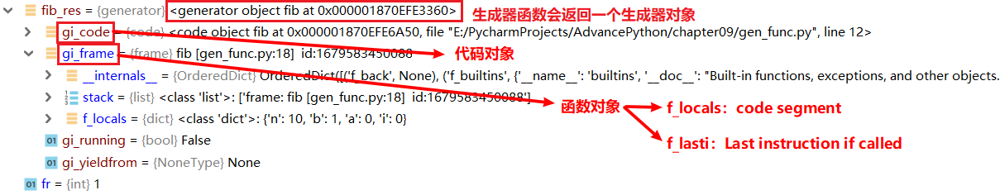
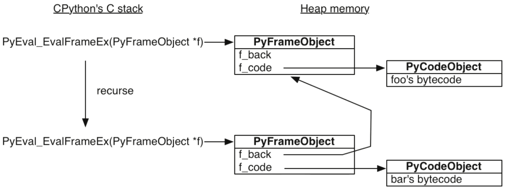
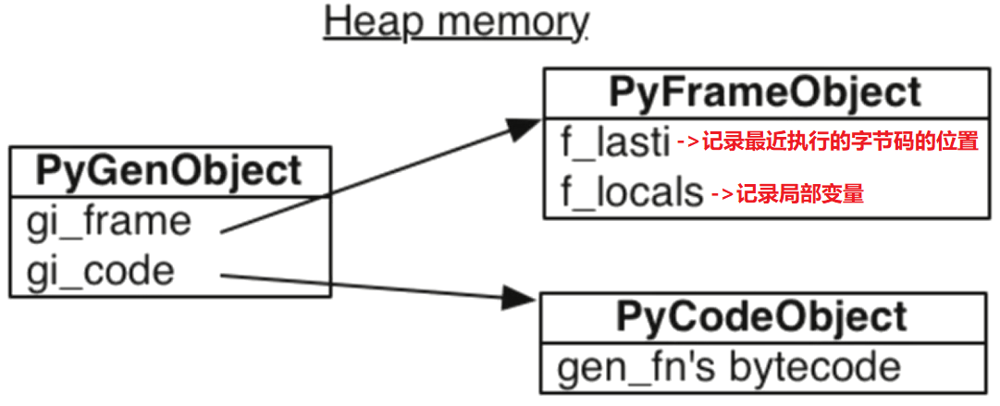

# Python 生成器


## 生成器的原理

调用生成器函数，就会返回一个生成器对象，一个含有 `yield` 关键字的函数就叫做生成器函数。

例如一个这样的计算 fib 数列的函数：

```python
def fib(n):
    """
    体会生成器的惰性计算，即在需要这个数的时候才计算
    """
    i, a, b = 0, 0, 1
    while i < n:
        yield b  # 含有 yield 关键字，所以这个函数是一个生成器函数
        a, b = b, a + b
        i += 1
```

调用这个函数，会得到一个生成器对象：

```python
if __name__ == '__main__':
    fib_res = fib(10)
    for fr in fib_res:
        print(fr)
        print("fib_res.gi_frame.f_lasti =", fib_res.gi_frame.f_lasti)
        print("fib_res.gi_frame.f_locals =", fib_res.gi_frame.f_locals)
```



正常的函数调用模型是这样的（和 Java 不同，Python 的函数对象是在堆中的）：



生成器对象相当于对 PyFrameObject 和 PyCodeObject 对象打了个包，将它们俩封装进一个生成器对象：



拿到了这个生成器对象，我们就可以通过这个生成器对象控制函数的执行过程，我们可以将它暂停在调用 `yield` 的地方，也可以通过调用生成器对象的 `next()` 函数再次启动它。这样就可以达到一种可以获取函数运行时的中间结果的效果。

对于函数改成的 generator 来说，遇到 return 语句或者执行到函数体最后一行语句，就是结束 generator 的指令，for 循环随之结束。


## 生成器的应用

### 生成器在 UserList 中的应用

如果我想要通过继承 Python 中的 list 来实现我们自己的 list，我们是不同通过继承 list 来实现的，虽然 list 是一个对象，不管它的函数的具体实现都是通过 c 语言编写的，其中做了许多的优化，因此有许多函数是不允许我们覆盖的。

所以当我们需要继承一个 list 时，不应该选择继承 list 本身，而是应该去继承 `collections.UserList`，这个类通过 Python 代码将 list 重新实现了一遍，我们在这里主要关注它的 `__iter__` 函数的实现。

UserList 继承了 MutableSequence，而 MutableSequence 又继承自 Sequence，`__iter__` 函数的实现其实在 _collections_abc.Sequence 中：

```python
def __iter__(self):
    i = 0
    try:
        while True:
            v = self[i]
            yield v  # 将 __iter__ 函数变为了一个生成器函数，然后相当于遍历一个值就将 __iter__ 暂停一下，
                     # 遍历下一个值时再通过 next() 函数启动它
            i += 1
    except IndexError:
        return
```

### 读取只有一行的大文件

假设现在有一个只要一行的，大小大于 500G 的大文件，文件过于庞大，我们显然不能通过 read 直接将其 read 进内存中，只能通过比如 read(4096)，分批将文件读取到内存中，这里我们就可以使用生成器函数，来方便的实现这个功能：

```python
def big_file_reader(f, separator):
    """
    f 文件中只有一行，以 separator 为分隔符，读取整个文件
    """
    buf = ""
    while True:
        while separator in buf:
            pos = buf.index(separator)
            yield buf[:pos]  # 通过 yield 将读取到的每一行返回
            buf = buf[pos + len(separator):]
        chunk = f.read(4096)
        if not chunk:  # 读取到文件末尾
            if not buf == "":
                yield buf
            break
        buf += chunk
```

