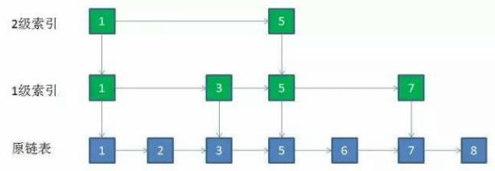
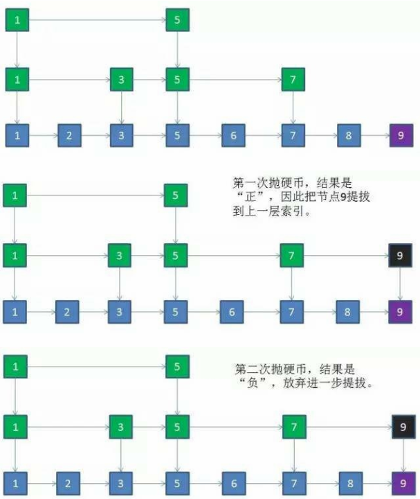
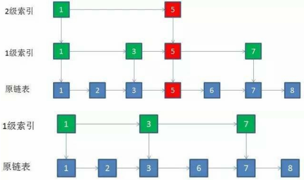
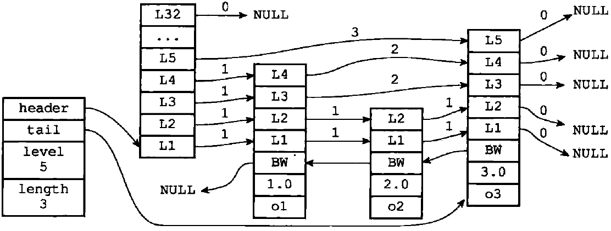
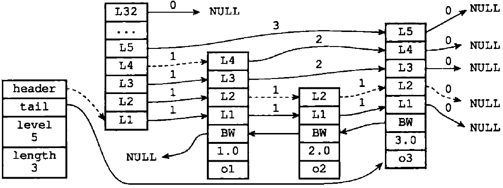
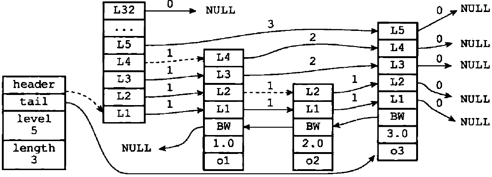

# Redis 常见面试题

简单来说 Redis 就是一个数据库，不过与传统数据库不同的是 Redis 的数据是存在内存中的，所以存写速度非常快，因此 Redis 被广泛应用于缓存方向。此外，redis 也经常用来做分布式锁。


## 为什么要用 Redis

**高性能**

假如用户第一次访问数据库中的某些数据。因为是从硬盘上读取的，所以这个过程会比较慢。我们可以将该用户这次访问的数据存在数缓存中，这样下一次再访问这些数据的时候就可以直接从缓存中获取了。操作缓存就是直接操作内存，所以速度相当快。如果数据库中的对应数据改变的之后，同步改变缓存中相应的数据即可！

**高并发**

高并发系统挂掉，多挂在数据库读写处，因为磁盘操作这个慢呀。直接操作缓存能够承受的请求是远远大于直接访问数据库的，所以我们可以考虑把数据库中的部分数据转移到缓存中去，这样用户的一部分请求会直接到缓存这里而不用经过数据库。


## 为什么要用 Redis 而不用 map 做缓存?

缓存分为本地缓存和分布式缓存。以 Java 为例，使用自带的 map 实现的是本地缓存，最主要的特点是轻量以及快速，生命周期随着 JVM 的销毁而结束，并且在多实例的情况下，每个实例都需要各自保存一份缓存，缓存不具有一致性。

使用 Redis 之类的称为分布式缓存，在多实例的情况下，各实例共用一份缓存数据，缓存具有一致性。缺点是需要保持 Redis 服务的高可用，会使整个程序的架构变的较为复杂。


## Redis 常见数据结构以及使用场景分析

### String

String 数据结构是简单的 key-value 类型，value 其实不仅可以是 String，也可以是数字。常规 key-value 缓存应用；常规计数：微博数，粉丝数等。

### List

双向链表，应用场景：微博的关注列表，粉丝列表，消息列表等。

#### 常用命令

```
lpush
rpush
lpop
rpop
blpop   # 阻塞 pop，bl：block
lrange  # LRANGE mylist 0 1，取出 list 0~1 的元素
llen
lrem
lindex  # 按 index get list 种的元素
linsert # LINSERT mylist BEFORE "World" "There"
lset    # LSET mylist 0 "four"，把第 0 个位置改成 "four"
```

#### 底层实现

链表。

### Hash

Hash 是一个 string 类型的 field 和 value 的映射表，又名字典，hash 特别适合用于存储对象，后续操作的时候，你可以直接仅仅修改这个对象中的某个字段的值。 比如我们可以Hash数据结构来存储用户信息，商品信息等等。

比如可以用 hash 类型存放：

```json
key=JavaUser293847
value={
    "id": 1,
    "name": "SnailClimb",
    "age": 22,
    "location": "Wuhan, Hubei"
}
```

#### 常用命令

```
hset     # HSET myhash field1 "Hello"，field1 是 key，"Hello" 是 value
hget
hdel     # 就 hash 特别，删除叫 del，别人都叫 rem
hgetAll  # 返回所有的 field 和 value，顺序：field1，value1，field2，value2，field3，value3 ...
hexists
hkeys
hvals
hsetnx   # 字段不存在时才 set，字段存在不 set
```

#### 底层实现

- 哈希表，一个字典有两个哈希表（`ht[0]` & `ht[1]`），一个是平时用的，一个是 rehash 时用的。
- 插入一个新的键值对时，会先根据 key 计算出哈希值和索引值，然后把键值对发到对应索引处。
- 哈希算法：MurmurHash2，该算法即使输入的键是由规律的，也能给出一个很好的随机性，并且速度快。
- 解决键冲突：链地址法，每个哈希表节点有一个 next 指针，冲突的键会形成一个单链表。
- 为了让哈希表的负载因子维持在一个合理的范围，当哈希表保存的键值对数量太多或太少时，程序会对哈希表的大小进行相应的扩展或收缩，这个过程叫 rehash。步骤如下：
	- `ht[0]` 是现在正在用的哈希表，Redis 会根据 `ht[0]` 中当前包含的键值对个数（`ht[0].used`）为 `ht[1]` 分配空间，空间大小取决于：
		- 扩展操作：`ht[1].size = 第一个大于 ht[0].used * 2 的 2^n`
		- 收缩操作：`ht[1].size = 第一个大于 ht[0].used 的 2^n`
	- 将 `ht[0]` 上的键值对 rehash 到 `ht[1]` 上；
	- 将 `ht[1]` 设置为 `ht[0]`，并在 `ht[1]` 新创建一个空白哈希表用于下一次 rehash。

### Set

适用于无顺序的集合，点赞点踩，抽奖，已读，共同好友（适合用来去重）

#### 常用命令

```
sadd     # SADD myset one two three，可以一次 add 一坨
sinter   # 两个集合的交集，SINTER key1 key2，其中 key1 和 key2 是两个 set 名
sunion   # 两个集合的并集
sdiff    # 第一个集合 - 交集
smembers
sismember
srem     # 删除元素
smove    # 把一个set中的元素移动到另一个集合
scard    # 集合的size
srandmember  # SRANDMEMBER myset n，随机取 n 个，可以用来做抽奖，不写 n 就是随机取一个
```

#### 底层实现

Set 有两种类型，一种是 intset，就是整数集合，另一种是对象集合。

### Sorted Set

排行榜，优先队列（适合用来排序）

多个节点可以包含相同的 score，不过成员对象必须是唯一的。元素先按照 score 大小进行排序，score 相同时，按照成员对象大小（字典序之类的）进行排序。

#### 常用命令

```
zadd       # ZADD myzset 2 "two" 3 "three"
zcard      # 集合的 size
zcount     # 可以计算一个范围内数的 size
zscore     # 查询 key 的值
zincrby    # 做加减法，对不存在的值加分会默认新建该值，并且初始值为 0
zrange     # ZRANGE myzset 0 -1 WITHSCORES，排行功能，打印排行后的结果
zrevrange  # 反转 Set
zrank      # key 的正向排名
zrevrank   # key 的反向排名
# 遍历
for (Tuple tuple : jedis.zrangeByScoreWithScores(rankKey, "60", "100")) {
    print(37, tuple.getElement() + ":" + String.valueOf(tuple.getScore()));
}
```

#### 底层实现（跳跃表）

传说中的跳跃表。跳跃表（skiplist）是一种随机化的数据，跳跃表以有序的方式在层次化的链表中保存元素， 效率和平衡树媲美 —— 查找、删除、添加等操作都可以在对数期望时间下完成， 并且比起平衡树来说， 跳跃表的实现要简单直观得多。

首先说一下我们的需求，我们要一个有序的列表，因为一个有序的列表搜索起来可以用二分法，快啊！

所以当我们要插入新元素的时候，就不能直接往表尾一放，我们需要保证把这个节点放进去之后，这个表还是有序的，所以我们的插入操作要分两步来进行：

1. 找：把新节点插哪我们的表还是有序滴
2. 插：把新节点插到我们上一步找到的位置处

这需求一看就是平衡树了，可是红黑树之流实现起来有多复杂，大家也是有目共睹的，所以，Redis 用了一种叫跳跃表的数据结构。我们先来介绍一下 [跳跃表](http://blog.jobbole.com/111731/)（这个小灰讲的超好，我就是在下面挑我关心的重点复述一下）：

首先，本质上来讲，跳跃表还是一个链表的，这样插入和删除就很快啦！不过存链表的查找很慢呀，根本用不了二分法之流，只能从头到尾一个一个的遍历，也就是说，它的查找移动步长只能是 1，那么怎么解决这个问题呢？我们首先想到的方法应该就是想尽一切办法能让查找操作以比较大的步长移动。

那么如何实现大步长移动呢？这就想到了 MySQL 的 InnoDB 的索引的实现方式，我们知道 InnoDB 的一个数据页中的数据和一个链表差不多，不过它有一个叫页目录的东西，这个页目录就是从它所在的页中，以一定的间隔抽出一些节点，作为这个页的目录，这样我们就能大跨度的在单链表中进行查找了。

跳跃表就是基于这个方法实现的大跨度的查找，它从真正的数据中抽出了一些作为一级索引，又从一级索引中抽出一部分作为二级索引，就这样抽抽抽，知道最高层只有两个节点为止（就剩俩了也没有必要继续抽了……）。抽完之后大概是这样的：



那么我们抽索引的时候，抽谁呢？跳跃表是个选择障碍症患者，所以它抛硬币，每插入一个新节点，它都有 50% 的概率被选为索引，所以跳跃表的插入操作的是这样滴，比如我们要在上面的那个表里插个 9：



那么删除呢？删除超简单，比如说我们要删个 5，那么我们从最高层开始找 5：

- 第一层有 5，删了，然后这层就剩 1，然后干脆把这层都删了……
- 第二层有 5，删了
- 第三层有 5，删了，好了，删光了！



不过呢，Redis 的实现方式和上面描述的过程还是有区别的，Redis 实现跳跃表用了两种结构体：

- `zskiplistNode`：表示跳跃表节点；
- `zskiplist`：保存跳跃表的相关信息；

先来看一下 `zskiplistNode` 的定义：

```c
typedef struct zskiplistNode {
    /* 下面俩货是我们的数据，不多说了 */
    robj *obj;     // member 对象
    double score;  // 分值
    
    /* 后退指针，指向当前节点的前一个节点，用于从表尾向表头遍历跳跃表中的所有节点 */
    struct zskiplistNode *backward;
    
    /* 层数组，实现大幅度跳跃的关键 */
    /* 每个节点的层数组长度不一定，是一个 1~32 的随机数，是根据幂次定理随机的，就是说数越大，出现的概率越小 */
    /* 每一个节点的同一层组成一个单链表，就是那个前进指针，比如 level[3] 吧，它就指向下一个有 level[3] 的节点 */
    struct zskiplistLevel {
        struct zskiplistNode *forward;  // 前进指针
        unsigned int span;  // 这个层跨越的节点数量
                            // 不要小看这个东西，这个东西可以拿来计算排位 rank
                            // 在查找某个节点的过程中，将沿途访问过的所有层的跨度累计起来，
                            // 得到的结果就是目标节点在跳跃表中的排位
                            // 要是没有这个东西，鬼知道你在进行大步跨越时，跨越了多少节点啊
    } level[];
} zskiplistNode;
```

再来看一下 `zskiplist` 的定义：

```c
typedef struct zskiplist {
    struct zskiplistNode *header, *tail;  // 头节点，尾节点
    unsigned long length;                 // 节点数量
    int level;                            // 目前表内节点的最大层数
} zskiplist;
```

所以 Redis 的表看起来是这样子滴：



如果我们想要遍历整个跳跃表，就是把 L1 层的链表从头遍历到尾，过程如下图虚线所示：



如果我们想查找一个节点，比如 o2，我们的查找过程如下图虚线所示：



这下明白 Redis 的跳跃表了吧！


## Redis 设置过期时间

Redis 中有个设置时间过期的功能，即对存储在 Redis 数据库中的值可以设置一个过期时间。作为一个缓存数据库，这是非常实用的。如我们一般项目中的 token 或者一些登录信息，尤其是短信验证码都是有时间限制的，按照传统的数据库处理方式，一般都是自己判断过期，这样无疑会严重影响项目性能。

对于这种数据，我们 set key 的时候，都可以给一个 expire time，就是过期时间，通过过期时间我们可以指定这个 key 可以存活的时间。这样就不需要我们再在应用中手动判断这个 key 是否过期，而是将这个任务交给 Redis 来做。

> 过期时间设置方式：`EXPIRE <key> <ttl>`

我们是不管了，那么 Redis 到底是怎么删除这个过期数据的呢？

Redis 删除过期数据的方式： **定期删除 + 惰性删除** 。

- **定期删除：** Redis 默认是每隔 100ms 就随机抽取一些设置了过期时间的 key，检查其是否过期，如果过期就删除。注意这里是随机抽取的。
	- 为什么要随机呢？你想一想假如 Redis 存了几十万个 key ，如果每隔 100ms 就遍历所有的设置过期时间的 key 的话，CPU怕是要废了……
- **惰性删除：** 定期删除可能会导致很多过期 key 到了时间并没有被删除掉，所以就有了惰性删除。惰性删除就是：假如你的过期 key，靠定期删除没有被删除掉，还停留在内存里，这时候你的系统去查了一下那个 key，Redis 会先检查下数据过期没，如果过期了，就会被 Redis 删除掉。

但是仅仅通过设置过期时间还是有问题的。我们想一下：如果定期删除漏掉了很多过期 key，然后你也没及时去查，也就没走惰性删除，此时会怎么样？当然会有好多过期的 key 堆积在内存中了，如果大量过期 key 堆积在内存里，是导致 Redis 内存块耗尽的。那么怎么解决这个问题呢？这就要依靠 Redis 的内存淘汰机制了。


## Redis 内存淘汰机制

即 MySQL 里有 2000w 数据，Redis 中只存 20w 的数据，那么如何保证 Redis 中的数据都是热点数据呢？

Redis 提供了如下 8 种数据淘汰策略：

| 策略                   | 描述                                                         |
| ---------------------- | ------------------------------------------------------------ |
| `volatile-lru`         | 从已设置过期时间的数据集（server.db[i].expires）中挑选最近最少使用的数据淘汰 |
| `allkeys-lru`          | 从数据集（server.db[i].dict）中挑选最近最少使用的数据淘汰    |
| `volatile-lfu`         | 从已设置过期时间的数据集（server.db[i].expires）中挑选使用频率最小的数据淘汰 |
| `allkeys-lfu`          | 从数据集（server.db[i].dict）中挑选挑选使用频率最小的数据淘汰 |
| `volatile-random`      | 从已设置过期时间的数据集（server.db[i].expires）中挑选任意选择数据淘汰 |
| `allkeys-random`       | 从数据集（server.db[i].dict）中挑选任意选择数据淘汰          |
| `volatile-ttl`         | 从已设置过期时间的数据集（server.db[i].expires）中挑选将要过期的数据淘汰 |
| `noeviction` (Default) | 禁止驱逐数据，也就是说当内存不足以容纳新写入数据时，新写入操作会报错 |

设置方式：在配置文件 redis.conf 中写入 `maxmemory-policy 策略名`。

> **记忆：**
>
> - LRU：Least Recently Used
> - LFU：Least Frequently Used
> - volatile：已设置过期时间的数据集（server.db[i].expires）
> - allkeys：数据集（server.db[i].dict）


## Redis 持久化机制

即怎么保证 Redis 挂掉之后再重启数据可以进行恢复？

Redis 是支持持久化的，而且还支持两种，它们分别是：

- 快照（snapshotting，RDB）
- 只追加文件（append-only file，AOF）

### RDB 持久化

Redis 可以通过创建快照来获得存储在内存里面的数据在某个时间点上的副本。Redis 创建快照之后，可以对快照进行备份，可以将快照复制到其他服务器从而创建具有相同数据的服务器副本（Redis 主从结构，主要用来提高 Redis 性能），还可以将快照留在原地以便重启服务器的时候使用。

快照持久化是 Redis 默认采用的持久化方式，在 redis.conf 配置文件中默认有此下配置：

```shell
save 900 1     # 在 900 秒(15分钟)之后，如果至少有 1 个 key 发生变化，Redis 就会自动触发 BGSAVE 命令创建快照
save 300 10    # 在 300 秒(5分钟)之后，如果至少有 10 个 key 发生变化，Redis 就会自动触发 BGSAVE 命令创建快照
save 60 10000  # 在 60 秒(1分钟)之后，如果至少有 10000 个 key 发生变化，Redis 就会自动触发 BGSAVE 命令创建快照
```

### AOF 持久化

与快照持久化相比，AOF 持久化的实时性更好，因此已成为主流的持久化方案。默认情况下 Redis 没有开启 AOF 方式的持久化，需要通过 appendonly 参数开启：

```shell
appendonly yes
```

开启 AOF 持久化后每执行一条会更改 Redis 中的数据的命令，Redis 就会将该命令写入硬盘中的 AOF 文件。AOF 文件的保存位置和 RDB 文件的位置相同，都是通过 dir 参数设置的，默认的文件名是 appendonly.aof。

在 Redis 的配置文件中存在三种不同的 AOF 持久化方式，它们分别是：

```shell
appendfsync always    # 每次有数据修改发生时都会写入 AOF 文件，这样会严重降低 Redis 的速度
appendfsync everysec  # 每秒钟同步一次，显示地将多个写命令同步到硬盘
appendfsync no        # 让操作系统决定何时进行同步
```

为了兼顾数据和写入性能，用户可以考虑 appendfsync everysec 选项 ，让 Redis 每秒同步一次 AOF 文件，Redis 性能几乎没受到任何影响。而且这样即使出现系统崩溃，用户最多只会丢失一秒之内产生的数据。当硬盘忙于执行写入操作的时候，Redis 还会优雅的放慢自己的速度以便适应硬盘的最大写入速度。


## Redis 事务

Redis 通过 `MULTI`、`EXEC`、`WATCH ` 等命令来实现事务功能。事务提供了一种将多个命令请求打包，然后一次性、按顺序地执行多个命令的机制，并且在事务执行期间，服务器不会中断事务而改去执行其他客户端的命令请求，它会将事务中的所有命令都执行完毕，然后才去处理其他客户端的命令请求。

一个事务从开始到结束会经历以下三个阶段：

- 事务开始
- 命令入队
- 事务执行

流程如下：

```shell
MULTI                # 事务开始
SET "name" "xxx"     # 放到事务队列的 index 0 处
GET "name"           # 放到事务队列的 index 1 处
SET "author" "Bean"  # 放到事务队列的 index 2 处
GET "author"         # 放到事务队列的 index 3 处
EXEC                 # 从 index 0 到 index 3 执行事务队列中的命令，并将 4 个命令的结果返回客户端
```

那么 `WATCH` 命令是干嘛的呢？它是一个乐观锁，可以在 `EXEC` 命令执行前，监视任意数量的数据库键，在 `EXEC` 命令执行时，只要有一个被监视的键发生了变化，服务器就会拒绝执行事务，并返回：`(nil)` 表示事务执行失败。

在传统的关系式数据库中，常常用 ACID 性质来检验事务功能的可靠性和安全性。在 Redis 中，事务总是具有原子性
（Atomicity)、一致性（Consistency）和隔离性（Isolation），并且当 Redis 运行在某种特定的持久化模式下时，事务也具有持久性（Durability）。


## 缓存穿透、缓存雪崩、缓存击穿问题的解决方案

### 缓存穿透

**问题描述：** 缓存穿透是指查询一个一定不存在的数据，由于缓存是命中时被动写的，这个数据不存在，所以缓存肯定没有，这将导致这个不存在的数据每次请求都要到存储层去查询，失去了缓存的意义。在流量大时，可能 DB 就挂掉了，要是有人利用不存在的 key 频繁攻击我们的应用，这就是漏洞。

**解决方法的思路：** 要能快速的判断出一个 key 在我们的系统到底存不存在，数据不存在，就不去 DB 查了。

**解决方法：布隆过滤器。** 将所有可能存在的数据哈希到一个足够大的 bitmap 中，要查询一个 key 之前，都先用这个 bitmap 判断一下存不存在，数据不存在就不去 DB 查了，从而避免了对底层存储系统的查询压力。

另外也有一个更为简单粗暴的方法，即如果一个查询返回的数据为空（不管是数据不存在，还是系统故障），我们仍然把这个空结果进行缓存，但它的过期时间会很短，最长不超过五分钟。

### 缓存雪崩

**问题描述：** 缓存雪崩是指在我们设置缓存时采用了相同的过期时间，导致缓存在某一时刻同时失效，请求全部转发到 DB，DB 瞬时压力过重雪崩。

**解决方法：** 将缓存失效时间分散开，比如我们可以在原有的失效时间基础上增加一个随机值，比如 1-5 分钟的随机时间，这样每一个缓存的过期时间的重复率就会降低，就很难引发集体失效的事件。

### 缓存击穿

**问题描述：** 对于一些设置了过期时间的 key，如果这些 key 可能会在某些时间点被超高并发地访问，是一种非常 “热点” 的数据。但当缓存在某个时间点过期的时候，如果恰好在这个时间点有对这个 key 的大量并发请求过来，这些请求发现缓存过期了，就会选择从后端 DB 加载数据并回设到缓存，这个时候大并发的请求可能会瞬间把后端 DB 压垮。

有如下 3 种解决方法：

#### 使用互斥锁（mutex key）

就是在缓存失效的时候（判断拿出来的值为空），不是立即去 load db，而是先使用缓存工具的某些带成功操作返回值的操作（比如 Redis 的 SETNX）去 set 一个 mutex key，当操作返回成功时，再进行 load db 的操作并回设缓存；否则，就重试整个 get 缓存的方法（此时其他成功的请求可能已经把缓存更新好了，这个请求就可以成功的 get 到了）。

也就是说，我们只放一个请求去 load DB，把其他的请求都拦在了缓存层。

#### "提前" 使用互斥锁

在这个 key 的 value 内部设置 1 个超时值 (timeout1)，timeout1 比实际的 timeout (timeout2) 要小。当从 cache 读取到 timeout1 发现它已经过期时候，马上延长 timeout1 并重新设置到 cache。然后再从数据库加载数据并设置到 cache 中。

也就是说，我们根本不让这个热点数据在缓存中不存在，热点数据快过期了就更新一下它，不让它真正的过期。

#### 永远不过期

缓存在 Redis 中的热点数据根本不设置过期时间，把过期时间存在 key 对应的 value 里，如果发现要过期了，通过一个后台的异步线程更新缓存。


## 如何解决 Redis 的并发竞争 Key 问题

所谓 Redis 的并发竞争 key 的问题也就是多个系统同时对一个 key 进行操作，但是最后执行的顺序和我们期望的顺序不同，这样也就导致了结果的不同！

推荐一种方案：分布式锁（zookeeper 和 redis 都可以实现分布式锁）。（但如果不存在 Redis 的并发竞争 key 问题，不要使用分布式锁，会影响性能）。

**分布式锁应该是怎么样的：**

- 互斥性：可以保证在分布式部署的应用集群中，同一个方法在同一时间只能被一台机器上的一个线程执行。
- 这把锁要是一把可重入锁（避免死锁）
- 不会发生死锁：有一个客户端在持有锁的过程中崩溃而没有解锁，也能保证其他客户端能够加锁。
- 获取锁和释放锁的性能要好

### 基于数据库表


### 基于 Redis 的分布式锁


### 基于 Zookeeper 实现分布式锁

基于 Zookeeper 临时有序节点可以实现的分布式锁。大致思想为：每个客户端对某个方法加锁时，在 Zookeeper 上的与该方法对应的指定节点的目录下，生成一个唯一的瞬时有序节点。 判断是否获取锁的方式很简单，只需要判断有序节点中序号最小的一个。 当释放锁的时候，只需将这个瞬时节点删除即可。同时，其可以避免服务宕机导致的锁无法释放，而产生的死锁问题。完成业务流程后，删除对应的子节点释放锁。


## 如何保证缓存与数据库双写时的数据一致性？

你只要用缓存，就可能会涉及到缓存与数据库双存储双写，你只要是双写，就一定会有数据一致性的问题，那么你如何解决一致性问题？

一般来说，就是如果你的系统不是严格要求缓存+数据库必须一致性的话，缓存可以稍微的跟数据库偶尔有不一致的情况，最好不要做这个方案，读请求和写请求串行化，串到一个内存队列里去，就是读的时候肯定不写，写的时候肯定不读，这样就可以保证一定不会出现不一致的情况，但是这会导致系统的吞吐量大幅度降低，用比正常情况下多几倍的机器去支撑线上的一个请求。

**最经典的缓存 + 数据库读写的模式：Cache Aside Pattern。** 即：

- 读的时候，先读缓存，缓存没有的话，就读数据库，然后取出数据后放入缓存，同时返回响应。
- 更新的时候， **先更新数据库，然后再删除缓存** 。（一个 lazy 计算的思想）
	- **为什么是删除缓存，而不是更新缓存？**
		- 很多时候，在复杂点的缓存场景，缓存不单单是数据库中直接取出来的值，而可能是多个数据库中的结果计算出来的。比如可能更新了某个表的一个字段，然后其对应的缓存，是需要查询另外两个表的数据并进行运算，才能计算出缓存最新的值的。
		- 数据库频繁更新的数据不一定是被频繁访问的数据，这种情况下，数据库更新一次就修改一次缓存是很不值得的。

Cache Aside Pattern 可能会出现的问题：

**1. 先修改数据库，再删除缓存。如果删除缓存失败了，那么会导致数据库中是新数据，缓存中是旧数据，数据就出现了不一致。**

- **解决思路：** 先删除缓存，再修改数据库。如果数据库修改失败了，那么数据库中是旧数据，缓存中是空的，那么数据不会不一致。因为读的时候缓存没有，则读数据库中旧数据，然后更新到缓存中。虽然数据还是旧的，不过至少数据库和缓存是一致的。

**2. 数据发生了变更，先删除了缓存，然后要去修改数据库，此时还没修改。一个请求过来，去读缓存，发现缓存空了，去查询数据库，查到了修改前的旧数据，放到了缓存中。随后数据变更的程序完成了数据库的修改。完了，数据库和缓存中的数据不一样了...**

- 更新数据的时候，根据 **数据的唯一标识**，将操作路由之后，发送到一个 jvm 内部队列中。读取数据的时候，如果发现数据不在缓存中，那么将重新读取数据 + 更新缓存的操作，根据唯一标识路由之后，也发送同一个 jvm 内部队列中。
- 一个队列对应一个工作线程，每个工作线程 **串行** 拿到对应的操作，然后一条一条的执行。这样的话，一个数据变更的操作，先删除缓存，然后再去更新数据库，但是还没完成更新。此时即使一个读请求过来，读到了空的缓存，它也会先将缓存更新的请求发送到队列中，等待缓存更新完成，而不是拿了旧数据就走，走前还不忘把旧数据放缓存里……
- **优化点：** 一个队列中，**多个更新缓存请求串在一起是没意义的**，如果发现队列中已经有一个更新缓存的请求了，那么就不用再放个更新请求操作进去了，直接等待前面的更新操作请求完成即可。
- 如果请求还在等待时间范围内，不断轮询发现可以取到值了，那么就直接返回；如果请求等待的时间超过一定时长，那么这一次直接从数据库中读取当前的旧值，但不会把这个旧值设置到缓存中去。


**参考：**

- [如何保证缓存与数据库双写时的数据一致性？](https://github.com/doocs/advanced-java/blob/master/docs/high-concurrency/redis-consistence.md)
- [分布式锁解决并发的三种实现方式](https://www.jianshu.com/p/8bddd381de06)
- [缓存穿透，缓存击穿，缓存雪崩解决方案分析](https://blog.csdn.net/zeb_perfect/article/details/54135506)


