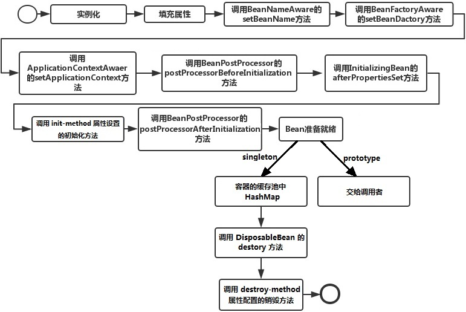
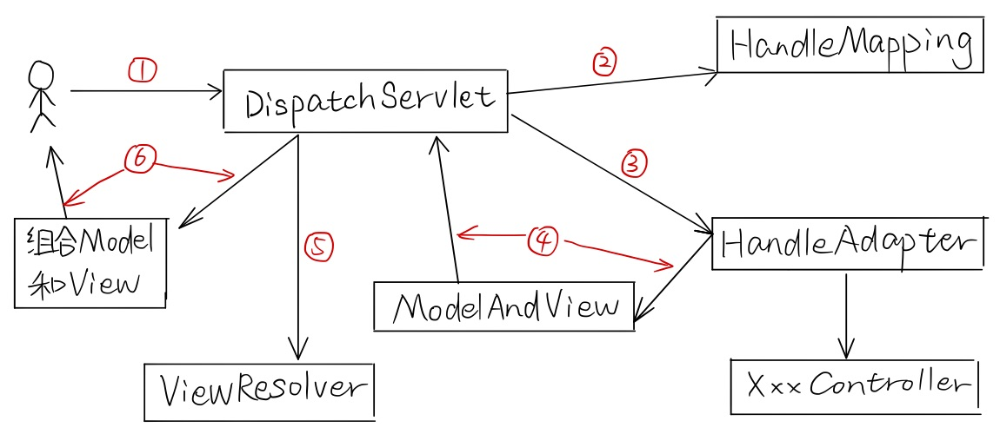
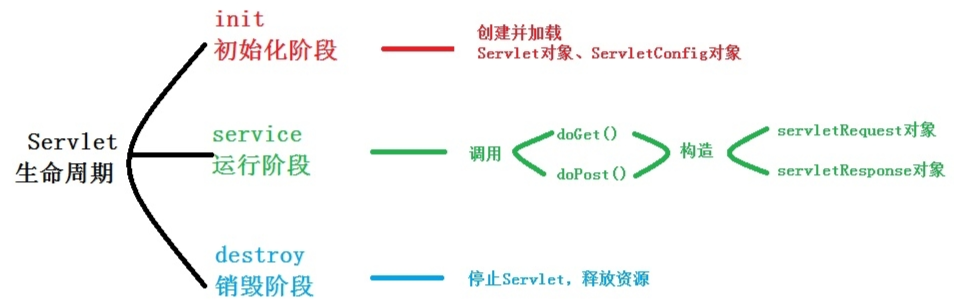

# Spring 常见面试题

## Spring IoC、AOP 的理解以及实现的原理

### Spring IoC

- Spring IoC 实现原理：反射创建实例。
- IoC 容器的加戴过程：`XML -> 读取 -> Resource -> 解析 -> BeanDefinition -> 注册 -> BeanFactory `

### Spring AOP

- Spring AOP 实现原理：动态代理
  - JDK 的动态代理：如果目标对象的实现类实现了接口，Spring AOP 将会采用 JDK 动态代理来生成 AOP 代理类。
  - CGLib 动态代理：如果目标对象的实现类没有实现接口，Spring AOP 将会采用 CGLIB 来生成 AOP 代理类。
  - 动态代理与 CGLib 实现的区别

## Spring Boot 和 Spring 的区别

- Spring Boot 是基于 Spring 的一套快速开发整合包；
- 内嵌了如 Tomcat，Jetty 和 Undertow 这样的容器，也就是说可以直接跑起来，用不着再做部署工作了；
- 无需再像 Spring 那样搞一堆繁琐的 xml 文件的配置；

## ApplicationContext 和 BeanFactory 的区别

- 加载 Bean 的时机不同
	- BeanFactroy 采用的是延迟加载形式来注入Bean 的，即只有在使用到某个 Bean 时（调用getBean()），才对该 Bean 进行加载实例化，这样，我们就不能发现一些存在的 Spring 的配置问题。
	- ApplicationContext 是在容器启动时，一次性创建了所有的 Bean。这样，在容器启动时，我们就可以发现 Spring 中存在的配置错误。

## Spring Bean 的作用域：

- singleton：在 Spring 的 IoC 容器中只存在一个对象实例，这个实例会被保存到缓存中，并且对该 bean 的所有后续请求和引用都将返回该缓存中的对象实例。
- prototype：每次对该 bean 的请求都会创建一个新的实例。
- request：每次 http 请求将会有各自的 bean 实例。
- session：在一个 http session 中，一个 bean 定义对应一个 bean 实例。
- globalSession：在一个全局的 http session 中，一个 bean 定义对应一个 bean 实例。

## Spring Bean 生命周期

- Spring 对 Bean 进行实例化。

	- 相当于程序中的 `new Xxx()`。
- Spring 将值和 Bean 的引用注入进 Bean 对应的属性中。
- 如果 Bean 实现了 BeanNameAware 接口，Spring 将 Bean 的 ID 传递给 setBeanName() 方法。

	- 实现 BeanNameAware 接口主要是为了通过 Bean 的引用来获得 Bean 的 ID，不过一般很少用到 Bean 的 ID。
- 如果 Bean 实现了 BeanFactoryAware 接口，Spring 将调用 setBeanFactory(BeanFactory bf) 方法并把 BeanFactory 容器实例作为参数传入。

	- 实现 BeanFactoryAware 主要目的是为了获取 Spring 容器，如 Bean 通过 Spring 容器发布事件。
- 如果 Bean 实现了 ApplicationContextAware 接口，Spring 容器将调用 setApplicationContext(ApplicationContext ctx) 方法，把当前应用上下文作为参数传入。

	- 作用与 BeanFactory 类似，都是为了获取 Spring 容器。 **不同的是**：Spring 容器在调用 setApplicationContext 方法时会把它自己作为参数传入，而调用 setBeanFactory 方法前需要程序员自己指定（注入）setBeanDactory 里的 BeanFactory 参数。
- 如果 Bean 实现了 BeanPostProcessor 接口，Spring 将调用它们的 postProcessorBeforeInitialization 方法。

	- 作用是在 Bean 实例创建成功后对进行增强处理，如对 Bean 进行修改或增加某个功能。
- 如果 Bean 实现了 InitializingBean 接口，Spring 将调用它们的 afterPropertiesSet 方法

	- 作用与在配置文件中对 Bean 使用 init-method 声明初始化的作用一样，都是在 Bean 的全部属性设置成功后执行的初始化方法。
- 如果 Bean 实现了 BeanPostProcessor 接口，Spring 将调用它们的 postProcessorAfterInitialization 方法。

	- 作用与 postProcessorBeforeInitialization 一样，只不过 postProcessorBeforeInitialization 是在 Bean 初始化前执行，这个在 Bean 初始化后执行。
- Bean 就准备就绪了，如果这个 Bean 是 singleton 的，就把它保存到容器的缓存中，如果是 prototype 的，就交给调用者。
- 如果 Bean 实现了 DisposableBean 接口，Spring 将调用它的 destroy 方法

	- 作用与在配置文件中对 Bean 使用 destory-method 属性一样，都是在 Bean 实例销毁前执行的方法。

## Spring 事务

### Spring 事务中的隔离级别

- `TransactionDefinition.ISOLATION_DEFAULT`：使用后端数据库默认的隔离级别，Mysql 默认采用的 REPEATABLE_READ 隔离级别 Oracle 默认采用的 READ_COMMITTED 隔离级别。
- `TransactionDefinition.ISOLATION_READ_UNCOMMITTED`：最低的隔离级别，允许读取尚未提交的数据变更，可能会导致脏读、幻读或不可重复读。
- `TransactionDefinition.ISOLATION_READ_COMMITTED`：允许读取并发事务已经提交的数据，可以阻止脏读，但是幻读或不可重复读仍有可能发生。
- `TransactionDefinition.ISOLATION_REPEATABLE_READ`：对同一字段的多次读取结果都是一致的，除非数据是被本身事务自己所修改，可以阻止脏读和不可重复读，但幻读仍有可能发生。
- `TransactionDefinition.ISOLATION_SERIALIZABLE`：最高的隔离级别，完全服从 ACID 的隔离级别。所有的事务依次逐个执行，这样事务之间就完全不可能产生干扰，也就是说，该级别可以防止脏读、不可重复读以及幻读。但是这将严重影响程序的性能。通常情况下也不会用到该级别。

### Spring 事务中的事务传播行为

#### 支持当前事务的情况

- `TransactionDefinition.PROPAGATION_REQUIRED`：如果当前存在事务，则加入该事务；如果当前没有事务，则创建一个新的事务。
- `TransactionDefinition.PROPAGATION_SUPPORTS`：如果当前存在事务，则加入该事务；如果当前没有事务，则以非事务的方式继续运行。
- `TransactionDefinition.PROPAGATION_MANDATORY`：如果当前存在事务，则加入该事务；如果当前没有事务，则抛出异常。（mandatory：强制性）

#### 不支持当前事务的情况

- `TransactionDefinition.PROPAGATION_REQUIRES_NEW`：创建一个新的事务，如果当前存在事务，则把当前事务挂起。
- `TransactionDefinition.PROPAGATION_NOT_SUPPORTED`：以非事务方式运行，如果当前存在事务，则把当前事务挂起。
- `TransactionDefinition.PROPAGATION_NEVER`：以非事务方式运行，如果当前存在事务，则抛出异常。

#### 其他情况

- `TransactionDefinition.PROPAGATION_NESTED`：如果当前存在事务，则创建一个事务作为当前事务的嵌套事务来运行；如果当前没有事务，则该取值等价于 TransactionDefinition.PROPAGATION_REQUIRED。

### 事务怎么配置（基于 Aspectj AOP 配置事务）

## Spring 的 Annotation 如何实现

## Spring MVC

### Spring MVC 原理

1. 客户端将请求发送到 DispatchServlet；
2. DispatchServlet 通过调用 HandleMapping，根据 URL 找到对应的处理器，并返回给 DispatchServlet；
3. DispatchServlet 通过 HandleAdapter 调用 Handle；
4. Handle 运行完会返回 ModelAndView 给 DispatchServlet；
5. DispatchServlet 将 ModelAndView 交给 ViewResolver 解析，解析将得到具体的 View；
6. 将 Model 填充进 View 中，将渲染结果返回客户端。

### 描述从 Tomcat 开始到 Spring MVC 返回到前端显示的整个流程

在没有 Spring MVC 前，Tomcat 处理一个 HTTP 请求的具体处理流程是这样的：

- Web 客户向 Servlet 容器（Tomcat）发出 HTTP 请求；
- Servlet 容器分析客户的请求信息
- Servlet 容器创建一个 HttpRequest 对象和一个 HttpResponse 对象，并将客户请求的信息封装到 HttpRequest 对象中；
- Servlet 容器调用 HttpServlet 对象的 service 方法，把 HttpRequest 对象与 HttpResponse 对象作为参数传给 HttpServlet对象；
- HttpServlet 调用 HttpRequest 对象的有关方法，获取 HTTP 请求信息；
- HttpServlet 调用 HttpResponse 对象的有关方法，生成响应数据；
- Servlet 容器把 HttpServlet 的响应结果传给 Web 客户；

我们有多少服务，就写多少个 Servlet，不过有了 Spring MVC 后，服务器里就剩一个 DispatchServlet 了，所有的 HTTP 请求都会被映射到这个 Servlet 上，请求进入到 DispatchServlet 中后，就算进入到了框架之中了，由 DispatchServlet 统一的分配 HTTP 请求到各个 Controller 中进行处理，流程详见Spring MVC 原理。

### 如果使用 Spring MVC，那 post 请求跟 put 请求有什么区别？

post 是新建资源，put 是更新资源。

### Spring MVC 中的 handlerMapping 的内部实现

### Servlet

- Servlet 是什么？
	- Servlet 是 Java 的三大组件之一，是动态资源，作用是**处理请求**，服务器会把接收到的请求交给Servlet来处理。
	- 需要完成：接收请求数据、处理请求、完成响应。
- 和 JSP 有什么联系？
	- JSP 是从 Servlet 继承来的，它在 Servlet 当中又添加/修改了一些方法，作了新的封装。它们只是为实现同样的功能而进行了不同封装的组件而已。
	- 使用 Servlet 产生动态网页，需要在代码中打印输出很多 HTML 的标签，此外，在 Servlet 中，我们不得不将静态现实的内容和动态产生内容的代码混合在一起。使用 Servlet 开发动态网页，程序员和网页编辑人员将无法一起工作，因为网页编辑人员不了解 Java 语言，无法修改 Servlet 代码，而 Java 程序员可能也不是很了解网页编辑人员的意图，以至于无法修改和实现网页功能。为了解决这些问题，Sun 公司就推出了 JSP 技术。
- JSP 的运行原理？
	- 第一次访问 showTime.jsp 文件时，web 服务器会把 showTime.jsp 翻译成一个 Servlet：showTime_jsp.java，再将其编译成一个showTime_jsp.class，然后把 class 加载到内存；
	- 如果是第二次或是以后访问，它就会直接访问内存中的实例了；
	- showTime_jsp.java 中有许多 `out.write()`，其内容正是我们所写的 JSP 页面的内容。这就是 JSP 将 Java 代码和 html 组合起来的方式。
	- 然后服务器真正运行的其实是这个 showTime_jsp.java 文件。

#### Servlet 生命周期

- 创建 Servlet 对象，通过服务器反射机制创建 Servlet 对象，第一次请求时才会创建；
- 调用 Servlet 对象的 `init()` 方法，初始化 Servlet 的信息，`init()` 方法只会在创建后被调用一次；
- 响应请求，调用 `service()` 或者是 `doGet()`，`doPost()` 方法来处理请求，这些方法是运行的在多线程状态下的；
- 在长时间没有被调用或者是服务器关闭时，会调用 `destroy()` 方法来销毁 Servlet 对象。

#### Servlet 是线程安全的吗？

Servlet 只有一个实例对象，所以可能会出现一个 Servlet 同时处理多个请求，但 Servlet 是线程不安全的 (所以它工作效率高)，因此我们尽可能不要在 Servlet 中创建成员变量，或者只创建只读 (只能 get 不能 set) 的成员变量来保证线程线程安全。

#### servlet 是单例吗？

**单例** 的典型应用，一个类只有一个对象，当然可能存在多个Servlet类。

#### servlet 和 filter 的区别？

- Servlet 流程是短的，url 传来之后，就对其进行处理，之后返回或转向到某一自己指定的页面。它主要用来在业务处理之前进行控制。
- filter 流程是线性的，url 传来之后，检查之后，可保持原来的流程继续向下执行，被下一个 filter 或 servlet 接收等，而 servlet 处理之后，不会继续向下传递。filter 功能可用来保持流程继续按照原来的方式进行下去，或者主导流程，而 servlet的功能主要用来主导流程。
- filter 可用来进行字符编码的过滤，检测用户是否登陆的过滤，禁止页面缓存等。

## Spring 中的设计模式

- 简单工厂
- 工厂方法
- 单例模式
- 适配器模式
- 装饰者模式
- 代理模式
- 观察者模式
- 策略模式
- 模板方法