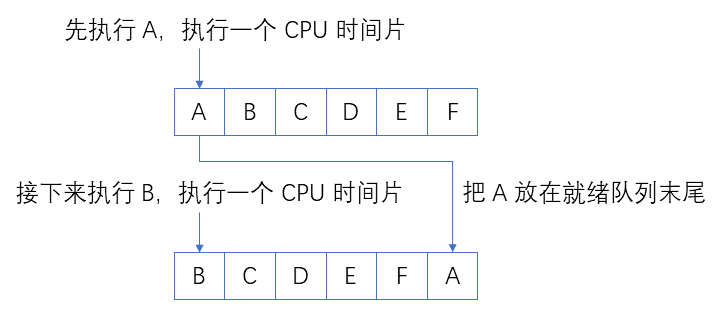
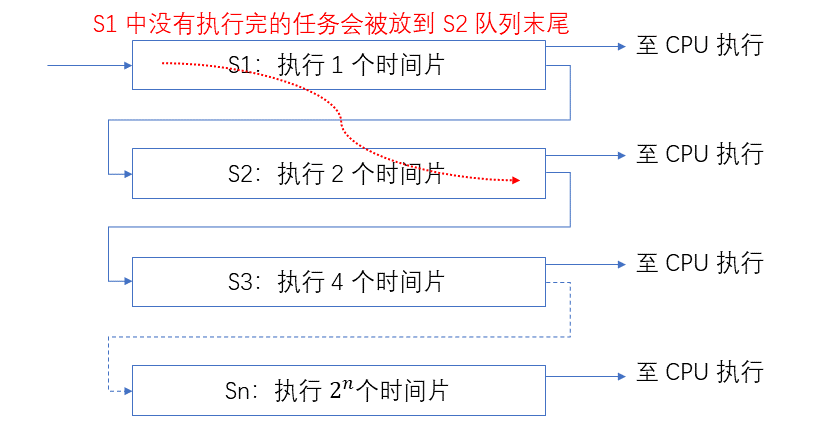

# 操作系统常见面试题

## 进程和线程的区别

- **进程** 是系统进行 **资源分配** 的基本单位。
- **线程** 是进程的一个实体，是 **独立调度** 的基本单位，它是比进程更小的能独立运行的基本单位，**最小的 CPU 执行单元**。 一个进程中可以有多个线程，它们共享它们所属进程的资源。

例如，QQ 和浏览器是两个进程，浏览器进程里面有很多线程，例如 HTTP 请求线程、事件响应线程、渲染线程等等，线程的并发执行使得在浏览器中点击一个新链接从而发起 HTTP 请求时，浏览器还可以响应用户的其它事件。

**它们之间的区别主要包括以下 4 个方面：**

- **拥有资源：** 进程是资源分配的基本单位，但是线程不拥有资源，线程可以访问隶属进程的资源。
- **调度：** 线程是独立调度的基本单位，在同一进程中，线程的切换不会引起进程切换，从一个进程中的线程切换到另一个进程中的线程时，会引起进程切换。
- **系统开销：** 由于创建或撤销进程时，系统都要为之分配或回收资源，如内存空间、I/O 设备等，所付出的开销远大于创建或撤销线程时的开销。类似地，在进行进程切换时，涉及当前执行进程 CPU 环境的保存及新调度进程 CPU 环境的设置，而线程切换时只需保存和设置少量寄存器内容，开销很小。
- **通信方面：** 线程间可以通过直接读写同一进程中的数据进行通信，但是进程通信需要借助 IPC (Inter-Process Communication)。

线程拥有的资源：程序计数器、寄存器、栈、状态字。

进程和线程的主要差别在于它们是 **不同的操作系统资源管理方式** 。简而言之：

- 一个程序至少有一个进程，一个进程至少有一个线程。
- 线程的划分尺度小于进程，使得多线程程序的并发性高。
- 进程在执行过程中拥有独立的内存单元，而多个线程共享内存，从而极大地提高了程序的运行效率。
- 多线程的意义在于一个应用程序中，有多个执行部分可以同时执行。但操作系统并没有将多个线程看做多个独立的应用，来实现进程的调度和管理以及资源分配。这就是进程和线程的重要区别。

## 进程状态切换图

## 进程调度算法

进程调度算法有，不同环境的调度算法目标不同，因此需要针对不同环境来讨论调度算法。

### 批处理系统

批处理系统没有太多的用户操作，在该系统中，**调度算法目标是保证吞吐量和周转时间（从提交到终止的时间）。**

- **先来先服务 first-come first-serverd（FCFS）[非抢占式]**
	- 按照请求的顺序进行调度，很公平哈。
	- 有利于长作业，但不利于短作业，因为短作业必须一直等待前面的长作业执行完毕才能执行，而长作业又需要执行很长时间，造成了短作业等待时间过长。
- **短作业优先 shortest job first（SJF）[非抢占式]**
	- 先调度估计运行时间最短的进程。
	- 每次从就绪队列中挑选估计服务时间最短的进程分配 CPU 时间片。
	- 长作业有可能会饿死，处于一直等待短作业执行完毕的状态。因为如果一直有短作业到来，那么长作业永远得不到调度。
- **最短剩余时间优先 shortest remaining time next（SRTN）[抢占式]**
	- 先调度估计剩余运行时间最短的进程。
	- 该算法首先按照短作业优先原则运行，在该作业运行期间，一旦有新作业到达系统，并且该新作业的服务时间比当前运行作业的剩余服务时间短，则发生抢占；否则，当前作业继续运行。
	- 该算法确保一旦新的短作业或短进程进入系统，能够很快得到处理。

> 长作业：CPU 繁忙性任务。
>
> 短作业：I/O 繁忙性任务。

### 交互式系统

交互式系统有大量的用户交互操作，在该系统中，**调度算法的目标是快速地进行响应。**

- **时间片轮转**

  - 将所有就绪进程按 FCFS 的原则排成一个队列，每次调度时，把 CPU 时间分配给队首进程，该进程可以执行一个时间片。当时间片用完时，由计时器发出时钟中断，调度程序便停止该进程的执行，并将它送往就绪队列的末尾，同时继续把 CPU 时间分配给队首的进程。**即一个进程运行一个时间片就切换下一个进程，大家轮着来。**

  - 执行过程图：

    

  - 时间片轮转算法的效率和时间片的大小有很大关系：

    - 如果时间片太小，进程切换都要保存进程的信息并且载入新进程的信息，会导致进程切换得太频繁，在进程切换上就会花过多时间。
    - 如果时间片过长，实时性就不能得到保证。

- **优先级调度**

  - 为每个进程分配一个优先级，按优先级进行调度。
  - 为了防止低优先级的进程永远等不到调度，可以随着时间的推移增加等待进程的优先级。

- **多级反馈队列**

  - 时间片轮转算法对于需要运行较长时间的进程很不友好，假设有一个进程需要执行 100 个时间片，如果采用时间片轮转调度算法，那么需要交换 100 次。因此发展出了多级反馈队列的调度方式。

  - 多级队列是为这种需要连续执行多个时间片的进程考虑，它设置了多个就绪队列，每个队列时间片大小都不同，例如 ：1, 2, 4, 8, ... 这样呈指数增长。如果进程在第一个队列没执行完，就会被移到下一个队列。

    - 在这种情况下，一个需要 100 个时间片才能执行完的进程只需要交换 7 次就能执行完 (`1 + 2 + 4 + 8 + 16 + 32 + 64 = 127 > 100`）。 

  - 每个队列优先权也不同，最上面的优先权最高。因此只有上一个队列没有进程在排队，才能调度当前队列上的进程。

  - 可以将这种调度算法看成是时间片轮转调度算法和优先级调度算法的结合。

  - 执行过程图：

  	

### 实时系统

实时系统要求一个请求在一个确定时间内得到响应。分为硬实时和软实时，前者必须满足绝对的截止时间，后者可以容忍一定的超时。

## 线程实现的方式

## 进程通信方式

- **管道：** 半双工通信方式，数据只能在父子进程间单向流动。
- **有名管道：** 半双工通信方式，数据能在非父子进程间单向流动。
- **信号量：** 信号量实际上是一个计数器，可以用来控制多个进程对共享资源的访问，**可以被用来作为一种锁机制，即可作为不同进程间或者同一进程的不同线程间的同步手段。**
- **消息队列：** 是由消息组成的链表。克服了信号量传递信息少，管道只能承载无格式字节流以及缓冲区大小受限等缺点。
- **信号：** 用于通知进程某个事件已经发生。
- **共享内存：** 映射一段能被其他进程访问的内存，即共享内存由一个进程创建，但是多个进程都可以访问，可以和信号量配合使用。
- **Socket：** 与其他通信机制不同的是，Socket 可用于不同主机间的进程通信。

## 信号量

### PV 原语

PV 操作由 P 操作原语和 V 操作原语组成（原语是不可中断的过程），可以对信号量进行操作。

- `P(s)`：S = S - 1，如果 S >= 0，进程继续执行，否则进程会进入等待状态，进入等待队列。(加锁操作)
- `V(S)`：S = S + 1，如果 S > 0，进程继续执行，否则释放等待队列中的第一个等待信号量的进程。(放锁操作)

一般来说，S >= 0 时表示可用资源的数目，S < 0 时，其绝对值表示等待进程的数量。

### 什么是信号量

信号量的数据结构为一个值和一个指针，指针指向等待该信号量的下一个进程。s

信号量的值与相应资源的使用情况有关。

- 当它的值大于 0 时，表示当前可用资源的数量；
- 当它的值小于 0 时，其绝对值表示等待使用该资源的进程个数。

信号量的值仅能由 PV 操作来改变。

### 信号量和互斥锁的区别

信号量不一定是锁定某一个资源，而是流程上的概念，比如：有 A，B 两个线程，B 线程要等 A 线程完成某一任务以后再进行自己下面的步骤，这个任务并不一定是锁定某一资源，还可以是进行一些计算或者数据处理之类。而线程互斥量则是 “锁住某一资源” 的概念，在锁定期间内，其他线程无法对被保护的数据进行操作。在有些情况下两者可以互换。 

## 僵尸进程

当子进程比父进程先结束，而父进程又没有回收子进程，释放子进程占用的资源，此时子进程将成为一个僵尸进程。

**怎样来清除僵尸进程：**

- 把父进程杀掉。父进程死后，僵尸进程成为”孤儿进程”，过继给 1 号进程 init，init 始终会负责清理僵尸进程。它产生的所有僵尸进程也跟着消失。
- 改写父进程，在子进程死后要为它收尸。。子进程死后，会发送 SIGCHLD 信号给父进程，父进程收到此信号后，执行 waitpid() 函数为子进程收尸。

## 死锁

### 产生死锁的必要条件

- 互斥条件：资源同时只能由一个进程占有。
- 不可抢占条件：不能抢别的进程的资源，只能等着对方放开。
- 占有且申请：申请其他资源时不放开自己已占有的资源。
- 循环等待：手中拿着对方想要的资源同时向对方要资源。

### 死锁预防

- **打破占有且申请：** 可以实行资源预先分配策略。即进程在运行前一次性地向系统申请它所需要的全部资源。如果某个进程所需的全部资源得不到满足，则不分配任何资源，此进程暂不运行。只有当系统能够满足当前进程的全部资源需求时，才一次性地将所申请的资源全部分配给该进程。
	- **缺点：**
		- 在许多情况下，一个进程在执行之前不可能知道它所需要的全部资源。
		- 资源利用率低。无论所分资源何时用到，一个进程只有在占有所需的全部资源后才能执行。即使有些资源最后才被该进程用到一次，但该进程在生存期间却一直占有它们，造成长期占着不用的状况。这显然是一种极大的资源浪费；
		- 降低了进程的并发性。因为资源有限，又加上存在浪费，能分配到所需全部资源的进程个数就必然少了。
- **打破循环等待：** 实行资源有序分配策略。采用这种策略，即把资源事先分类编号，按号分配，使进程在申请，占用资源时不会形成环路。所有进程对资源的请求必须严格按资源序号递增的顺序提出。进程占用了小号资源，才能申请大号资源，就不会产生环路，从而预防了死锁。
	- **缺点：**
		- 限制了进程对资源的请求，同时给系统中所有资源合理编号也是件困难事，并增加了系统开销；
		- 为了遵循按编号申请的次序，暂不使用的资源也需要提前申请，从而增加了进程对资源的占用时间。

### 死锁预防

#### 安全序列

安全序列是指对当前申请资源的进程排出一个序列，保证按照这个序列分配资源完成进程，不会发生 “酱油和醋” 的尴尬问题。

我们假设有进程 P1, P2, ..... Pn，则安全序列要求满足：Pi (1<=i<=n) 需要资源 <= 剩余资源 + 分配给Pj(1 <= j < i) 资源为什么等号右边还有已经被分配出去的资源？想想银行家那个问题，分配出去的资源就好比第二个开发商，人家能还回来钱，咱得把这个考虑在内。

#### 银行家算法

把操作系统看作是银行家，操作系统管理的资源相当于银行家管理的资金，进程向操作系统请求分配资源相当于用户向银行家贷款。

为保证资金的安全，**银行家规定：**

- 当一个顾客对资金的最大需求量不超过银行家现有的资金时就可接纳该顾客；
- 顾客可以分期贷款，但贷款的总数不能超过最大需求量；
- 当银行家现有的资金不能满足顾客尚需的贷款数额时，对顾客的贷款可推迟支付，但总能使顾客在有限的时间里得到贷款；
- 当顾客得到所需的全部资金后，一定能在有限的时间里归还所有的资金。

**分配资源的方式：** 

- 当进程首次申请资源时，要测试该进程对资源的最大需求量，如果系统现存的资源可以满足它的最大需求量则按当前的申请量分配资源，否则就推迟分配。
- 当进程在执行中继续申请资源时，先测试该进程本次申请的资源数是否超过了该资源所剩余的总量。若超过则拒绝分配资源，若能满足则按当前的申请量分配资源，否则也要推迟分配。

### 分布式锁

分布式锁，是控制分布式系统之间同步访问共享资源的一种方式。在分布式系统中，常常需要协调他们的动作。如果不同的系统或是同一个系统的不同主机之间共享了一个或一组资源，那么访问这些资源的时候，往往需要互斥来防止彼此干扰来保证一致性，在这种情况下，便需要使用到分布式锁。

**参考：**

- [CS-Notes-计算机操作系统](http://cyc2018.gitee.io/cs-notes/#/notes/计算机操作系统)