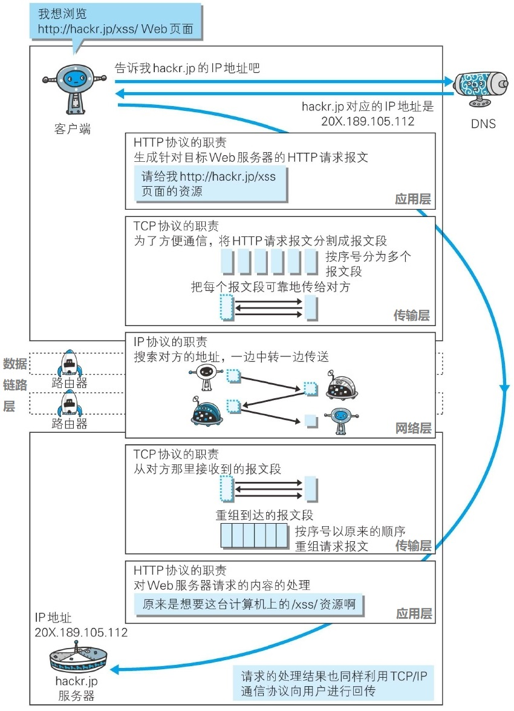
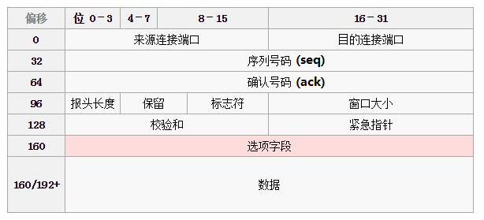
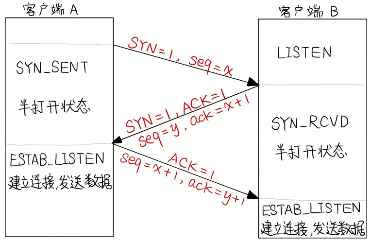
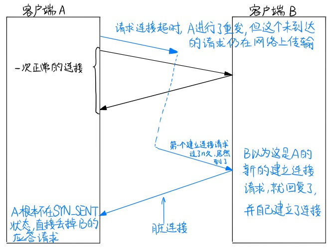
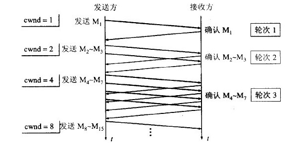
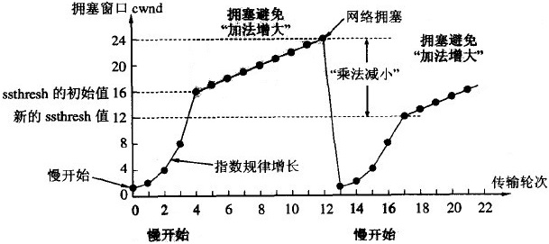
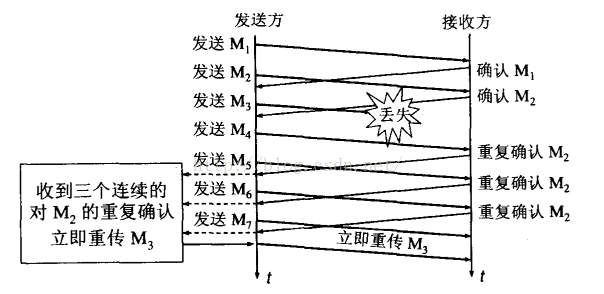
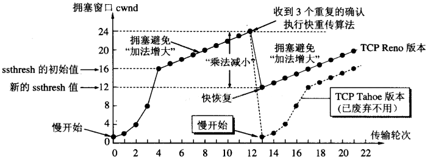
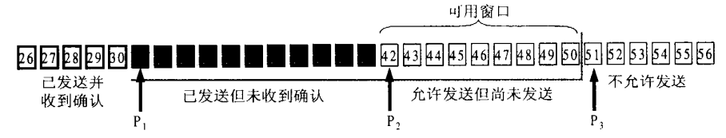
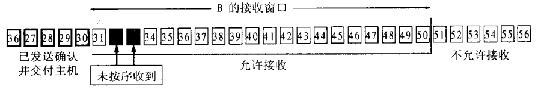

# 计算机网络

<!-- TOC -->

- [计算机网络](#计算机网络)
    - [一次完整的 HTTP 请求所经历的步骤？](#一次完整的-http-请求所经历的步骤)
        - [DNS 解析](#dns-解析)
        - [TCP 连接](#tcp-连接)
        - [发送 HTTP 请求](#发送-http-请求)
        - [服务器处理请求并返回 HTTP 报文](#服务器处理请求并返回-http-报文)
        - [浏览器解析渲染页面](#浏览器解析渲染页面)
    - [DNS 解析](#dns-解析-1)
            - [DNS 负载均衡](#dns-负载均衡)
    - [CDN（Content Distribute Network）](#cdncontent-distribute-network)
    - [TCP 是如何传输数据的？](#tcp-是如何传输数据的)
    - [TCP 报文结构](#tcp-报文结构)
    - [什么是 TCP 三次握手、四次挥手？](#什么是-tcp-三次握手四次挥手)
        - [三次握手](#三次握手)
            - [三次握手的流程](#三次握手的流程)
            - [为什么 TCP 连接需要三次握手，两次不可以吗？](#为什么-tcp-连接需要三次握手两次不可以吗)
        - [四次挥手](#四次挥手)
            - [四次挥手的流程](#四次挥手的流程)
            - [TIME_WAIT 存在的必要性](#time_wait-存在的必要性)
    - [TCP 如何进行流量控制、拥塞控制？](#tcp-如何进行流量控制拥塞控制)
        - [流量控制](#流量控制)
        - [拥塞控制](#拥塞控制)
            - [慢启动和拥塞避免](#慢启动和拥塞避免)
            - [快重传和快恢复](#快重传和快恢复)
    - [什么是 TCP 滑动窗口？](#什么是-tcp-滑动窗口)
        - [停止等待协议（ARQ 协议，滑动窗口协议的简易版）](#停止等待协议arq-协议滑动窗口协议的简易版)
        - [滑动窗口协议（连续 ARQ 协议）](#滑动窗口协议连续-arq-协议)
    - [TCP 与 UDP 的区别？](#tcp-与-udp-的区别)
    - [HTTP 长连接、短连接？](#http-长连接短连接)
        - [短连接](#短连接)
        - [长连接](#长连接)
    - [TCP 长连接、短连接？](#tcp-长连接短连接)
        - [短链接](#短链接)
        - [长连接](#长连接-1)
    - [HTTP、HTTPS 区别？](#httphttps-区别)
        - [HTTP 通信存在的问题](#http-通信存在的问题)
        - [区别](#区别)
    - [HTTP 1.1 与 HTTP 1.0 的区别？](#http-11-与-http-10-的区别)
    - [如果客户端不断的发送请求连接会怎样？](#如果客户端不断的发送请求连接会怎样)
        - [DDos 攻击](#ddos-攻击)
        - [DDos 预防](#ddos-预防)
    - [GET 和 POST 区别？](#get-和-post-区别)
    - [什么是 301、302 重定向？](#什么是-301302-重定向)
    - [URL 和 URI](#url-和-uri)
    - [NAT：网络地址转换？](#nat网络地址转换)

<!-- /TOC -->

## 一次完整的 HTTP 请求所经历的步骤？

即在浏览器中输入 URL 地址 >> 显示主页的过程。总体来说分为以下几个过程：

1. DNS 解析
2. TCP 连接
3. 发送 HTTP 请求
4. 服务器处理请求并返回 HTTP 报文
5. 浏览器解析渲染页面
6. 连接结束

简单的来说，就是先经过下图的过程，将客户端的请求传到服务器，再经过下图过程的逆过程，将客户端请求的数据返回给客户端，然后客户端浏览器对返回的数据进行渲染，最终得到了我们看到的页面。




### DNS 解析

DNS 解析的过程就是寻找哪台机器上有你需要资源的过程。也就是说，把你输入的 URL 地址转换为 IP 地址。

### TCP 连接

客户端 (浏览器) 通过 TCP 传输协议建立到服务器的 TCP 连接，详见后面 TCP 是如何传输数据，以及三次握手和四次挥手等。

### 发送 HTTP 请求

发送 HTTP 请求的过程就是构建 HTTP 请求报文并通过 TCP 协议中发送到服务器指定端口 (HTTP 协议 80/8080，HTTPS 协议443)。HTTP 请求报文是由三部分组成： **请求行** 、 **请求报头** 、 **请求正文 **。

### 服务器处理请求并返回 HTTP 报文

后端从固定的端口接收到 TCP 报文（这一部分对应于编程语言中的 socket），它会对 TCP 连接进行处理，对 HTTP 协议进行解析，并按照报文格式进一步封装成 HTTP Request 对象，供上层使用。这一部分工作一般是由 Web 服务器去进行，我使用过的  Web 服务器有 Tomcat，Jetty。

HTTP 响应报文也是由三部分组成： **状态码** 、 **响应报头** 、 **响应报文** 。

> **状态码：**
>
> - 1xx：指示信息–表示请求已接收，继续处理。
> - 2xx：成功–表示请求已被成功接收、理解、接受。
> - 3xx：重定向–要完成请求必须进行更进一步的操作。
> - 4xx：客户端错误–请求有语法错误或请求无法实现。
> - 5xx：服务器端错误–服务器未能实现合法的请求。

### 浏览器解析渲染页面

即浏览器收到 HTML、CSS、JS 文件后，把页面呈现到屏幕上的过程。


## DNS 解析

DNS 解析的过程就是寻找哪台机器上有你需要资源的过程。也就是说，把你输入的 URL 地址转换为 IP 地址。

DNS 域名解析过程如下图所示，简单来说就是先查自己的本地域名服务器，如果自己就有缓存，直接从缓存里面读就可以，如果缓存里没有，本地域名服务器会发出递归连环问去查找。


#### DNS 负载均衡

DNS 可以根据每台机器的负载量，该机器离用户地理位置的距离等等，返回一个合适的机器的 IP 给用户，这个过程就是 DNS 负载均衡，又叫做 DNS 重定向。大家耳熟能详的 CDN (Content Delivery Network) 就是利用 DNS 的重定向技术实现的，DNS 服务器会返回一个跟用户最接近的服务器的 IP 地址给用户，CDN 节点的服务器负责响应用户的请求。


## CDN（Content Distribute Network）

CDN，内容分发网络。最简单的 CDN 网络由一个 DNS 服务器和几台缓存服务器组成：

- 当用户点击网站页面上的内容 URL，经过本地 DNS 系统解析，DNS 系统会最终将域名的解析权交给 CNAME 指向的 CDN 专用 DNS 服务器。
- CDN 的 DNS 服务器将 CDN 的全局负载均衡设备 IP 地址返回用户。
- 用户向 CDN 的全局负载均衡设备发起内容 URL 访问请求。
- CDN 全局负载均衡设备根据用户 IP 地址，以及用户请求的内容 URL，选择一台用户所属区域的区域负载均衡设备，告诉用户这台服务器的 IP 地址，让用户向这台设备发起请求。选择的依据包括：
  - 根据用户 IP 地址，判断哪一台服务器距用户最近；
  - 根据用户所请求的 URL 中携带的内容名称，判断哪一台服务器上有用户所需内容；
  - 查询各个服务器当前的负载情况，判断哪一台服务器尚有服务能力；
- 用户向缓存服务器发起请求，缓存服务器响应用户请求，将用户所需内容传送到用户终端。
- 如果这台缓存服务器上并没有用户想要的内容，而区域均衡设备依然将它分配给了用户，那么这台服务器就要向它的上一级缓存服务器请求内容，直至追溯到网站的源服务器将内容拉到本地。


## TCP 是如何传输数据的？

TCP (Transmission Control Protocol, TCP)，是一种面向连接、确保数据在端到端间可靠传输的协议。在传输前需要先建立一条可靠的传输链路，然后让数据在这条链路上流动，完成传输。简单来说就是，TCP 在想尽各种办法保证数据传输的可靠性，为了可靠性 TCP 会这样进行数据传输：

- 三次握手建立连接；
- 对发出的每一个字节进行编号确认，校验每一个数据包的有效性，在出现超时进行重传；
- 通过流量控制（通过滑动窗口协议实现）和拥塞控制（慢启动和拥塞避免、快重传和快恢复）等机制，避免网络状况恶化而影响数据传输；
- 四次挥手断开连接。


## TCP 报文结构

**TCP 头部长度的前 20 字节是固定的，后面部分长度不定，但最多 40 字节** ，因此 TCP 头部一般在 20 ~ 60 字节之间。它的结构图如下：



**它的每一字段的说明如下：**

- **0 ~ 32 比特：源端口和目的端口** ，各占 16 比特（2 字节）。
- **32 ~ 64 比特：序列号 seq** ，当前 TCP 数据报数据部分的第一个字节的序号（4 字节）。
- **64 ~ 96 比特：确认序号 ack** ，表示当前主机作为接收端时，下一个希望接收的序列号是多少，确认号 = 当前主机已经正确接收的最后一个字节的序列号 + 1
- **96 ~ 112 比特：数据报报头长度，保留字段，标识符。**
	- 标识符：用于表示 TCP 报文的性质，只能是 0 或 1。TCP 的常用标识符：
		- `URG=1`：紧急指针有效性标志，表示本数据报的数据部分包含紧急信息，紧急数据一定位于当前数据包数据部分的最前面，后面的紧急指针则标明了紧急数据的尾部。
		- `ACK=1`：在连接建立后传送的所有报文段都必须把 ACK 置 1，也就是说 `ACK=1` 后确认号字段才有效。
		- `PSH=1`：接收方应尽快将报文段提交至应用层，不会等到缓冲区满后再提交，一些交互式应用需要这样的功能，降低命令的响应时间。
		- `RST=1`：当该值为 1 时，表示当前 TCP 连接出现严重问题，必须要释放重连。
		- `SYN=1`：用在建立连接时
			- `SYN=1, ACK=0`：当前报文段是一个连接请求报文。
			- `SYN=1, ACK=1`：表示当前报文段是一个同意建立连接的应答报文。
		- `FIN=1`：表示此报文段是一个释放连接的请求报文。
- **112 ~ 128 比特：接收窗口大小** ，该字段用于实现 TCP 的流量控制。
	- 它表示当前接收方的接收窗口的剩余大小，发送方收到该值后会将发送窗口调整成该值的大小（收到一个数据报就调整一次）。发送窗口的大小又决定了发送速率，所以接收方通过设置该值就可以控制发送放的发送速率。
- **128 ~ 144 比特：校验和** ，用于接收端检验整个数据包在传输过程中是否出错。
- **144 ~ 160 比特：紧急指针** ， 用来标明紧急数据的尾部，和 URG 标识符一起使用。


## 什么是 TCP 三次握手、四次挥手？

- TCP 的三次握手：为了建立可靠的通信信道，即双方确认自己与对方的发送和接收都是正常的。
- TCP 的四次挥手：确保双方都在没有想说的内容之后，释放 TCP 连接。

### 三次握手

#### 三次握手的流程



- 第一次握手：A 向 B 发送建立连接请求（A 对 B 说：“我们在一起吧！”）
- 第二次握手：B 收到 A 的建立连接请求后，发给 A 一个同意建立连接的应答报文（B 对 A 说：“好的，同意和你在一起啦”）
- 第三次握手：A 向 B 发送个报文，表示我已经收到你的应答了（A 对 B 说：“亲爱的，你同意真是太好了，我们可以互相砸数据了”）

#### 为什么 TCP 连接需要三次握手，两次不可以吗？

首先，我们要知道，这三次握手是为了让双方确认自己与对方的发送和接收都是正常的。但是，只成功完成两次握手的时候，B 不知道自己的发送能力是否正常，也不知道 A 的收报能力是否正常，所以它们需要第三次握手。

同时，如果没有第三次连接，很有可能导致 B 建立一个脏连接。

**脏连接建立的过程：**



- A 发送的第一个建立连接的请求，这个连接好久好久都没有达到 B 那里；
- 所以，A 又重新发送了一个新的建立连接请求给 B，这个请求成功了，A 和 B 愉快的交换完了数据并且断开了连接；
- 此时，A 第一个发的建立连接的请求终于穿越 n 个路由器到达了 B，B 以为这时 A 发来的新的建立连接的请求，愉快的返回了同意建立连接的请求；
- 如果只需要两次握手，此时 B 会单方面的建立起与 A 的连接，而 A 根本就不在 SYN_SENT 状态，它会把 B 的应答请求直接丢掉，不会建立连接。此时，B单方面创建的这个连接就是脏连接。

### 四次挥手

#### 四次挥手的流程


- A：我们分手吧。
- B：好的，我收到了你的分手请求，再等一会，我把你剩我这的东西打包给你。（此时 A 已经不能再给 B 发东西了）
- B：好了，东西发完了，分吧。（此时 B 也不能再给 A 发东西了）
- A：好的，知道你东西都发完了，我在等 2MSL，然后就消失了。

#### TIME_WAIT 存在的必要性

如果 A 发送完最后一个 `ACK=1` 后，立即进入 CLOSED 状态，可能会导致 B 无法进入 CLOSED 状态。

原因：假设 A 最后的 ACK 在网络传输中丢失了，B 会认为 A 根本没收到自己发的 `FIN=1, ACK=1` 报文，会导致 B 超时重发 `FIN=1, ACK=1` 报文。A 第二次收到 `FIN=1, ACK=1` 报文后，会再发一次 ACK，并重新开始 TIME_WAIT 的计时。如果 A 发完最后一个 ACK 后立即关闭，B 可能会永远接收不到最后一个 ACK，也就无法进入 CLOSED 状态。

> 在高并发上，可以将 TIME_WAIT 调到小于 30s 为宜。
>
> 设置方法：改变服务器的配置文件 /etc/sysctl.conf 中的 `net.ipv4.tcp_fin_timeout=30`

*注：seq 表示序列号，ack 表示确认号，2MSL 是报文在网络中生存的最长时间。*


## TCP 如何进行流量控制、拥塞控制？

### 流量控制

**产生原因：** 如果发送方数据发送的过快，接收方可能来不及接收，这会造成数据的丢失。

**解决方法：** 通过滑动窗口实现，接收端告诉发送发自己的接收窗口有多大，发送端会调整自己的发送窗口不超过接收端的接收窗口大小。

**流量控制引发的死锁：** 当发送者收到了一个窗口为 0 的应答后，发送者会停止发送，等待接收者的下一个应答。但是如果这个窗口不为 0 的应答在传输过程丢失，发送者一直等待下去，而接收者以为发送者已经收到该应答，等待接收新数据，这样双方就相互等待，从而产生死锁。

### 拥塞控制

#### 慢启动和拥塞避免

首先，发送方维持一个叫做 **拥塞窗口 cwnd（congestion window）** 的状态变量。拥塞窗口的大小取决于网络的拥塞程度，并且动态地在变化。发送方让自己的发送窗口等于 `min{拥塞窗口, 接收窗口}`。

**慢启动就是：** 不要一开始就发送大量的数据，先探测一下网络的拥塞程度，也就是说由小到大逐渐增加拥塞窗口的大小。具体过程如下：



慢启动的时候，拥塞窗口每次是呈 2 的指数次方增长的，因为开始的时候需要比较快速的将拥塞窗口的大小增长到一个合适值。如果我们一直使用慢启动的方法确认拥塞窗口 cwnd 的大小，cwnd 会飞速增大，而且增长的粒度会越来越粗，一不小心就增的过大了，就会导致网络的拥塞。

为了避免这种情况，我们设定了一个慢开始门限 ssthresh，令 cwnd 大于一定值之后就采用拥塞避免算法，拥塞避免算法和慢启动算法的区别在于：拥塞避免算法每次只将 cwnd 增加 1，也就是呈加法增长的。ssthresh 的用法如下：

- cwnd < ssthresh 时，使用慢开始算法
- cwnd > ssthresh 时，改用拥塞避免算法
- cwnd = ssthresh时，慢开始与拥塞避免算法任意

拥塞避免算法会让拥塞窗口缓慢增长，即每经过一个往返时间 RTT 就把发送方的拥塞窗口 cwnd 加 1，而不是加倍。这样拥塞窗口按线性规律缓慢增长。

无论是在 **慢启动阶段** 还是在 **拥塞避免阶段** ，只要发送方判断 **网络出现拥塞** （其根据就是没有收到确认，虽然没有收到确认可能是其他原因的分组丢失，但是因为无法判定，所以都当做拥塞来处理）， **就把慢开始门限设置为出现拥塞时的发送窗口大小的一半（乘法减小算法）。然后把拥塞窗口设置为 1，执行慢开始算法。** 

通过使用慢启动与拥塞避免算法，拥塞窗口的大小变化大致如下图所示：



*注：这里只是为了讨论方便而将拥塞窗口大小的单位改为数据报的个数，实际上应当是字节。*

#### 快重传和快恢复

**快重传** 要求接收方在收到一个失序的报文段后就立即发出重复确认（为的是使发送方及早知道有报文段没有到达对方）而不等到自己发送数据时捎带确认。

快重传算法规定：发送方只要一连收到三个重复确认就应当立即重传对方尚未收到的报文段，而不必继续等待设置的重传时间计时器到期。如下图：



**快恢复** 要求当发送发连续接收到三个确认时，就执行乘法减小算法，把慢启动开始门限（ssthresh）减半，但是接下来并不执行慢开始算法。而是将 cwnd 设置为 ssthresh 的大小，然后执行拥塞避免算法。

通过使用快重传与快恢复算法，拥塞窗口的大小变化大致如下图所示：




## 什么是 TCP 滑动窗口？

### 停止等待协议（ARQ 协议，滑动窗口协议的简易版）

**原理：**

- A 向 B 每发送一个分组，都要停止发送，等待 B 的确认应答；A 只有收到了 B 的确认应答后才能发送下一个分组。

**A 发送的分组丢失或出错**

- 丢失：发送者 A 拥有超时计时器。每发送一个分组便会启动超时计时器，等待 B 的应答。若超时仍未收到应答，A 就会重发刚才的分组。
- 出错：若 B 收到分组，但通过检查和字段发现分组在运输途中出现差错，它会直接丢弃该分组，并且不会有任何其他动作。A 超时后便会重新发送该分组，直到 B 正确接收为止。

**B 发送的确认应答丢失或迟到**

- 丢失：A 迟迟收不到 B 的确认应答，会进行超时重传，B 收到重复的分组后会立即补发一个确认应答。
- 迟到：A 会根据分组号得知该分组已被接收，会直接丢弃该应答。

### 滑动窗口协议（连续 ARQ 协议）

**ARQ 协议的缺点：** 每次只发送一个分组，在该分组的应答到来前只能等待。为了解决这个问题，我们改成一次发送一堆，也就是我们有个窗口，在发送端没有收到确认应答时，可以继续发送窗口中的分组，而不是干等着。

**累计确认：** 接收端不用为每一个分组发送一个应答了，改为为一组分组发送一个确认应答。这个应答会通过 TCP 头中的 ack（确认号）来告诉发送端它下一个希望接收的分组号是多少。

**发送窗口：**



发送端收到接收端发来的一个确认应答后，会根据确认应答的 TCP 头中的各种信息移动 P1、P2、P3 三个指针：

- 根据 ack 的值移动 P1 指针，确认哪些分组被成功接收了；
- 然后根据窗口大小移动 `P3 = P1 + 窗口大小`；
- 然后 P2 从 P1 开始向 P3 移动，向接收端发送分组数据。

**接收窗口：**



- 接收者收到的字节会存入接收窗口，接收者会对已经正确接收的有序字节进行累计确认，发送完确认应答后，接收窗口就可以向前移动指定字节。
- 如果某些字节并未按序收到，接收者只会确认最后一个有序的字节，从而乱序的字节就会被重新发送。

**注意：**

- 同一时刻发送窗口的大小并不一定和接收窗口一样大（因为时延和拥塞窗口）。
- TCP 标准并未规定未按序到达的字节的处理方式。但 TCP 一般都会缓存这些字节，等缺少的字节到达后再交给应用层处理（应用层可以对它进行排序）。这比直接丢弃乱序的字节要节约带宽。


## TCP 与 UDP 的区别？

**从特点上看：**

- TCP 是面向连接的，UDP 是无连接的，即
	- TCP 在传输数据前要先通过三次握手建立连接，而且在数据传递时，有确认、窗口、重传、拥塞控制机制建立连接，数据传输结束后要释放连接。
	- UDP 在传输数据前不需要建立连接，远地主机在接收到报文之后也无需确认。
- 所以 TCP 是可靠传输，UDP 是不可靠传输。
- TCP 因为有连接，所以数据以字节流的形式传输，UDP 则以数据报文段形式传输，而且 TCP 只能是一对一的，而 UDP 可以各种通信。

**从性能上看：** TCP 传输效率慢，需要资源多，但可靠。UDP 传输效率快，需要资源少，但不可靠。

**应用场景：** TCP 应用在要求传输数据可靠的情况下，如文件传输、邮件传输等。UDP 应用在要求通信速度但对可靠性要求比较低的场景，如 QQ 语音、视频等。

**首部字节：** TCP 首部有 20 ~ 60 个字节，UDP 首部由 8 个字节 4 个字段组成。

**怎么用 UDP 实现 TCP？**

在传输层 UDP 是不可靠的，所以需要在应用层自己实现一些保证可靠传输的机制，简单来说，就是使用 UDP 来构建可靠的面向连接的数据传输，就是在应用层实现类似于 TCP 的超时重传（定时器），拥塞控制（滑动窗口），有序接收（添加包序号），应答确认（ack 和 seq）等。目前已经有了实现 UDP 可靠运输的机制 —— UDT：主要用于高速广域网海量数据传输，是应用层协议。


## HTTP 长连接、短连接？

### 短连接

在 HTTP/1.0 中默认使用 **短连接：客户端和服务器每进行一次 HTTP 操作，就建立一次连接，任务结束就中断连接。** 当客户端浏览器访问的某个 HTML 或其他类型的 Web 页中包含有其他的 Web 资源（如：JavaScript 文件、图像文件、CSS 文件等）时，浏览器就会重新建立一个 HTTP 会话。

**应用：** WEB 网站的 http 服务一般都用短链接，因为并发量大，但每个用户无需频繁操作。

### 长连接

而从 HTTP/1.1 起，默认使用长连接。使用长连接的HTTP协议，会在响应头加入这行代码：

```
Connection:keep-alive
```

**在使用长连接的情况下，当一个网页打开完成后，客户端和服务器之间用于传输 HTTP 数据的 TCP 连接不会关闭，客户端再次访问这个服务器时，会继续使用这一条已经建立的连接。** Keep-Alive 不会永久保持连接，它有一个保持时间，可以在不同的服务器软件（如Apache）中设定这个时间。实现长连接需要客户端和服务端都支持长连接。

HTTP 协议的长连接和短连接，实质上是 TCP 协议的长连接和短连接，有关 TCP 长连接、短连接的介绍请看下一小节。

**应用：** 适用于操作频繁的点对点通讯，而且连接数不能太多。


## TCP 长连接、短连接？

### 短链接

**短连接过程：** client 向 server 发起连接请求，server 接到请求，然后双方建立连接。client 向 server 发送消息，server 回应 client，然后一次请求就完成了。这时候双方任意都可以发起 close 操作，不过一般都是 client 先发起 close 操作。也就是说，短连接一般只会在 client 和 server 间进行一次请求操作。

**优点：** 管理起来比较简单，存在的连接都是有用的连接，不需要额外的控制手段。

**缺点：** 如果客户请求频繁，将在 TCP 的建立和关闭操作上浪费时间和带宽。

### 长连接

**长连接过程：** client 向 server 发起连接，server 接受 client 连接，双方建立连接，client 与 server完成一次请求后，它们之间的连接并不会主动关闭，后续的读写操作会继续使用这个连接。

TCP 的保活功能主要为服务器应用提供。如果客户端已经消失而连接未断开，则会使得服务器上保留一个半开放的连接，而服务器又在等待来自客户端的数据，此时服务器将永远等待客户端的数据。保活功能就是试图在服务端器端检测到这种半开放的连接。

如果一个给定的连接在两小时内没有任何动作，服务器就向客户发送一个探测报文段，根据客户端主机响应探测 4 个客户端状态：

- 客户主机依然正常运行，且服务器可达。此时客户的TCP响应正常，服务器将保活定时器复位。
- 客户主机已经崩溃，并且关闭或者正在重新启动。上述情况下客户端都不能响应 TCP。服务端将无法收到客户端对探测的响应。服务器总共发送 10 个这样的探测，每个间隔 75 秒。若服务器没有收到任何一个响应，它就认为客户端已经关闭并终止连接。
- 客户端崩溃并已经重新启动。服务器将收到一个对其保活探测的响应，这个响应是一个复位，使得服务器终止这个连接。
- 客户机正常运行，但是服务器不可达。这种情况与第二种状态类似。

**优点：** 对于请求比较频繁客户来说，可以节省在 TCP 的建立和关闭操作上浪费时间和带宽。

**缺点：** 存活探测周期太长，而且 client 端一般不会主动关闭它与服务器之间的连接，如果 **client 与 server 之间的连接一直不关闭的话，随着客户端连接越来越多，server 早晚有扛不住的时候** ，这时候 server 端需要采取一些策略，如关闭一些长时间没有读写事件发生的连接，以避免一些恶意连接导致 server 端服务受损；如果条件再允许就可以以客户端机器为颗粒度，限制每个客户端的最大长连接数，这样可以完全避免某个蛋疼的客户端连累后端服务。


## HTTP、HTTPS 区别？

HTTPS 的全称为：HTTP over SSL，简单理解就是在之前的 HTTP 传输上增加了 SSL 协议加密。

```
|------|  
| HTTP |
|------| <-- HTTPS 在 HTTP 和 TCP 间加了一层 SSL or TLS
| TCP  |
|------|
|  IP  |
|------|
```

### HTTP 通信存在的问题

- **容易被监听：** http 通信都是明文，数据在客户端与服务器通信过程中，任何一点都可能被劫持，如果明文保存的密码被截取了是很危险的。
- **被伪装：** http 通信时无法保证双方是合法的。比如你请求 www.taobao.com，你无法知道返回的数据就是来自淘宝，还是中间人伪装的淘宝。
- **被篡改：** 中间人将发给你的信息篡改了你也不知道。

因为 http 不安全，所以 https 出现了！

### 区别

- HTTPS 需要到 CA 申请证书，HTTP 不需要
- HTTPS 密文传输，HTTP 明文传输
- 连接方式不同，HTTPS 默认使用 443 端口，HTTP 使用 80 端口
- HTTPS = HTTP + 加密 + 认证 + 完整性保护，比 HTTP 安全


## HTTP 1.1 与 HTTP 1.0 的区别？

- 1.0 需要设置 keep-alive 参数来告知服务器建立长连接，1.1 默认建立长连接。
- 1.1 支持只发 header 不带 body，如果服务器认为客户端有权利访问，返回 100，否则返回 401，客户端可以接到 100 后再把 body 发过去，接到 401 就不发了，这样比较节省带宽。
- 1.1 有 host 域，1.0 没有。
	- host 域用于处理一个IP地址对应多个域名的情况，假设我的虚拟机服务器 IP 是 111.111.111.111，我们可以把 www.qiniu.com，www.taobao.com 和 www.jd.com 这些网站都架设那台虚拟机上面，但是这样会有一个问题，我们每次访问这些域名其实都是解析到服务器 IP 111.111.111.111，那么如何来区分每次根据域名显示出不同的网站的内容呢？就是通过 Host 域的设置，可以在 Tomcat 的 conf 目录下的 server.xml 进行配置。
- 1.1 会进行带宽优化。1.0 存在浪费带宽的现象，而且不支持断点续传，1.1 在请求头中引入了 range 域，允许只请求某个资源的某个部分，即返回状态码 206。


## 如果客户端不断的发送请求连接会怎样？

服务器端会为每个请求创建一个链接，然后向 client 端发送创建连接时的回复，然后进行等待客户端发送第三次握手数据包，这样会白白浪费资源。DDos 攻击就是基于这一点达到的。

### DDos 攻击

简单的说就是不停的向服务器发送建立连接请求，但不发送第三次握手的数据包。

- 客户端向服务器端发送连接请求数据包
- 服务器向客户端回复连接请求数据包，然后服务器等待客户端发送tcp/ip链接的第三步数据包
- 如果客户端不向服务器端发送最后一个数据包，服务器须等待 30s 到 2min 才能将此连接关闭。当大量的请求只进行到第二步，而不进行第三步，服务器将有大量的资源在等待第三个数据包，造成DDos攻击。

### DDos 预防

- DDoS清洗：对用户请求数据进行实时监控，及时发现异常流量，封掉异常流量的 IP，使用的命令：`iptables`。
	- 用 `iptables` 屏蔽单个 IP 的命令：`iptables -I INPUT -s ***.***.***.*** -j DROP`
	- 用 `iptables` 屏蔽整个 IP 段命令：`iptables -I INPUT -s 121.0.0.0/8 -j DROP`
	- 用 `iptables` 解禁 IP 命令：`iptables -D INPUT -s ***.***.***.*** -j DROP`
	- 相当于在 /etc/iptables.conf 配置文件中写入：`-A INPUT -s ***.***.***.*** -j DROP`
- CDN 加速：在现实中，CDN 服务将网站访问流量分配到了各个节点中，这样一方面隐藏网站的真实 IP，另一方面即使遭遇 DDoS 攻击，也可以将流量分散到各个节点中，防止源站崩溃。


## GET 和 POST 区别？

- Http 报文层面：GET 将请求信息放在 URL 中，POST 方法报文中，所以 POST 方法更安全，毕竟数据在地址栏上不可见。
- 数据库层面：GET 符合幂等性，POST 不符合。
- 缓存层面：GET 可以被缓存、被存储（书签），而 POST 不行。


## 什么是 301、302 重定向？

**HTTP 返回码中 301 和 302 的区别：**

- 301，302 都是 HTTP 的状态码，都代表着某个 URL 发生了转移，不同之处在于：
	- 301 代表永久性转移 (Permanently Moved)。
	- 302 代表暂时性转移(Temporarily Moved )。搜索引擎会抓取新的内容而保留旧的网址，因为服务器返回 302 代码，搜索引擎认为新的网址只是暂时的。

**使用场景：**

- 域名到期不想续费；
- 在搜索引擎的搜索结果中出现了不带 www 的域名，而带 www 的域名却没有收录，这个时候可以用 301 重定向来告诉搜索引擎我们目标的域名是哪一个；
- 空间服务器不稳定，换空间的时候。

**注意：尽量使用 301 跳转！原因：网址劫持！**

从网址 A 做一个 302 重定向到网址 B 时，主机服务器的隐含意思是网址 A 随时有可能改主意，重新显示本身的内容或转向其他的地方。大部分的搜索引擎在大部分情况下，当收到 302 重定向时，一般只要去抓取目标网址就可以了，也就是说网址 B。如果搜索引擎在遇到 302 转向时，百分之百的都抓取目标网址 B 的话，就不用担心网址 URL 劫持了。问题就在于，有的时候搜索引擎，尤其是 Google，并不能总是抓取目标网址。比如说，有的时候 A 网址很短，但是它做了一个 302 重定向到 B 网址，而 B 网址是一个很长的乱七八糟的 URL 网址，甚至还有可能包含一些问号之类的参数。很自然的，A 网址更加用户友好，而 B 网址既难看，又不用户友好。这时 Google 很有可能会仍然显示网址A。

这就造成了网址 URL 劫持的可能性。也就是说，一个不道德的人在他自己的网址 A 做一个 302 重定向到你的网址 B，出于某种原因， Google 搜索结果所显示的仍然是网址 A，但是所用的网页内容却是你的网址 B 上的内容，这种情况就叫做网址 URL 劫持。你辛辛苦苦所写的内容就这样被别人偷走了。

302 重定向很容易被搜索引擎误认为是利用多个域名指向同一网站，那么你的网站就会被封掉，罪名是 “利用重复的内容来干扰 Google 搜索结果的网站排名”。


## URL 和 URI

URI 叫做统一资源标志符，就是在某一规则下能把一个资源独一无二地标识出来。

URL 叫做统一资源定位符，是以描述资源的位置来唯一确定一个资源的。所以URL 是 URI 的子集。


## NAT：网络地址转换？

常用于私有地址与公有地址的转换，以解决 IP 地址匮乏的问题。

NAT 的基本工作原理是：当私有网主机和公共网主机通信的 IP 包经过 NAT 网关时，将 IP 包中的源 IP 或目的 IP 在私有 IP 和 NAT 的公共 IP 之间进行转换。


